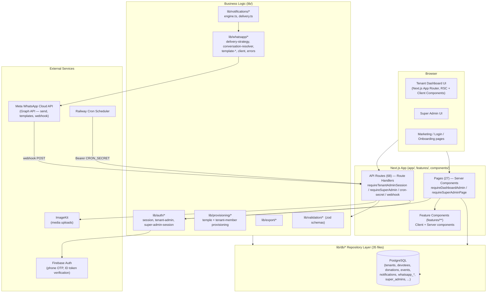
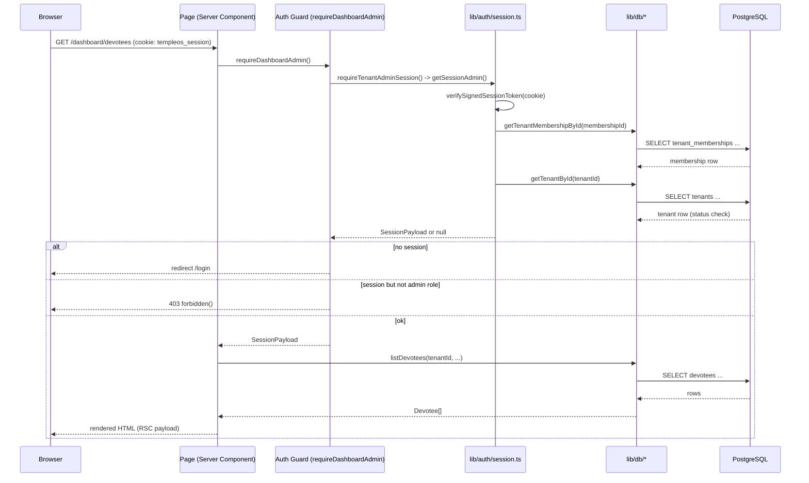
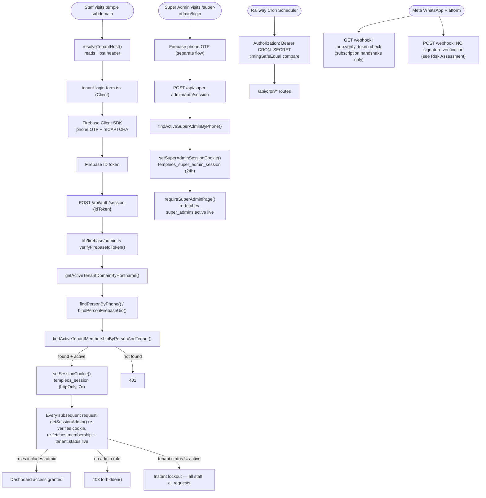
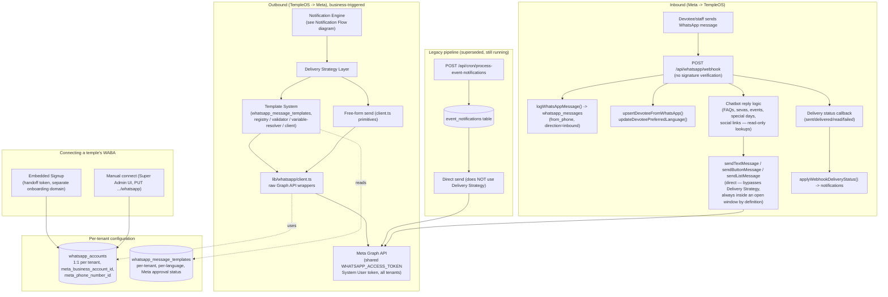
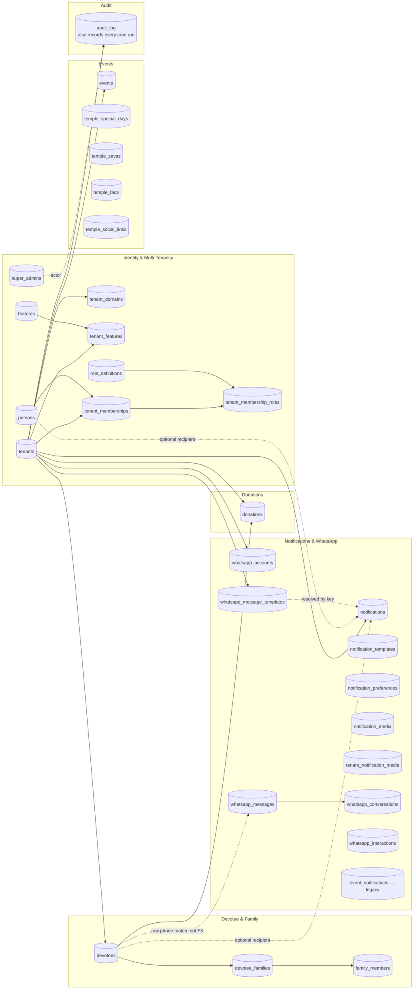
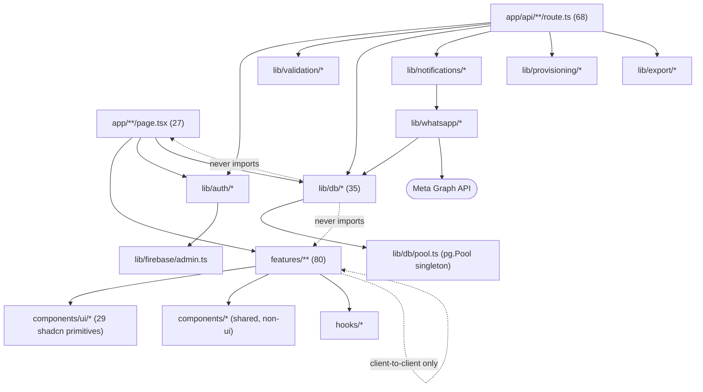

<!-- title: TempleOS — Full Architecture & File Audit -->

# TempleOS — Full Architecture & File Audit

*A complete developer handbook for the TempleOS codebase: every architecturally meaningful file, every API route, every database table, every background process, every auth path, and a read-only risk assessment. Produced by static analysis of the repository as of the current `main` branch — no code was modified, refactored, or deleted to produce this document.*

## Contents

1. [Executive Summary](#1-executive-summary)
2. [Folder Tree](#2-folder-tree)
3. [Diagrams](#3-diagrams)
4. [Authentication & Authorization Flow](#4-authentication--authorization-flow)
5. [Notification Engine & WhatsApp Architecture](#5-notification-engine--whatsapp-architecture)
6. [Background Processes](#6-background-processes)
7. [API Route Reference (68 routes)](#7-api-route-reference)
8. [Database & Repository Layer (35 files, 30 tables)](#8-database--repository-layer)
9. [Migration History (22 files)](#9-migration-history)
10. [UI Pages (27 routes)](#10-ui-pages)
11. [Feature Components (80 files)](#11-feature-components)
12. [File Classification](#12-file-classification)
13. [Risk Assessment](#13-risk-assessment)
14. [Final Recommendations](#14-final-recommendations)

---

## 1. Executive Summary

TempleOS is a multi-tenant SaaS platform that gives individual Hindu temples a dashboard for managing devotees, donations, and events, plus a WhatsApp chatbot/notification channel to reach devotees, all provisioned and overseen by a separate platform-level Super Admin layer. It is a Next.js 15 App Router application (`app/`) backed directly by PostgreSQL via hand-written SQL in a repository layer (`lib/db/`, no ORM), with Firebase used only for phone-OTP identity verification (not for authorization or data storage) and Meta's WhatsApp Cloud API as the sole outbound/inbound messaging channel.

**Scale**: 435 TypeScript/TSX/MTS source files (161 `lib/`, 127 `app/`, 80 `features/`, 49 `components/`, 8 `scripts/`, 4 `hooks/`), 69 test files, 68 API routes, 27 pages, 35 database repository files, 22 migrations producing 30 tables, 29 shared UI primitives, 12 `features/` domains.

**Architectural shape**: three independent identity/session systems (tenant staff, platform Super Admin, and a shared-secret cron caller) with no central `middleware.ts` — every page and API route calls its own guard function inline. A single generic Notification Engine (`notifications` table + `lib/notifications/*`) drives almost all WhatsApp/in-app messaging, recently extended with a Delivery Strategy layer (`lib/whatsapp/delivery-strategy.ts`) that automatically falls back to a Meta-approved Message Template when the 24-hour free-form messaging window has closed — before this, any notification to a recipient outside that window silently failed. One older, narrower notification pipeline (`event_notifications` table) still runs in parallel and has not yet been consolidated into the generic engine.

**Headline findings** (detailed in [§13](#13-risk-assessment)): the inbound WhatsApp webhook accepts and acts on unauthenticated POST requests (no Meta signature verification); a handful of stub/legacy API routes and one duplicated small helper pattern are candidates for cleanup; no single file was found to be catastrophically oversized or circularly dependent. None of this required or received any code change — this document is analysis only, per the request that produced it.

---

## 2. Folder Tree

Application source only (`node_modules`, `.next`, `.git` excluded). The `.agents/`, `.claude/`, `_bmad/`, `_bmad-output/` trees are AI-tooling scaffolding (BMAD agent-framework skills and its generated planning artifacts) — not application code, listed once and not expanded further.

```
TempleOS-main/
├── .agents/skills/bmad-*/            AI agent-framework skill definitions (tooling, not app code)
├── .claude/skills/bmad-*/            mirror of the above for Claude Code
├── .vscode/
├── _bmad/                            BMAD framework config/scripts
├── _bmad-output/                     generated planning/architecture docs (2 architecture write-ups + reviews)
├── app/                                                    127 files — Next.js App Router
│   ├── (auth)/
│   │   ├── access-denied/page.tsx
│   │   └── login/page.tsx
│   ├── (dashboard)/
│   │   ├── template.tsx                                    (modified — animation wrapper)
│   │   └── dashboard/
│   │       ├── page.tsx                                     dashboard home
│   │       ├── require-dashboard-admin.ts                   tenant-admin page guard
│   │       ├── admins/page.tsx                               vestigial redirect
│   │       ├── chatbot-settings/page.tsx                    central temple config hub
│   │       ├── devotees/
│   │       │   ├── page.tsx · [id]/page.tsx · import/page.tsx
│   │       │   └── family/new/page.tsx · family/[familyId]/edit/page.tsx
│   │       ├── donations/page.tsx
│   │       ├── events/page.tsx
│   │       ├── notification-preferences/page.tsx
│   │       └── users/
│   │           ├── page.tsx · activity/page.tsx · import/page.tsx
│   ├── (marketing)/
│   │   ├── privacy-policy/page.tsx
│   │   └── terms-of-service/page.tsx
│   ├── (super-admin)/super-admin/
│   │   ├── login/page.tsx
│   │   ├── require-super-admin.ts                           super-admin page guard
│   │   └── (shell)/
│   │       ├── page.tsx                                      platform dashboard
│   │       ├── admins/page.tsx · roles/page.tsx
│   │       └── temples/page.tsx · new/page.tsx · [tenantId]/page.tsx
│   ├── whatsapp-onboarding/page.tsx                          standalone embedded-signup handoff page
│   └── api/                                                  68 route.ts files — see §7
│       ├── account/locale/ · admins/ (retired) · audit-log/ · auth/{session,tenant-context}/
│       ├── cron/{daily-birthday-check,process-event-notifications,process-notifications}/
│       ├── devotees/… · donations/… · events/… · media/… · notification-media/…
│       ├── notification-preferences/ · super-admin/… · temple-{faqs,sevas,social-links,special-days}/…
│       ├── tenant/ · users/… · whatsapp/{connect,disconnect,onboarding,templates,webhook}/…
│
├── components/                                              49 files — shared UI
│   ├── ui/                                                   29 shadcn/radix primitives (button, dialog, table, sheet, ...)
│   ├── legal/                                                LegalHero, LegalSection, TableOfContents
│   ├── table-shell.tsx · mobile-list-view.tsx · mobile-list-row.tsx
│   ├── pagination-controls.tsx · empty-state.tsx · page-header.tsx
│   ├── responsive-search-bar.tsx (modified) · sticky-toolbar.tsx (new, untracked)
│
├── features/                                                80 files — see §11
│   ├── auth/ (2) · chatbot-settings/ (16) · dashboard/ (10) · devotees/ (4) · donations/ (4)
│   ├── events/ (6) · export/ (1) · media/ (3) · notifications/ (3) · super-admin/ (21, incl. bottom-nav new)
│   ├── users/ (9) · whatsapp-onboarding/ (1)
│
├── hooks/                                                   4 files (incl. use-mobile.ts, modified)
├── i18n/                                                    next-intl config
├── lib/                                                     161 files — see §5, §8
│   ├── auth/                                                 session, tenant-admin, super-admin-session, session-token, tenant-host, features
│   ├── cron/                                                 auth.ts, log-run.ts
│   ├── db/                                                   35 repository files — see §8
│   ├── events/ · export/ (+columns/) · firebase/ (admin, client, errors) · i18n/ · media/
│   ├── notifications/                                        engine.ts, delivery.ts
│   ├── provisioning/                                         temples.ts, tenant-members.ts
│   ├── validation/                                            zod schemas per domain
│   └── whatsapp/                                             client, delivery-strategy, conversation-resolver,
│                                                               template-{registry,validator,variable-resolver,client,sync},
│                                                               delivery-logger, send-notification, errors, event-notifications (legacy), locales/
│
├── locales/en/, locales/te/                                 next-intl JSON message catalogs
├── migrations/                                               22 .sql files — see §9
├── public/                                                   static assets
├── scripts/                                                  8 .mts operational/one-off scripts (incl. load-env.mts)
├── types/                                                    db.ts (shared domain types) and friends
├── middleware.ts                                             ABSENT — no Next.js Edge Middleware exists in this repo
├── package.json, tsconfig.json, next.config.ts, vitest.config.ts, eslint.config.mjs, components.json
└── MVP_SPEC.md, PRODUCTION_RESET.md, README.md
```

---

## 3. Diagrams

### 3.1 Architecture Diagram



### 3.2 Runtime Flow Diagram (typical admin request)



### 3.3 Authentication Flow Diagram



### 3.4 Notification Flow Diagram

```mermaid
flowchart TB
    Trigger["Trigger event\n(devotee created, donation recorded,\nevent published, user invited, birthday cron,\ntenant status changed, festival greeting, ...)"]
    Trigger --> Enqueue["enqueueNotification()\nINSERT notifications (status=queued)"]
    Enqueue --> Dispatch{"Dispatch path"}
    Dispatch -->|"most routes"| AfterFn["after() — fire-and-forget\n(HTTP response returns first)"]
    Dispatch -->|"/api/events/[id]/announce only"| Awaited["awaited processNotifications()\n(blocks for real sent/failed count)"]
    Dispatch -->|"cron tick"| CronTick["POST /api/cron/process-notifications\nlistDueNotifications()"]

    AfterFn --> ProcessOne
    Awaited --> ProcessOne
    CronTick --> ProcessOne

    ProcessOne["processOneNotification()"] --> SendNotif["sendNotification()"]
    SendNotif --> Resolve["resolveDeliveryStrategy()"]
    Resolve --> ConvCheck["resolveConversationStatus()\nquery whatsapp_messages 24h window"]
    ConvCheck -->|window open| FreeForm["FREE_FORM\nsendTextMessage / sendImageMessage\n(unchanged, pre-existing)"]
    ConvCheck -->|window closed + template approved| Template["TEMPLATE\ntemplate-registry -> template-validator ->\ntemplate-variable-resolver -> sendTemplateMessage"]
    ConvCheck -->|window closed + no template| Undeliverable["UNDELIVERABLE\nimmediate permanent failure, no Meta call"]

    FreeForm --> Meta["Meta Graph API"]
    Template --> Meta
    Meta --> Result{"Result"}
    Result -->|success| LogSent["logDeliveryOutcome() -> markNotificationSent"]
    Result -->|permanent error\n(131047, 131026, 132xxx)| LogPerm["markNotificationPermanentlyFailed\n+ meta_error_code/category"]
    Result -->|temporary error\n(5xx, rate limit)| LogRetry["markNotificationFailed\n-> retrying, backoff 1/5/30min"]
    Undeliverable --> LogPerm

    LogRetry -.->|next cron tick, backoff elapsed| CronTick

    WebhookIn["Meta webhook: delivery status callback"] --> ApplyStatus["applyWebhookDeliveryStatus()\n(separate path, untouched by strategy layer)"]
    ApplyStatus --> NotifRow[("notifications table")]
    LogSent --> NotifRow
    LogPerm --> NotifRow
```

### 3.5 WhatsApp Architecture / Flow Diagram



### 3.6 Database Interaction Diagram



### 3.7 File Dependency Graph (layering)



---

## 4. Authentication & Authorization Flow

### Overview

TempleOS has **no `middleware.ts`** (confirmed absent repo-wide). There is no Next.js Edge Middleware gate at all. Every authorization check happens *inline*, per request, inside Server Components (pages) and Route Handlers (`app/api/**/route.ts`), by explicitly calling one of three guard functions at the top of the function body. This is a deliberate, consistent pattern — not an oversight — but it does mean a new page/route that forgets to call its guard is invisible to any central enforcement layer (see [§13](#13-risk-assessment)).

There are **three completely separate identity systems** that never overlap in the same cookie/session:

| System | Cookie | Session payload | Table | Login method |
|---|---|---|---|---|
| Tenant (temple staff) | `templeos_session` | `SessionPayload` (`tenantId, personId, membershipId, roles[], phoneNumber, displayName, exp`) | `persons` + `tenant_memberships` + `tenant_membership_roles` | Firebase phone-OTP, scoped to the temple's own hostname |
| Super Admin (TempleOS platform staff) | `templeos_super_admin_session` | `SuperAdminSessionPayload` (`superAdminId, phoneNumber, displayName, exp`) | `super_admins` | Firebase phone-OTP, on the fixed super-admin login route |
| Cron | none (no cookie) | none | none | `Authorization: Bearer $CRON_SECRET` header, timing-safe compared |

A person can simultaneously hold a tenant session and a super-admin session in the same browser (two different cookies) — the super-admin guards explicitly check for a *tenant* cookie's presence to distinguish "not logged in at all" (401) from "logged in as tenant staff but not a super admin" (403).

### Session tokens (`lib/auth/session-token.ts`)

Both session systems share one primitive: `createSignedSessionToken` / `verifySignedSessionToken`. This is a **hand-rolled signed cookie, not a JWT library** — `base64url(JSON.stringify(payload)) + "." + HMAC-SHA256(payload, SESSION_SECRET)`. Verification uses `timingSafeEqual` for the signature comparison (constant-time, avoids timing side-channel) and checks `payload.exp < Date.now()` for expiry. There is no signature algorithm confusion risk (unlike JWT `alg:none` attacks) because there's no algorithm field at all — always HMAC-SHA256 against one server-held secret (`SESSION_SECRET` env var). Cookies are set `httpOnly`, `sameSite: "lax"`, `secure` in production, 7-day expiry for tenant sessions, 24-hour for super-admin sessions.

### Tenant (temple staff) login flow

1. Staff visits their temple's own subdomain/custom domain (multi-tenant by **hostname**, resolved via `lib/auth/tenant-host.ts`'s `resolveTenantHost()`, which reads `x-forwarded-host`/`host` headers, or a local-dev override env var `TEMPLEOS_LOCAL_TENANT_HOST` that is explicitly ignored in production).
2. `features/auth/tenant-login-form.tsx` (Client Component) collects a phone number (`country-code-select.tsx` for the country prefix) and drives Firebase's client SDK (`lib/firebase/client.ts`) through phone-OTP verification (reCAPTCHA + SMS code), yielding a Firebase ID token.
3. The form POSTs that ID token to `POST /api/auth/session`. The route:
   - Resolves the tenant from the request's `Host` header via `getActiveTenantDomainByHostname` (`tenant_domains` table).
   - Verifies the Firebase ID token server-side via `lib/firebase/admin.ts`'s `verifyFirebaseIdToken` (Firebase Admin SDK, service-account credentials).
   - Looks up (or binds) a `persons` row by phone number, then an active `tenant_memberships` row scoped to that `(person, tenant)` pair (`findActiveTenantMembershipByPersonAndTenant`).
   - On success, calls `setSessionCookie()` and updates `touchLastSignedIn`.
4. Every subsequent tenant page/route resolves identity by calling `getSessionAdmin()` (`lib/auth/session.ts`), which re-verifies the cookie, re-fetches the live `tenant_memberships` row (so a role change or removal takes effect on the *next* request, not just at next login), and **re-checks the tenant's own status is `"active"`** — this one function is a single, shared kill-switch: suspending a tenant instantly locks out every one of its staff on their very next request, page or API, with no separate enforcement needed anywhere else.

### Authorization tiers

- **Guest / public**: marketing pages (`(marketing)`), `/login`, `/whatsapp-onboarding`, `GET /api/auth/tenant-context`, the WhatsApp webhook. No cookie required.
- **Devotee**: devotees are *not* an authenticable identity in this system at all — they have no login, no session, no dashboard access. They exist purely as `devotees` table rows that receive WhatsApp notifications and reply to the chatbot webhook. (The `"devotee"` value in `ROLE_CODES` is a `tenant_memberships` role for a staff account that happens to be tagged as a devotee-facing role — it still requires the same phone-OTP tenant login as any other staff role, and still needs `"admin"` to reach the dashboard; see below.)
- **Tenant staff, non-admin** (`priest`, `committee_member`, `volunteer` in `ROLE_CODES`, `types/db.ts:150`): can hold a valid `templeos_session`, but every dashboard page (`requireDashboardAdmin()`) and every mutating API route (`requireTenantAdminSession()`) additionally requires `session.roles.includes("admin")`. In the current codebase there is effectively one dashboard-reachable tier below super-admin — "admin" — the other three role codes exist in the schema/type system (assignable via `PUT /api/users/[membershipId]/roles`) but no page or route branches on them; they carry no distinct permissions today (see [§13](#13-risk-assessment) for the implication).
- **Tenant admin**: `session.roles.includes("admin")` — reaches `requireDashboardAdmin()` (pages, redirects to `/login` if unauthenticated, `forbidden()` (403) if authenticated but not admin) or `requireTenantAdminSession()` (API routes, returns 401/403 JSON). Additionally gated per-feature by `lib/auth/features.ts`'s `requireTenantFeature`/`requireTenantFeatureApi`, which checks the tenant's `tenant_features` row for that specific module (e.g. `devotees`, `donations`, `events`, `whatsapp_chatbot`, `user_management`, `notifications`) and renders a plain 404 (`notFound()`) rather than a 403 when disabled — deliberately indistinguishable from the route not existing, so a disabled module reveals nothing about what it would have shown.
- **Super admin**: entirely separate login (`app/(super-admin)/super-admin/login`), entirely separate session/cookie/table. `requireSuperAdminPage()` distinguishes "no super-admin cookie" (redirect to `/super-admin/login?next=...`) from "cookie present but invalid/inactive superadmin" (403 `forbidden()`). Super admins provision tenants, manage tenant status/features, manage other super admins, and can manually connect/disconnect a tenant's WhatsApp Business Account. `super_admins.active` is the platform's own admin allowlist — deactivating a row (`deactivateSuperAdmin`) revokes access on the next request via the same live-refetch pattern as tenant sessions.
- **Cron**: `isAuthorizedCronRequest()` (`lib/cron/auth.ts`) does a `timingSafeEqual` comparison of the `Authorization: Bearer <CRON_SECRET>` header against `process.env.CRON_SECRET`. Not tied to any user identity — it's a shared platform secret, used by Railway's cron scheduler to invoke `/api/cron/*` routes.
- **Meta webhook**: `GET /api/whatsapp/webhook` checks `hub.verify_token` against `WHATSAPP_VERIFY_TOKEN` (Meta's one-time subscription handshake only). **`POST /api/whatsapp/webhook`, which processes every inbound message and delivery-status update, has no signature verification at all** — see [§13](#13-risk-assessment), finding 1.
- **WhatsApp onboarding handoff** (`whatsapp-onboarding` flow, embedded signup): a special case that is neither a session nor a shared secret — `POST /api/whatsapp/connect/start` (tenant-admin-session-gated) mints a short-lived signed **handoff token** (same `createSignedSessionToken` primitive, different payload shape) because the embedded-signup redirect lands on a separate fixed domain that never carries the tenant's session cookie. `POST /api/whatsapp/onboarding/complete` verifies that handoff token instead of a session, then mints a **result token** the dashboard page reads back out of its own URL query param.

---

## 5. Notification Engine & WhatsApp Architecture

### Two distinct "template" concepts — do not confuse

TempleOS has two unrelated systems that both use the word "template," which is a natural point of confusion when reading the code:

1. **`notification_templates`** (`lib/db/notification-templates.ts`) — TempleOS's own free-form message-body copy, `{{variable}}` placeholders rendered with `renderTemplate()`. This is what generates the *text* of a free-form WhatsApp message or an in-app notification. Tenant-specific, editable, no Meta involvement.
2. **`whatsapp_message_templates`** (`lib/db/whatsapp-message-templates.ts`) — Meta-approved **HSM (Highly Structured Message) templates**, required by WhatsApp's Business Platform to message a recipient *outside* the 24-hour customer-service window. Each row mirrors a template that a human admin registered directly in Meta Business Manager and got approved; TempleOS never authors or auto-submits template content to Meta. Per-tenant (each temple has its own WhatsApp Business Account, so approval is never global — see below).

### The 24-hour conversation window

Meta only allows arbitrary free-form outbound messages within 24 hours of the recipient's last **inbound** message to the business's WhatsApp number. Outside that window, a free-form send is rejected by Meta with error 131047, and only an approved template message can reach that recipient. This single platform rule is the reason the whole Delivery Strategy layer exists: welcome messages to newly-invited staff, and any notification to a recipient who hasn't recently messaged the temple, would otherwise silently fail forever.

`lib/whatsapp/conversation-resolver.ts`'s `resolveConversationStatus(tenantId, phone)` answers "is the window open for this phone right now" by querying `whatsapp_messages WHERE from_phone = $1 AND direction = 'inbound' ORDER BY created_at DESC LIMIT 1` and comparing the timestamp against a 24h cutoff (backed by a dedicated index, `idx_whatsapp_messages_phone_direction`). Because `whatsapp_messages.from_phone` is a **raw phone string, not a foreign key to `devotees`**, this works identically for a devotee or for a staff member's phone — closing the single biggest practical gap (staff welcome messages, where the recipient is never a `devotees` row).

### Delivery Strategy — the single decision point

`lib/whatsapp/delivery-strategy.ts`'s `resolveDeliveryStrategy({tenantId, phone, templateKey, language})` is the one place that decides *how* a message goes out, so no caller ever branches on window/template logic itself:

- **`FREE_FORM`** — window open, send the plain text/image/button/list message exactly as before.
- **`TEMPLATE`** — window closed, but an approved+enabled template exists for this `(tenant, templateKey, language)` — send that instead.
- **`UNDELIVERABLE`** — window closed and no usable template configured. Fails immediately and permanently (no retry), with a specific `reason` — this is the state literally every tenant is in today, since no tenant has gone through Meta's manual template-approval process yet in production.

`lib/whatsapp/send-notification.ts`'s `sendNotification()` is the unified entry point that wraps this decision: `FREE_FORM` calls the pre-existing, byte-identical `sendTextMessage`/`sendImageMessage`; `TEMPLATE` goes through `template-client.ts` → `template-registry.ts` (load) → `template-validator.ts` (approved? enabled? all variables resolvable?) → `template-variable-resolver.ts` (map named vars from the notification's own `metadata` JSONB into Meta's positional `{{1}},{{2}}...` params) → `client.ts`'s `sendTemplateMessage` primitive; `UNDELIVERABLE` short-circuits to a permanent failure without ever calling Meta. `lib/whatsapp/delivery-logger.ts` is the single place that persists the outcome (strategy used, template used, conversation status, Meta response/error, timing) back onto the `notifications` row.

`lib/notifications/delivery.ts`'s `processOneNotification` calls `sendNotification()` then `logDeliveryOutcome()` — this is the only caller of the whole strategy stack; `applyWebhookDeliveryStatus` (the async Meta delivery-status webhook handler) is separate and untouched by any of this.

### Per-tenant WhatsApp Business Account, shared platform token

Each temple has its own Meta WhatsApp Business Account (`whatsapp_accounts`, 1:1 with tenant, storing `meta_business_account_id`/`meta_phone_number_id`). TempleOS is a Meta **Tech Provider** with delegated access to every connected WABA through **one shared platform-level `WHATSAPP_ACCESS_TOKEN`** System User token — no per-tenant OAuth token is stored or refreshed. This means: (a) a single token outage/revocation affects every tenant at once; (b) Message Template approval is inherently **per-WABA**, so one temple's approved template never applies to another temple — each connected WABA needs its own independent Meta review, confirmed by the schema's `UNIQUE(tenant_id, template_key, language)` constraint.

### Error classification (`lib/whatsapp/errors.ts`)

A `Record<number, {category, description}>` (not a plain permanent/temporary boolean set) drives retry behavior:

| Category | Meta codes | Retried? |
|---|---|---|
| Re-engagement (window closed) | 131047 | No |
| Recipient unreachable/invalid | 131026 | No |
| Template param count/format mismatch, not approved/found, hydrated-text mismatch | 132000, 132001, 132005, 132012 | No |
| Everything else (rate limits, 5xx, network) | — | Yes, existing 1/5/30-minute backoff, unchanged |
| Local validation failures (missing template, disabled, invalid variables) | resolved before any Meta call | No — never attempted |

### Legacy pipeline still present, not yet removed

`lib/whatsapp/event-notifications.ts` is an older, event-specific notification pipeline (its own `event_notifications` table, its own cron route `POST /api/cron/process-event-notifications`) that predates the generic `notifications`-table-based Notification Engine. It is explicitly being superseded, not deleted — both pipelines currently run side by side (two separate cron jobs). See [§13](#13-risk-assessment) for a consolidation recommendation.

---

## 6. Background Processes

TempleOS has no long-running worker process, queue broker, or job scheduler library (no BullMQ/Redis/etc.) — all "background" work is **cron-triggered HTTP endpoints**, invoked by Railway's cron scheduler hitting a public URL with a bearer-token secret, plus a small amount of **inline fire-and-forget work** dispatched from within a request via Next.js's `after()` API.

### Cron routes (`app/api/cron/*`, guarded by `isAuthorizedCronRequest`)

| Route | Purpose | What it does |
|---|---|---|
| `POST /api/cron/daily-birthday-check` | Daily digest of date-driven notifications | Iterates every active tenant (`listTenantIdsAndTimezones`), computes "today" in *that tenant's own timezone*, and enqueues: devotee/priest birthdays, devotee/priest anniversaries, family-occasion reminders due tomorrow, event reminders for events starting tomorrow. One notification-engine pass (`enqueueNotification` → `notifications` table) per matching recipient, then calls `processNotifications()` to actually attempt delivery. Logs the run via `logCronRun` (`lib/cron/log-run.ts`). |
| `POST /api/cron/process-notifications` | The generic Notification Engine's retry/delivery tick | Pulls due rows from `notifications` (queued, and retrying rows whose backoff window has elapsed) via `listDueNotifications`, and for each calls the `sendNotification()` → `logDeliveryOutcome()` pipeline described above. This is what actually drains the queue that every `enqueueNotification()` call anywhere in the app writes into. |
| `POST /api/cron/process-event-notifications` | The **legacy** event-notification pipeline's delivery tick | Pulls due rows from the separate `event_notifications` table and sends them directly — does not go through the new Delivery Strategy layer described above. |

All three are stateless HTTP handlers with no persistent process; "the queue" is just rows in Postgres with a status column, and "the worker" is Railway re-invoking these routes on a schedule. Idempotency and duplicate-send prevention rely on each row's status transition (e.g. `queued → sent`) happening inside the same request that reads it, not on any distributed lock — safe as long as Railway's cron doesn't invoke overlapping instances of the same route concurrently.

### Fire-and-forget in-request work (`after()`)

Most mutation routes that need to trigger a WhatsApp send (devotee created, donation recorded, event published, user invited, tenant status/feature changed, festival greeting sent) call `enqueueNotification()` synchronously (so the `notifications` row exists and the API response is consistent) but then dispatch the actual `processNotifications()` delivery attempt via Next.js's `after()`, so the HTTP response returns to the browser before the WhatsApp Graph API round-trip completes. The one deliberate exception is `POST /api/events/[id]/announce`, which `await`s delivery synchronously so the "Announce" button can report a real sent/failed count back to the admin — its latency scales with recipient count.

### The WhatsApp webhook is not "background" — it's synchronous request handling

`POST /api/whatsapp/webhook` (Meta's delivery-status and inbound-message callback) runs entirely within the HTTP request Meta itself makes — it is not cron-triggered and has no queue. Inbound chatbot replies (FAQ answers, seva/event info, special-days info) are computed and sent back to Meta synchronously inside that same request.

---

## 7. API Route Reference

68 routes in `app/api/**/route.ts`, grouped by resource.

### Account

| Path | Method | Auth | Input | DB Actions/Tables | Side Effects | Validation |
|---|---|---|---|---|---|---|
| `app/api/account/locale/route.ts` → `/api/account/locale` | POST | `requireTenantAdminSession` | Body: `{locale}` | `updateTenantMembershipLocale` → `tenant_memberships` | Sets locale cookie | Inline `z.object({locale: z.enum(["en","te"])})` |

### Admins (retired)

| Path | Method | Auth | Input | DB Actions/Tables | Side Effects | Validation |
|---|---|---|---|---|---|---|
| `app/api/admins/route.ts` → `/api/admins` | GET | none | — | none | none | — |
| `app/api/admins/route.ts` → `/api/admins` | POST | none | — | none | none | — |
| `app/api/admins/[id]/route.ts` → `/api/admins/[id]` | PATCH | none | — | none | none | — |
| `app/api/admins/[id]/route.ts` → `/api/admins/[id]` | DELETE | none | — | none | none | — |

All four handlers unconditionally return `410 Gone` (`TENANT_ADMIN_MANAGEMENT_RETIRED`) — stub-only, no auth check needed since they do nothing. Superseded by `/api/users/*`.

### Audit Log

| Path | Method | Auth | Input | DB Actions/Tables | Side Effects | Validation |
|---|---|---|---|---|---|---|
| `app/api/audit-log/route.ts` → `/api/audit-log` | GET | `requireTenantAdminSession` | none | `listAuditLogEntriesForTenant` (limit 100) → `audit_log` | none | none |

### Auth

| Path | Method | Auth | Input | DB Actions/Tables | Side Effects | Validation |
|---|---|---|---|---|---|---|
| `app/api/auth/session/route.ts` → `/api/auth/session` | POST | none (Firebase ID token verified in-body) | Body: `{idToken}`; tenant resolved from Host header | `getActiveTenantDomainByHostname`→`tenant_domains`; `findPersonByPhone`,`bindPersonFirebaseUid`→`persons`; `findActiveTenantMembershipByPersonAndTenant`,`touchLastSignedIn`→`tenant_memberships` | Sets session cookie + locale cookie; Firebase Admin SDK call | Inline `z.object({idToken})` |
| `app/api/auth/session/route.ts` → `/api/auth/session` | DELETE | tenant session cookie (implicit) | none | none | Clears session cookie | none |
| `app/api/auth/tenant-context/route.ts` → `/api/auth/tenant-context` | GET | none (public) | Host header | `getActiveTenantDomainByHostname`→`tenant_domains`; `getTenantById`→`tenants` | none | none |

### Cron

| Path | Method | Auth | Input | DB Actions/Tables | Side Effects | Validation |
|---|---|---|---|---|---|---|
| `app/api/cron/daily-birthday-check/route.ts` → `/api/cron/daily-birthday-check` | POST | `isAuthorizedCronRequest` (CRON_SECRET bearer) | none | `listTenantIdsAndTimezones`,`getTenantById`→`tenants`; `listTenantMembershipsForTenant`→`tenant_memberships`; `listDevoteesWithBirthdayToday`,`listDevoteesWithAnniversaryToday`,`listFamilyOccasionRemindersDueTomorrow`,`listDevoteesEligibleForEventReminders`→`devotees`; `listPublishedEventsStartingTomorrow`→`events` | `enqueueNotification`×N → `notifications`; `processNotifications` → WhatsApp sends via Graph API; `logCronRun` | none |
| `app/api/cron/process-event-notifications/route.ts` → `/api/cron/process-event-notifications` | POST | `isAuthorizedCronRequest` | none | `listDueEventNotifications`→`event_notifications` | `processEventNotifications` → WhatsApp Graph API sends; `logCronRun` | none |
| `app/api/cron/process-notifications/route.ts` → `/api/cron/process-notifications` | POST | `isAuthorizedCronRequest` | none | `listDueNotifications`→`notifications` | `processNotifications` → WhatsApp Graph API sends; `logCronRun` | none |

### Devotees

| Path | Method | Auth | Input | DB Actions/Tables | Side Effects | Validation |
|---|---|---|---|---|---|---|
| `app/api/devotees/route.ts` → `/api/devotees` | GET | `requireTenantAdminSession` + `requireTenantFeatureApi("devotees")` | Query: `search` | `listDevotees`→`devotees` | none | none |
| `app/api/devotees/route.ts` → `/api/devotees` | POST | same | Body per schema | `createDevotee`→`devotees`; `listTenantMembershipsForTenant`→`tenant_memberships` | Enqueues `devotee_registered` notif to staff→`notifications`; WhatsApp send via `after()` | `createDevoteeSchema` (lib/validation/devotees) |
| `app/api/devotees/[id]/route.ts` → `/api/devotees/[id]` | PATCH | `requireTenantAdminSession` | Route param `id`; body | `updateDevotee`→`devotees` | none | `updateDevoteeSchema` |
| `app/api/devotees/[id]/route.ts` → `/api/devotees/[id]` | DELETE | `requireTenantAdminSession` | Route param `id` | `deactivateDevotee`→`devotees` (soft delete) | none | none |
| `app/api/devotees/[id]/donations/route.ts` → `/api/devotees/[id]/donations` | GET | `requireTenantAdminSession` | Route param `id` | `listDonationsByDevotee`→`donations` | none | none |
| `app/api/devotees/[id]/status/route.ts` → `/api/devotees/[id]/status` | PUT | `requireTenantAdminSession` | Route param `id`; body `{isActive}` | `reactivateDevotee`/`deactivateDevotee`→`devotees` | none | Inline `z.object({isActive: z.boolean()})` |
| `app/api/devotees/export/route.ts` → `/api/devotees/export` | GET | `requireTenantAdminSession` | Query `format,search` | `getTenantById`→`tenants`; `listDevotees`→`devotees` | Builds xlsx/csv/pdf file | Inline `formatSchema` |
| `app/api/devotees/export/route.ts` → `/api/devotees/export` | POST | `requireTenantAdminSession` | Body `{format, ids[]}` | `listDevoteesByIds`→`devotees` | Builds export file | Inline `selectedExportSchema` |
| `app/api/devotees/families/route.ts` → `/api/devotees/families` | GET | `requireTenantAdminSession` | none | `listFamiliesForTenant`→`devotee_families` | none | none |
| `app/api/devotees/families/route.ts` → `/api/devotees/families` | POST | `requireTenantAdminSession` | Body | `createFamilyWithMembers`→`devotee_families`,`family_members` | none | `createFamilySchema` (lib/validation/devotee-families) |
| `app/api/devotees/families/[id]/route.ts` → `/api/devotees/families/[id]` | GET | `requireTenantAdminSession` | Route param `id` | `getFamilyWithMembers`→`devotee_families`,`family_members` | none | none |
| `app/api/devotees/families/[id]/route.ts` → `/api/devotees/families/[id]` | PATCH | `requireTenantAdminSession` | Route param + body | `updateFamilyWithMembers`→`devotee_families`,`family_members` | none | `updateFamilySchema` |
| `app/api/devotees/families/[id]/route.ts` → `/api/devotees/families/[id]` | DELETE | `requireTenantAdminSession` | Route param `id` | `deleteFamily`→`devotee_families` | none | none |
| `app/api/devotees/import/commit/route.ts` → `/api/devotees/import/commit` | POST | `requireTenantAdminSession` | Body: rows[] (previewed) | `listExistingPhones`,`createDevotee`→`devotees`; `getFamilyByName`,`addMembersToFamily`,`createFamilyWithMembers`→`devotee_families`,`family_members` | none | Inline `rowSchema`/`commitSchema` |
| `app/api/devotees/import/preview/route.ts` → `/api/devotees/import/preview` | POST | `requireTenantAdminSession` | multipart `file` (csv/xlsx) | `listExistingPhones`→`devotees` (read-only) | Parses uploaded file (ExcelJS), no writes | `validateImportRow`/`validateFamilyGroups` (lib/validation/devotee-import) |
| `app/api/devotees/import/template/route.ts` → `/api/devotees/import/template` | GET | `requireTenantAdminSession` | none | `getTenantById`→`tenants` | Builds xlsx template file | none |

### Donations

| Path | Method | Auth | Input | DB Actions/Tables | Side Effects | Validation |
|---|---|---|---|---|---|---|
| `app/api/donations/route.ts` → `/api/donations` | GET | `requireTenantAdminSession` + `requireTenantFeatureApi("donations")` | Query: `search,devoteeId,dateFrom,dateTo` | `listDonations`→`donations` | none | none |
| `app/api/donations/route.ts` → `/api/donations` | POST | same | Body | `createDonation`→`donations`; `getDevoteeById`→`devotees`; `getTenantById`→`tenants` | Enqueues `donation_thank_you` notif + `enqueueDonationRecordedBroadcast` (broadcast to opted-in devotees)→`notifications`; WhatsApp send via `after()` | `createDonationSchema` (lib/validation/donations) |
| `app/api/donations/[id]/route.ts` → `/api/donations/[id]` | PATCH | `requireTenantAdminSession` | Route param + body | `updateDonation`→`donations` | none | `updateDonationSchema` |
| `app/api/donations/[id]/route.ts` → `/api/donations/[id]` | DELETE | `requireTenantAdminSession` | Route param `id` | `deleteDonation`→`donations` | none | none |
| `app/api/donations/export/route.ts` → `/api/donations/export` | GET | `requireTenantAdminSession` | Query `format,search,dateFrom,dateTo` | `getTenantById`; `listDonations`→`donations` | Builds export file | Inline `formatSchema` |
| `app/api/donations/export/route.ts` → `/api/donations/export` | POST | `requireTenantAdminSession` | Body `{format, ids[]}` | `listDonationsByIds`→`donations` | Builds export file | Inline `selectedExportSchema` |

### Events

| Path | Method | Auth | Input | DB Actions/Tables | Side Effects | Validation |
|---|---|---|---|---|---|---|
| `app/api/events/route.ts` → `/api/events` | GET | `requireTenantAdminSession` + `requireTenantFeatureApi("events")` | Query `status,upcoming` | `listEvents`→`events` | none | `eventStatusSchema` |
| `app/api/events/route.ts` → `/api/events` | POST | same | Body | `createEvent`→`events`; `getTenantById`→`tenants` | If published: `enqueueEventAnnouncement`→`notifications`; WhatsApp send via `after()` | `createEventSchema` (lib/validation/events) |
| `app/api/events/[id]/route.ts` → `/api/events/[id]` | PATCH | `requireTenantAdminSession` | Route param + body | `getEventById`,`updateEvent`→`events`; `getTenantById`→`tenants` | Conditionally `enqueueEventAnnouncement`→`notifications`; WhatsApp send via `after()` | `updateEventSchema` |
| `app/api/events/[id]/route.ts` → `/api/events/[id]` | DELETE | `requireTenantAdminSession` | Route param `id` | `deleteEvent`→`events` | none | none |
| `app/api/events/[id]/announce/route.ts` → `/api/events/[id]/announce` | POST | `requireTenantAdminSession` | Route param `id` | `getEventById`→`events`; `getTenantById`→`tenants`; `getWhatsAppAccountByTenant`→`whatsapp_accounts`; `countSentNotifications`→`notifications` | `enqueueEventAnnouncement`→`notifications`; **awaited** `processNotifications` (WhatsApp Graph API sends, blocking) | none |
| `app/api/events/export/route.ts` → `/api/events/export` | GET | `requireTenantAdminSession` | Query `format,status` | `getTenantById`; `listEvents`→`events` | Builds export file | Inline `formatSchema`, `eventStatusSchema` |
| `app/api/events/export/route.ts` → `/api/events/export` | POST | `requireTenantAdminSession` | Body `{format, ids[]}` | `listEventsByIds`→`events` | Builds export file | Inline `selectedExportSchema` |

### Media

| Path | Method | Auth | Input | DB Actions/Tables | Side Effects | Validation |
|---|---|---|---|---|---|---|
| `app/api/media/[id]/route.ts` → `/api/media/[id]` | GET | `requireTenantAdminSession` | Route param `id` | `getNotificationMediaById`→`notification_media` | none | none |
| `app/api/media/[id]/route.ts` → `/api/media/[id]` | DELETE | `requireTenantAdminSession` | Route param `id` | `deleteNotificationMedia`→`notification_media` | none | none |
| `app/api/media/upload/route.ts` → `/api/media/upload` | POST | `requireTenantAdminSession` | multipart: `file,category,title` | `createNotificationMedia`→`notification_media` | **ImageKit** `uploadImage` external API call | Manual checks (mime type, ≤5MB, category enum) — no zod |

### Notification Media

| Path | Method | Auth | Input | DB Actions/Tables | Side Effects | Validation |
|---|---|---|---|---|---|---|
| `app/api/notification-media/[id]/send-festival-greeting/route.ts` → `/api/notification-media/[id]/send-festival-greeting` | POST | `requireTenantAdminSession` | Route param `id` | `getNotificationMediaById`→`notification_media`; `getTenantById`→`tenants` | `enqueueFestivalGreeting`→`notifications`; WhatsApp send via `after()` (image broadcast) | none |
| `app/api/notification-media/link/route.ts` → `/api/notification-media/link` | PUT | `requireTenantAdminSession` | Body `{notificationType, mediaId}` | `getNotificationMediaById`→`notification_media`; `setTenantMediaForType`→`tenant_notification_media` | none | Inline `linkSchema` |
| `app/api/notification-media/link/route.ts` → `/api/notification-media/link` | DELETE | `requireTenantAdminSession` | Body `{notificationType}` | `clearTenantMediaForType`→`tenant_notification_media` | none | Inline `unlinkSchema` |

### Notification Preferences

| Path | Method | Auth | Input | DB Actions/Tables | Side Effects | Validation |
|---|---|---|---|---|---|---|
| `app/api/notification-preferences/route.ts` → `/api/notification-preferences` | GET | `requireTenantAdminSession` | none | `listPreferencesForPerson`→`notification_preferences` | none | none |
| `app/api/notification-preferences/route.ts` → `/api/notification-preferences` | PUT | `requireTenantAdminSession` | Body `{notificationType,inAppEnabled,whatsappEnabled}` | `upsertPreference`→`notification_preferences` | none | Inline `bodySchema` |

### Super Admin

| Path | Method | Auth | Input | DB Actions/Tables | Side Effects | Validation |
|---|---|---|---|---|---|---|
| `app/api/super-admin/admins/route.ts` → `/api/super-admin/admins` | GET | `requireSuperAdmin` | none | `listActiveSuperAdmins`→`super_admins` | none | none |
| `app/api/super-admin/admins/route.ts` → `/api/super-admin/admins` | POST | `requireSuperAdmin` | Body `{phoneNumber,displayName}` | `addSuperAdmin`→`super_admins` | `createAuditLogEntry`→`audit_log` | Inline `addSuperAdminSchema` |
| `app/api/super-admin/admins/[id]/route.ts` → `/api/super-admin/admins/[id]` | PUT | `requireSuperAdmin` | Route param `id`; body `{active:false}` | `deactivateSuperAdmin`→`super_admins` | `createAuditLogEntry`→`audit_log` | Inline `bodySchema` (`z.literal(false)`) |
| `app/api/super-admin/auth/session/route.ts` → `/api/super-admin/auth/session` | POST | none (Firebase token verified) | Body `{idToken}` | `findActiveSuperAdminByPhone`,`bindSuperAdminFirebaseUid`→`super_admins` | Sets super-admin session cookie; Firebase Admin SDK call | Inline `bodySchema` |
| `app/api/super-admin/auth/session/route.ts` → `/api/super-admin/auth/session` | DELETE | super-admin cookie (implicit) | none | none | Clears cookie | none |
| `app/api/super-admin/me/route.ts` → `/api/super-admin/me` | GET | `requireSuperAdmin` | none | none (session lookup only, via `getSuperAdminById` inside guard) | none | none |
| `app/api/super-admin/roles/route.ts` → `/api/super-admin/roles` | GET | `requireSuperAdmin` | none | `listRoleDefinitionsForSuperAdmin`→`role_definitions` | none | none |
| `app/api/super-admin/roles/route.ts` → `/api/super-admin/roles` | POST/PUT/PATCH/DELETE | `requireSuperAdmin` | — | none | none | Always `405 CUSTOM_ROLES_DEFERRED` |
| `app/api/super-admin/temples/route.ts` → `/api/super-admin/temples` | GET | `requireSuperAdmin` | none | `listTenantsForSuperAdmin`→`tenants` (+joins) | none | none |
| `app/api/super-admin/temples/route.ts` → `/api/super-admin/temples` | POST | `requireSuperAdmin` | Body (temple provisioning) | `provisionTemple` (lib/provisioning/temples) → `tenants`,`tenant_domains`,`tenant_memberships`,`persons`,`tenant_features`,`audit_log` | Writes `audit_log` | `parseProvisionTempleInput` (custom parser, not raw zod export) |
| `app/api/super-admin/temples/[tenantId]/route.ts` → `/api/super-admin/temples/[tenantId]` | GET | `requireSuperAdmin` | Route param (UUID-validated) | `getTenantDetailForSuperAdmin`→`tenants`+joins | none | UUID regex check |
| `app/api/super-admin/temples/[tenantId]/route.ts` → `/api/super-admin/temples/[tenantId]` | PATCH | `requireSuperAdmin` | Route param + body | `updateProvisionedTemple`(lib/provisioning/temples)→`tenants`; `listTenantMembershipsForTenant`→`tenant_memberships` | Enqueues `tenant_config_changed` notif to tenant admins→`notifications`; WhatsApp send via `after()` | `parseUpdateProvisionedTempleInput` |
| `app/api/super-admin/temples/[tenantId]/features/route.ts` → `/api/super-admin/temples/[tenantId]/features` | GET | `requireSuperAdmin` | Route param | `listTenantFeatures`→`tenant_features`,`features` | none | none |
| `app/api/super-admin/temples/[tenantId]/features/route.ts` → `/api/super-admin/temples/[tenantId]/features` | PATCH | `requireSuperAdmin` | Route param + body `{featureKey,enabled}` | `getTenantById`→`tenants`; `setTenantFeature`→`tenant_features`; `listTenantMembershipsForTenant`→`tenant_memberships` | Enqueues `tenant_config_changed` notif→`notifications`; WhatsApp send via `after()` | Inline `bodySchema` |
| `app/api/super-admin/temples/[tenantId]/members/[membershipId]/roles/route.ts` → `.../roles` | PUT | `requireSuperAdmin` | Route params + body | `assignTenantMemberRoles`(lib/provisioning/temples)→`tenant_membership_roles` | none | `parseAssignTenantMemberRolesInput` |
| `app/api/super-admin/temples/[tenantId]/status/route.ts` → `/api/super-admin/temples/[tenantId]/status` | PATCH | `requireSuperAdmin` | Route param + body `{status}` | `setTenantStatus`→`tenants`; `listTenantMembershipsForTenant`→`tenant_memberships` | Enqueues `tenant_status_changed` notif→`notifications`; WhatsApp send via `after()` | Inline `bodySchema` (`z.enum(TENANT_STATUSES)`) |
| `app/api/super-admin/temples/[tenantId]/whatsapp/route.ts` → `.../whatsapp` | PUT | `requireSuperAdmin` | Route param + body (manual WA connect) | `getTenantById`→`tenants`; `getWhatsAppAccountByTenant`,`manuallyConnectWhatsAppAccount`→`whatsapp_accounts` | `createAuditLogEntry`→`audit_log`; **Meta Graph API**: `validatePlatformAccessToken`,`fetchPhoneNumberDetails`,`fetchWabaDetails`,`subscribeWabaWebhooks`,`verifyWabaSubscription` | `manualWhatsAppConnectSchema` (lib/validation/whatsapp-connect) |
| `app/api/super-admin/temples/[tenantId]/whatsapp/route.ts` → `.../whatsapp` | DELETE | `requireSuperAdmin` | Route param | `getWhatsAppAccountByTenant`,`deleteWhatsAppAccount`→`whatsapp_accounts` | `createAuditLogEntry`→`audit_log`; Meta Graph API `unsubscribeWabaWebhooks` | none |

### Temple FAQs / Sevas / Social Links / Special Days

*(All four content resources follow the same pattern: no GET on the root route — list views are fetched server-side directly in the Chatbot Settings RSC page via `listFaqs()`/`listSevas()`/`listSocialLinks()`/`listSpecialDays()`, bypassing the API layer entirely.)*

| Path | Method | Auth | Input | DB Actions/Tables | Side Effects | Validation |
|---|---|---|---|---|---|---|
| `app/api/temple-faqs/route.ts` → `/api/temple-faqs` | POST | `requireTenantAdminSession` | Body | `createFaq`→`temple_faqs` | none | `createFaqSchema` |
| `app/api/temple-faqs/[id]/route.ts` → `/api/temple-faqs/[id]` | PATCH | `requireTenantAdminSession` | Route param + body | `updateFaq`→`temple_faqs` | none | `updateFaqSchema` |
| `app/api/temple-faqs/[id]/route.ts` → `/api/temple-faqs/[id]` | DELETE | `requireTenantAdminSession` | Route param `id` | `deleteFaq`→`temple_faqs` | none | none |
| `app/api/temple-sevas/route.ts` → `/api/temple-sevas` | POST | `requireTenantAdminSession` | Body | `createSeva`→`temple_sevas` | none | `createSevaSchema` |
| `app/api/temple-sevas/[id]/route.ts` → `/api/temple-sevas/[id]` | PATCH | `requireTenantAdminSession` | Route param + body | `updateSeva`→`temple_sevas` | none | `updateSevaSchema` |
| `app/api/temple-sevas/[id]/route.ts` → `/api/temple-sevas/[id]` | DELETE | `requireTenantAdminSession` | Route param `id` | `deleteSeva`→`temple_sevas` | none | none |
| `app/api/temple-social-links/[platform]/route.ts` → `/api/temple-social-links/[platform]` | PUT | `requireTenantAdminSession` | Route param `platform`; body `{url}` | `upsertSocialLink`→`temple_social_links` | none | `socialPlatformSchema`,`upsertSocialLinkSchema` |
| `app/api/temple-social-links/[platform]/route.ts` → `/api/temple-social-links/[platform]` | DELETE | `requireTenantAdminSession` | Route param `platform` | `deleteSocialLink`→`temple_social_links` | none | `socialPlatformSchema` |
| `app/api/temple-special-days/route.ts` → `/api/temple-special-days` | POST | `requireTenantAdminSession` | Body | `createSpecialDay`→`temple_special_days` | none | `createSpecialDaySchema` |
| `app/api/temple-special-days/[id]/route.ts` → `/api/temple-special-days/[id]` | PATCH | `requireTenantAdminSession` | Route param + body | `updateSpecialDay`→`temple_special_days` | none | `updateSpecialDaySchema` |
| `app/api/temple-special-days/[id]/route.ts` → `/api/temple-special-days/[id]` | DELETE | `requireTenantAdminSession` | Route param `id` | `deleteSpecialDay`→`temple_special_days` | none | none |

### Tenant

| Path | Method | Auth | Input | DB Actions/Tables | Side Effects | Validation |
|---|---|---|---|---|---|---|
| `app/api/tenant/route.ts` → `/api/tenant` | PATCH | `requireTenantAdminSession` | Body (tenant settings) | `updateTenant`→`tenants` | none | `updateTenantSettingsSchema` |

### Users

| Path | Method | Auth | Input | DB Actions/Tables | Side Effects | Validation |
|---|---|---|---|---|---|---|
| `app/api/users/route.ts` → `/api/users` | GET | `requireTenantAdminSession` + `requireTenantFeatureApi("user_management")` | Query `search,status,role` | `listTenantMembershipsForTenant`→`tenant_memberships` | none | none |
| `app/api/users/route.ts` → `/api/users` | POST | same | Body (invite) | `inviteTenantMember`(lib/provisioning/tenant-members)→`tenant_memberships`,`persons`; `getTenantById`→`tenants` | Enqueues `user_welcome` notif→`notifications`; WhatsApp send via `after()` | `parseInviteTenantMemberInput` |
| `app/api/users/[membershipId]/route.ts` → `/api/users/[membershipId]` | PATCH | `requireTenantAdminSession` | Route param + body `{displayName?,preferredUiLanguage?}` | `updateTenantMemberDetails`→`tenant_memberships` | none | Inline `bodySchema` |
| `app/api/users/[membershipId]/route.ts` → `/api/users/[membershipId]` | DELETE | `requireTenantAdminSession` | Route param | `deleteTenantMember`→`tenant_memberships` | none | none |
| `app/api/users/[membershipId]/activity/route.ts` → `.../activity` | GET | `requireTenantAdminSession` | Route param | `listAuditLogEntriesForTenant` (filtered by target)→`audit_log` | none | none |
| `app/api/users/[membershipId]/roles/route.ts` → `.../roles` | PUT | `requireTenantAdminSession` | Route param + body `{roles[]}` | `changeTenantMemberRoles`→`tenant_membership_roles` | none | Inline `bodySchema` |
| `app/api/users/[membershipId]/status/route.ts` → `.../status` | PUT | `requireTenantAdminSession` | Route param + body `{status}` | `setTenantMemberStatus`→`tenant_memberships` | none | Inline `bodySchema` |
| `app/api/users/export/route.ts` → `/api/users/export` | GET | `requireTenantAdminSession` | Query `format,search,status,role` | `getTenantById`; `listTenantMembershipsForTenant`→`tenant_memberships` | Builds export file | Inline `formatSchema` |
| `app/api/users/export/route.ts` → `/api/users/export` | POST | `requireTenantAdminSession` | Body `{format,ids[]}` | `listTenantMembershipsByIds`→`tenant_memberships` | Builds export file | Inline `selectedExportSchema` |
| `app/api/users/import/commit/route.ts` → `/api/users/import/commit` | POST | `requireTenantAdminSession` | Body: rows[] (previewed) | `listActiveMemberPhonesForTenant`,`inviteTenantMember`→`tenant_memberships`,`persons` | none (does not enqueue welcome notif per row) | Inline `rowSchema`/`commitSchema` |
| `app/api/users/import/preview/route.ts` → `/api/users/import/preview` | POST | `requireTenantAdminSession` | multipart `file` | `listActiveMemberPhonesForTenant`→`tenant_memberships` (read-only) | Parses uploaded file, no writes | `validateImportRow` (lib/validation/user-import) |
| `app/api/users/import/template/route.ts` → `/api/users/import/template` | GET | `requireTenantAdminSession` | none | `getTenantById`→`tenants` | Builds xlsx template | none |

### WhatsApp

| Path | Method | Auth | Input | DB Actions/Tables | Side Effects | Validation |
|---|---|---|---|---|---|---|
| `app/api/whatsapp/connect/callback/route.ts` → `/api/whatsapp/connect/callback` | POST | `requireTenantAdminSession` | Body `{code,wabaId,phoneNumberId}` | `getWhatsAppAccountByTenant`,`completeEmbeddedSignup`→`whatsapp_accounts` | Meta Graph API: `exchangeCodeForConfirmation`,`fetchPhoneNumberDetails`,`fetchWabaDetails`,`subscribeWabaWebhooks`; `createAuditLogEntry`→`audit_log` | `embeddedSignupCallbackSchema` |
| `app/api/whatsapp/connect/start/route.ts` → `/api/whatsapp/connect/start` | POST | `requireTenantAdminSession` | none (uses Host header) | none | Mints signed handoff token (`createHandoffToken`) | none (relies on env var check) |
| `app/api/whatsapp/disconnect/route.ts` → `/api/whatsapp/disconnect` | POST | `requireTenantAdminSession` | none | `getWhatsAppAccountByTenant`,`disconnectWhatsAppAccount`→`whatsapp_accounts` | Meta Graph API `unsubscribeWabaWebhooks`; `createAuditLogEntry`→`audit_log` | none |
| `app/api/whatsapp/onboarding/complete/route.ts` → `/api/whatsapp/onboarding/complete` | POST | **none — handoff-token auth instead** (`verifyHandoffToken`) | Body `{handoffToken,code,wabaId,phoneNumberId}` | none | Mints signed result token (`createResultToken`) | Inline `bodySchema` |
| `app/api/whatsapp/templates/route.ts` → `/api/whatsapp/templates` | GET | `requireTenantAdminSession` | none | `listTemplatesForTenant`→`whatsapp_message_templates` | none | none |
| `app/api/whatsapp/templates/route.ts` → `/api/whatsapp/templates` | POST | `requireTenantAdminSession` | Body | `createTemplate`→`whatsapp_message_templates` | none | `createWhatsAppTemplateSchema` |
| `app/api/whatsapp/templates/[id]/route.ts` → `/api/whatsapp/templates/[id]` | PATCH | `requireTenantAdminSession` | Route param + body | `updateTemplate`→`whatsapp_message_templates` | none | `updateWhatsAppTemplateSchema` |
| `app/api/whatsapp/templates/[id]/route.ts` → `/api/whatsapp/templates/[id]` | DELETE | `requireTenantAdminSession` | Route param `id` | `deleteTemplate`→`whatsapp_message_templates` | none | none |
| `app/api/whatsapp/templates/[id]/sync/route.ts` → `.../sync` | POST | `requireTenantAdminSession` | Route param `id` | `getTemplateById`,`setApprovalStatus`→`whatsapp_message_templates`; `getWhatsAppAccountByTenant`→`whatsapp_accounts` | Meta Graph API `syncTemplateApprovalStatus` (read-only Template List API) | none |
| `app/api/whatsapp/templates/[id]/test-send/route.ts` → `.../test-send` | POST | `requireTenantAdminSession` | Route param + body `{toPhone,sampleContext}` | `getTemplateById`→`whatsapp_message_templates`; `getWhatsAppAccountByTenant`→`whatsapp_accounts` | Meta Graph API `sendTemplate` (real WhatsApp send) | `testSendWhatsAppTemplateSchema` |
| `app/api/whatsapp/webhook/route.ts` → `/api/whatsapp/webhook` | GET | Meta verify-token challenge (`hub.verify_token` === `WHATSAPP_VERIFY_TOKEN`) | Query `hub.mode,hub.verify_token,hub.challenge` | none | Echoes challenge | none |
| `app/api/whatsapp/webhook/route.ts` → `/api/whatsapp/webhook` | POST | **none — no signature verification** | Meta webhook JSON payload | `getWhatsAppAccountByPhoneNumberId`→`whatsapp_accounts`; `upsertDevoteeFromWhatsApp`,`updateDevoteePreferredLanguage`→`devotees`; `logWhatsAppMessage`→`whatsapp_messages`; `logWhatsAppInteraction`→(interactions); `applyWebhookDeliveryStatus`→`notifications`; reads `events`,`temple_special_days`,`temple_sevas`,`temple_faqs`,`temple_social_links` for bot replies | Sends WhatsApp replies via Graph API (`sendTextMessage`/`sendButtonMessage`/`sendListMessage`) | none (manual payload shape checks only) |

### Notable findings from the route audit

1. **Unauthenticated inbound webhook, no signature check**: `app/api/whatsapp/webhook/route.ts` POST processes Meta webhook payloads (creates/updates devotee records, sends outbound WhatsApp messages) with **no `X-Hub-Signature-256` verification** anywhere in the codebase. Anyone who discovers the URL can POST fabricated payloads to create devotee rows, trigger bot replies/sends, or forge delivery-status updates. The GET verification handshake (`hub.verify_token`) only protects webhook *registration*, not ongoing POST delivery. **See [§13.7](#13-risk-assessment).**
2. **Retired stub routes still deployed**: `app/api/admins/route.ts` and `app/api/admins/[id]/route.ts` have no auth check at all — every method unconditionally returns `410 Gone`. Intentional (management moved to `/api/users/*` and `/api/super-admin/admins/*`), but dead code with zero references elsewhere. Candidate for deletion.
3. **Handoff-token auth pattern instead of session cookies**: `app/api/whatsapp/onboarding/complete/route.ts` deliberately has no session guard — it runs on a separate fixed onboarding domain that never carries the tenant session cookie, so it authenticates via a signed handoff token minted by `/api/whatsapp/connect/start` instead. Not a bug, the one intentional exception.
4. **Content routes have no GET/list endpoint**: `temple-faqs`, `temple-sevas`, `temple-special-days` root routes export only POST — list views are fetched server-side directly in the Chatbot Settings RSC page, bypassing the API layer. Means these three read paths are unreachable from any non-RSC API consumer without adding a GET handler.
5. **`super-admin/roles` mutation methods are all hard-blocked**: POST/PUT/PATCH/DELETE still require `requireSuperAdmin` but always return `405 CUSTOM_ROLES_DEFERRED` — confirms custom tenant-local roles are a deferred/unshipped feature, pre-wired for when it lands.
6. **Blocking vs. fire-and-forget sends are inconsistent by design**: most mutation routes enqueue then dispatch WhatsApp sends via `after()` (non-blocking). `app/api/events/[id]/announce/route.ts` is the one exception — it awaits `processNotifications` synchronously so the "Announce" button can report real sent/failed counts, so that endpoint's latency scales with recipient count.
7. **Manual WhatsApp connect route has heavy inline logging**: `app/api/super-admin/temples/[tenantId]/whatsapp/route.ts` PUT logs full request context (tenant, phone/WABA IDs, env-var presence flags) at multiple steps — more verbose than any other route in the codebase.
8. **Export "Selected" endpoints use POST, not GET+body**: every `*/export` resource pairs a GET (export all/filtered) with a POST (export selected, `{format, ids[]}` in body) — consistent across devotees/donations/events/users, because large ID arrays don't fit reliably in a query string.
9. **`super_admin` vs. `tenant_admin` auth boundary is enforced consistently, but the cross-check helper isn't centralized**: every super-admin route's auth-error helper distinguishes "no session at all" (401) from "has a tenant session but not a super-admin one" (403) by independently checking the tenant session cookie — duplicated verbatim across ~10 files rather than factored into one shared helper (unlike the tenant side, which centralizes this in `lib/auth/tenant-admin.ts`).
10. **All 68 route files export at least one real handler** — no empty/stub files (the two `admins` files are stubs in behavior, not in export shape).

---

## 8. Database & Repository Layer

35 files in `lib/db/*.ts` (excluding tests), one file per table/domain, no ORM — hand-written parameterized SQL via a shared `pg.Pool`.

<details>
<summary><strong>lib/db/audit-log.ts</strong> — table: <code>audit_log</code></summary>

| Function | Operation | Tenant-scoped? | Description |
|---|---|---|---|
| `createAuditLogEntry` | INSERT | Optional | Inserts one audit entry, returns it |
| `listRecentPlatformAuditEntries` | SELECT | No (Super Admin live feed) | Most recent entries platform-wide |
| `listAuditLogEntriesForTenant` | SELECT | Yes | Audit entries for a tenant, filterable by target |

No transactions. Written to by many other repo files as a side effect.
</details>

<details>
<summary><strong>lib/db/devotee-families.ts</strong> — tables: <code>devotee_families</code>, <code>family_members</code> (also writes <code>devotees</code>)</summary>

| Function | Operation | Tenant-scoped? | Description |
|---|---|---|---|
| `getFamilyById` | SELECT | Yes | Fetch one family |
| `getFamilyByName` | SELECT | Yes | Case-insensitive lookup (import dedup) |
| `getFamilyWithMembers` | SELECT (N+1) | Yes | Family + resolved member devotee rows |
| `listFamiliesForTenant` | SELECT | Yes | All families (reassignment dropdown) |
| `countFamilies` | SELECT | Yes | Count families |
| `deleteFamily` | DELETE | Yes | Cascades `family_members`, nulls `devotees.family_id` |
| `createFamilyWithMembers` | INSERT (txn) | Yes | Creates family + member devotees + links, atomically |
| `updateFamilyWithMembers` | UPDATE/INSERT/DELETE (txn) | Yes | Reconciles full member set |
| `addMembersToFamily` | INSERT (txn) | Yes | Appends new members to an existing family |

**Transactions: yes** (`client.connect()` + BEGIN/COMMIT/ROLLBACK) in the three mutating functions.
</details>

<details>
<summary><strong>lib/db/devotees.ts</strong> — table: <code>devotees</code></summary>

| Function | Operation | Tenant-scoped? | Description |
|---|---|---|---|
| `listDevotees` | SELECT | Yes | Paginated/filterable devotee list, family-joined |
| `countDevoteesFiltered` | SELECT | Yes | Count matching filters |
| `listDevoteesByIds` | SELECT | Yes | Fetch by id array ("Export Selected") |
| `listExistingPhones` | SELECT | Yes | Batch phone dedup check (import) |
| `listRecentDevotees` | SELECT | Yes | Dashboard "Recent Devotees" widget |
| `listDevoteesEligibleForEventReminders` | SELECT | Yes | Opted-in + event-notif-enabled + active |
| `listDevoteesWithBirthdayToday` | SELECT | Yes | Birthday today (tz-aware), dedup vs `notifications` |
| `listDevoteesWithAnniversaryToday` | SELECT | Yes | Anniversary today (tz-aware), dedup |
| `listFamilyOccasionRemindersDueTomorrow` | SELECT | Yes | Tomorrow's family occasions, grouped by head |
| `getDevoteeById` / `getDevoteeByPhone` | SELECT | Yes | Fetch one devotee |
| `createDevotee` | INSERT | Yes | Manual add (opt-in defaults false) |
| `upsertDevoteeFromWhatsApp` | UPSERT | Yes | Create/refresh from inbound WhatsApp message |
| `updateDevoteePreferredLanguage` | UPDATE | Yes | Sets language from bot's language picker |
| `updateDevotee` | UPDATE | Yes | Generic partial update (CASE-WHEN) |
| `deactivateDevotee` / `reactivateDevotee` | UPDATE | Yes | Soft-delete / restore |
| `countDevotees` / `countOptedInDevotees` / `countIndividualDevotees` / `countBirthdaysThisWeek` / `countAnniversariesThisWeek` | SELECT | Yes | Dashboard metrics |

No transactions.
</details>

<details>
<summary><strong>lib/db/donation-broadcasts.ts</strong> — writes <code>notifications</code></summary>

| Function | Operation | Tenant-scoped? | Description |
|---|---|---|---|
| `enqueueDonationRecordedBroadcast` | INSERT...SELECT | Yes | Bulk-enqueues "donation recorded" broadcast per language to opted-in devotees |
</details>

<details>
<summary><strong>lib/db/donations.ts</strong> — table: <code>donations</code> (writes cache columns on <code>devotees</code>)</summary>

| Function | Operation | Tenant-scoped? | Description |
|---|---|---|---|
| `createDonation` / `updateDonation` / `deleteDonation` | INSERT/UPDATE/DELETE (txn) | Yes | Mutates donation + recomputes devotee `is_donor`/`total_donated_amount`/`last_donation_at` cache |
| `getDonationById` | SELECT | Yes | Fetch one |
| `listDonations` / `countDonationsFiltered` / `listDonationsByIds` / `listDonationsByDevotee` | SELECT | Yes | Paginated/filtered/exported lists |
| `getDonationSummary` / `getDonationsPerDay` | SELECT | Yes | Dashboard totals + chart data |

**Transactions: yes** — the three mutators. Touches `devotees`.
</details>

<details>
<summary><strong>lib/db/event-announcements.ts</strong> — writes <code>notifications</code></summary>

| Function | Operation | Tenant-scoped? | Description |
|---|---|---|---|
| `enqueueEventAnnouncement` | INSERT...SELECT | Yes | Bulk-enqueues new/updated/cancelled/manual event announcements per language |
</details>

<details>
<summary><strong>lib/db/event-notifications.ts</strong> — table: <code>event_notifications</code> (legacy, drain-only)</summary>

| Function | Operation | Tenant-scoped? | Description |
|---|---|---|---|
| `listDueEventNotifications` | SELECT | No (cron, all tenants) | Pending/retrying rows due |
| `claimEventNotification` | UPDATE | No | Atomically claims a row |
| `markEventNotificationSent` / `markEventNotificationFailed` | UPDATE | No | Records outcome + retry state |
| `computeRetryState` | pure | N/A | Backoff/terminal-state calculation |

No transactions. Table receives no new rows — superseded by `event-announcements.ts` writing into `notifications`; only drained by cron.
</details>

<details>
<summary><strong>lib/db/events.ts</strong> — table: <code>events</code></summary>

| Function | Operation | Tenant-scoped? | Description |
|---|---|---|---|
| `listEvents` / `countEventsFiltered` / `listEventsByIds` | SELECT | Yes | List/count/export |
| `listPublishedEventsStartingTomorrow` | SELECT | Yes | Tomorrow's events (tz-aware), dedup vs `notifications` |
| `getEventById` | SELECT | Yes | Fetch one |
| `createEvent` / `updateEvent` / `deleteEvent` | INSERT/UPDATE/DELETE | Yes | CRUD |
| `countUpcomingPublishedEvents` | SELECT | Yes | Dashboard metric |

No transactions.
</details>

<details>
<summary><strong>lib/db/features.ts</strong> — table: <code>features</code> (platform-global)</summary>

| Function | Operation | Tenant-scoped? | Description |
|---|---|---|---|
| `listFeatures` / `getFeatureByKey` | SELECT | No | Global feature catalog |
| `seedFeatureCatalog` | UPSERT (txn) | No | Idempotently seeds/updates ~26-entry catalog |
</details>

<details>
<summary><strong>lib/db/festival-greetings.ts</strong> — writes <code>notifications</code></summary>

| Function | Operation | Tenant-scoped? | Description |
|---|---|---|---|
| `enqueueFestivalGreeting` | INSERT...SELECT | Yes | Bulk-enqueues festival greeting per language to opted-in devotees |
</details>

<details>
<summary><strong>lib/db/notification-media.ts</strong> — table: <code>notification_media</code></summary>

| Function | Operation | Tenant-scoped? | Description |
|---|---|---|---|
| `createNotificationMedia` | INSERT | Yes | Records uploaded media asset + audit entry |
| `getNotificationMediaById` / `listNotificationMedia` | SELECT | Yes | Fetch/list |
| `deleteNotificationMedia` | DELETE | Yes | Deletes ImageKit asset then DB row + audit entry |
</details>

<details>
<summary><strong>lib/db/notification-preferences.ts</strong> — table: <code>notification_preferences</code></summary>

| Function | Operation | Tenant-scoped? | Description |
|---|---|---|---|
| `getPreference` / `listPreferencesForPerson` | SELECT | No (personId only) | Per-person preferences |
| `upsertPreference` | UPSERT | No | Insert/update one preference row |
</details>

<details>
<summary><strong>lib/db/notification-templates.ts</strong> — table: <code>notification_templates</code> (platform-global)</summary>

| Function | Operation | Tenant-scoped? | Description |
|---|---|---|---|
| `getTemplate` | SELECT | No | Fetch template with English fallback |
| `renderTemplate` | pure | N/A | `{{var}}` substitution |
| `seedNotificationTemplates` | UPSERT (txn) | No | Idempotently seeds ~40-row template catalog |
</details>

<details>
<summary><strong>lib/db/notifications.ts</strong> — table: <code>notifications</code> (joins <code>persons</code>, <code>devotees</code>)</summary>

| Function | Operation | Tenant-scoped? | Description |
|---|---|---|---|
| `createNotification` | INSERT | Yes | Enqueues a single notification |
| `listDueNotifications` | SELECT | No (cron, all tenants) | Pending/retrying due rows |
| `claimNotification` | UPDATE | No | Atomic claim |
| `markNotificationSent` / `markNotificationDelivered` / `markNotificationReadReceipt` | UPDATE | No | Delivery-status transitions |
| `getNotificationByProviderMessageId` | SELECT | No | Resolves row from Meta webhook callback |
| `computeRetryState` | pure | N/A | Backoff calculation |
| `markNotificationPermanentlyFailed` / `markNotificationFailed` | UPDATE | No | Terminal / retryable failure |
| `listNotificationsForPerson` / `countUnreadNotificationsForPerson` / `markNotificationRead` | SELECT/UPDATE | Yes/partial | In-app notification center |
| `countSentNotifications` | SELECT | No (ids array) | Sent/delivered tally for a batch |
| `countNotificationsByCategory` / `countStuckRetryingNotifications` / `countPendingNotifications` / `countNotificationsFiltered` | SELECT | Yes | Dashboard counts |
| `listNotificationsForDevotee` | SELECT | Yes | Devotee detail "Notification History" |
| `listRecentNotifications` | SELECT | Yes | Notification Center feed |
| `getWhatsAppDeliveryAnalytics` | SELECT (aggregate) | Yes | WhatsApp delivery/template analytics block |

No transactions.
</details>

<details>
<summary><strong>lib/db/persons.ts</strong> — table: <code>persons</code></summary>

| Function | Operation | Tenant-scoped? | Description |
|---|---|---|---|
| `findOrCreatePersonByPhoneForProvisioning` | UPSERT | No (global identity) | Provisioning-time upsert by phone |
| `findPersonByPhone` / `getPersonById` (React `cache`) | SELECT | No | Lookups |
| `bindPersonFirebaseUid` / `clearPersonFirebaseUidByPhone` | UPDATE | No | Firebase UID binding |
</details>

<details>
<summary><strong>lib/db/platform-stats.ts</strong> — no dedicated table; reads 8 tables platform-wide</summary>

| Function | Operation | Tenant-scoped? | Description |
|---|---|---|---|
| `countTenantsByStatus` / `getPlatformActivityCounts` / `countConnectedWhatsAppTenants` / `countPendingNotificationsPlatformWide` / `getLastSystemActivityAt` / `getCronJobHealth` / `getWhatsAppSendHealth` | SELECT | No (deliberate) | Super Admin Dashboard tiles |
| `checkDatabaseHealth` | SELECT 1 | No | Live DB round-trip/latency check |

No transactions.
</details>

<details>
<summary><strong>lib/db/pool.ts</strong> &amp; <strong>lib/db/query-client.ts</strong> — infra, no table</summary>

`pool.ts`'s `getPool()` lazily creates/returns the shared `pg.Pool` global singleton (TLS-aware, hot-reload-safe). `query-client.ts` defines the `QueryClient` interface implemented by both `Pool` and `PoolClient`, letting repo functions accept either (so a function can run standalone or inside a caller's transaction).
</details>

<details>
<summary><strong>lib/db/role-definitions.ts</strong> — table: <code>role_definitions</code></summary>

| Function | Operation | Tenant-scoped? | Description |
|---|---|---|---|
| `listRoleDefinitionsForSuperAdmin` / `listActiveRoleCodesForSuperAdmin` | SELECT | No | Platform role catalog |
| `seedV0RoleDefinitions` | UPSERT (txn) | No | Deactivates unknown codes + upserts the 5 canonical roles |
</details>

<details>
<summary><strong>lib/db/super-admins.ts</strong> — table: <code>super_admins</code> (joins <code>persons</code>)</summary>

| Function | Operation | Tenant-scoped? | Description |
|---|---|---|---|
| `upsertFirstSuperAdmin` | UPSERT (CTE) | No | Bootstraps first Super Admin |
| `listActiveSuperAdmins` | SELECT | No | Active admins joined with `persons` |
| `addSuperAdmin` | UPSERT (CTE) | No | Adds/reactivates |
| `deactivateSuperAdmin` | UPDATE | No | Deactivates unless it's the last active admin |
| `findActiveSuperAdminByPhone` / `getSuperAdminById` | SELECT | No | Lookups |
| `bindSuperAdminFirebaseUid` | UPDATE | No | Binds Firebase UID (via `persons`) |
</details>

<details>
<summary><strong>lib/db/temple-faqs.ts / temple-sevas.ts / temple-social-links.ts / temple-special-days.ts</strong> — CMS content, one table each</summary>

All four follow the identical shape: `list*` (SELECT, ordered), `get*ById` (SELECT), `create*` (INSERT, server-computed `display_order` where applicable), `update*` (partial UPDATE), `delete*` (DELETE) — plus `temple-special-days.ts`'s extra `getSpecialDayForDate` (bot date-override lookup) and `temple-social-links.ts`'s `upsertSocialLink`/`deleteSocialLink` being keyed by `platform` instead of `id`. All tenant-scoped, no transactions.
</details>

<details>
<summary><strong>lib/db/tenant-domains.ts</strong> — table: <code>tenant_domains</code></summary>

| Function | Operation | Tenant-scoped? | Description |
|---|---|---|---|
| `createTenantDomainForSuperAdmin` | INSERT | Yes | Creates primary domain during provisioning |
| `getActiveTenantDomainByHostname` | SELECT | No (hostname lookup) | Resolves tenant by custom hostname |
</details>

<details>
<summary><strong>lib/db/tenant-features.ts</strong> — table: <code>tenant_features</code> (joins <code>features</code>)</summary>

| Function | Operation | Tenant-scoped? | Description |
|---|---|---|---|
| `listTenantFeatures` | SELECT | Yes | Full catalog LEFT JOINed against tenant overrides |
| `isFeatureEnabled` | SELECT | Yes | Hot-path feature-flag check |
| `setTenantFeature` | UPSERT | Yes | Upserts one flag + audit entry (rejects core features) |
| `initializeTenantFeatures` | INSERT (loop) | Yes | Seeds one row per catalog feature during provisioning |
</details>

<details>
<summary><strong>lib/db/tenant-memberships.ts</strong> — tables: <code>tenant_memberships</code>, <code>tenant_membership_roles</code></summary>

| Function | Operation | Tenant-scoped? | Description |
|---|---|---|---|
| `findActiveTenantMembershipByPersonAndTenant` | SELECT | Yes | Session lookup |
| `getTenantMembershipById` (React `cache`) | SELECT | No | Fetch by id |
| `createTenantMembershipForProvisioning` / `assignTenantMembershipRolesForProvisioning` | INSERT | — | Provisioning |
| `replaceTenantMembershipRolesForSuperAdmin` / `replaceTenantMembershipRoles` | DELETE+INSERT | Yes | Replace a member's roles (row-locked) |
| `updateTenantMembershipLocale` / `updateTenantMembershipDetails` | UPDATE | No/Yes | UI language switch / admin edit |
| `deleteTenantMembership` | DELETE | Yes | Hard delete (only if no donation/event history) |
| `listTenantMembershipsForTenant` / `countTenantMembershipsFiltered` / `listTenantMembershipsByIds` / `listActiveMemberPhonesForTenant` | SELECT | Yes | List/count/export/dedup |
| `touchLastSignedIn` | UPDATE | No | Login timestamp |
| `deactivateTenantMembership` / `reactivateTenantMembership` | UPDATE | Yes | Status change (row-locked) |

No explicit `BEGIN`/`COMMIT`, but several functions use `FOR UPDATE` row locks and accept an external `QueryClient` to run inside a caller's transaction.
</details>

<details>
<summary><strong>lib/db/tenant-notification-media.ts</strong> — table: <code>tenant_notification_media</code></summary>

`getTenantMediaIdForType` (SELECT), `setTenantMediaForType` (UPSERT + audit entry), `clearTenantMediaForType` (DELETE + audit entry) — all tenant-scoped.
</details>

<details>
<summary><strong>lib/db/tenants.ts</strong> — table: <code>tenants</code></summary>

| Function | Operation | Tenant-scoped? | Description |
|---|---|---|---|
| `createTenantForSuperAdmin` | INSERT | No | Creates tenant during provisioning |
| `getTenantById` | SELECT | Yes | Fetch one |
| `listTenantIdsAndTimezones` | SELECT | No (deliberate, cron) | All tenant id/timezone pairs |
| `listTenantsForSuperAdmin` (LATERAL joins) / `getTenantDetailForSuperAdmin` | SELECT | No/Yes | List/detail w/ domain, admin, member, WhatsApp summary |
| `updateProvisionedTenantDetailsForSuperAdmin` / `updateTenant` | UPDATE | Yes | Provisioning fields / full CMS settings |
| `setTenantStatus` | UPDATE | Yes | Lifecycle status change + audit entry |

Functions accept an external `QueryClient` for provisioning's transaction rather than opening their own.
</details>

<details>
<summary><strong>lib/db/unique-violation.ts</strong> — infra, no table</summary>

`isUniqueViolation(err)` (SQLSTATE 23505 check) and `getConstraintName(err)` — the shared helper that several `app/api/**/route.ts` files reimplement locally instead of importing (see [§13.3](#13-risk-assessment)).
</details>

<details>
<summary><strong>lib/db/whatsapp-accounts.ts</strong> — table: <code>whatsapp_accounts</code></summary>

`getWhatsAppAccountByPhoneNumberId` (webhook routing), `getWhatsAppAccountByTenant`, `linkWhatsAppAccountForProvisioning`, `manuallyConnectWhatsAppAccount` (Super Admin), `deleteWhatsAppAccount`, `completeEmbeddedSignup` (self-service), `disconnectWhatsAppAccount` (soft-disconnect, preserves history).
</details>

<details>
<summary><strong>lib/db/whatsapp-conversations.ts</strong> — table: <code>whatsapp_conversations</code></summary>

`listConversations`, `getConversationByDevoteeId`, `markConversationRead`, `touchConversation` (upsert, runs inside `whatsapp-messages.ts`'s transaction via a passed `PoolClient`), `getWhatsAppStats` (dashboard aggregate).
</details>

<details>
<summary><strong>lib/db/whatsapp-interactions.ts</strong> — table: <code>whatsapp_interactions</code></summary>

`logWhatsAppInteraction` — logs one bot-menu interaction event.
</details>

<details>
<summary><strong>lib/db/whatsapp-message-templates.ts</strong> — table: <code>whatsapp_message_templates</code></summary>

`getApprovedTemplate` (resolves the one enabled+approved template for send), `listTemplatesForTenant`, `getTemplateById`, `createTemplate`, `updateTemplate` (bumps `version` on sendable-shape change), `setApprovalStatus` (+ `last_synced_at`), `deleteTemplate`.
</details>

<details>
<summary><strong>lib/db/whatsapp-messages.ts</strong> — table: <code>whatsapp_messages</code></summary>

`logWhatsAppMessage` (INSERT, **txn**, also upserts `whatsapp_conversations` summary — the single choke-point log for every send/receive), `listRecentMessages`, `listMessagesForDevotee` (cursor-paginated), `listAllMessagesForDevotee` (full transcript export), `countMessagesByDirection`, `countFailedMessages`, `getMessagesPerDay` (dashboard chart).
</details>

---

## 9. Migration History

22 files in `migrations/*.sql`, chronological (two pairs of duplicate numbers — `006`/`006`, `014`/`014`, `015`/`015` — ordered here by actual commit history).

| # | Filename | Summary |
|---|---|---|
| 1 | `001_initial_schema.sql` | Baseline: `tenants`, `super_admins`, `persons`, `tenant_domains`, `role_definitions`, `tenant_memberships`, `tenant_membership_roles`, `whatsapp_accounts`, `events`, `devotees`, `whatsapp_messages`, `whatsapp_interactions`. |
| 2 | `002_seed_pilot_tenant.sql` | **No-op/retired** — comment-only, original pilot-tenant seed removed after the super-admin provisioning cutover. |
| 3 | `003_admin_roles.sql` | **No-op** — comment-only, superseding a legacy `admin` table concept already replaced in 001. |
| 4 | `004_donations.sql` | Creates `donations`; adds cached `is_donor`/`total_donated_amount`/`last_donation_at` to `devotees`. |
| 5 | `005_chatbot_settings.sql` | Adds CMS columns to `tenants`; creates `temple_special_days`, `temple_sevas`, `temple_faqs`, `temple_social_links`; widens `whatsapp_interactions.interaction_type` CHECK. |
| 6 | `006_language_support.sql` | Adds `tenants.donation_info`, `devotees.preferred_language`; widens interaction-type CHECK again. |
| 7 | `006_super_admin_provisioning.sql` | Adds `tenants.slug` (unique); adds `UNIQUE(tenant_id)` on `whatsapp_accounts`; creates `audit_log`. |
| 8 | `007_event_notifications.sql` | Widens `events.status` (adds `cancelled`); adds `notify_on_*` toggles; creates the (now-legacy) `event_notifications` queue table. |
| 9 | `008_whatsapp_conversations.sql` | Adds `whatsapp_messages.message_type`; creates + backfills `whatsapp_conversations`. |
| 10 | `009_dashboard_locale.sql` | Adds `tenant_memberships.preferred_ui_language` (dashboard UI language, distinct from devotee-facing bot language). |
| 11 | `010_tenant_membership_last_login.sql` | Adds `tenant_memberships.last_signed_in_at`. |
| 12 | `011_super_admin_person_identity.sql` | **Fix/consolidation** — moves Firebase UID binding off `super_admins` onto `persons`; backfills; then **drops `super_admins.firebase_uid`**, undoing the split-identity design from 001. |
| 13 | `012_whatsapp_embedded_signup.sql` | Adds `whatsapp_accounts.business_name`/`phone_verification_status`/`webhook_subscribed`/`disconnected_at`. |
| 14 | `013_notification_engine.sql` | Widens `audit_log.actor_type` (adds `system`); creates `notification_templates`, `notifications`, `notification_preferences` (leaves `event_notifications` untouched). |
| 15 | `014_whatsapp_account_uniqueness.sql` | **Fixes a `001` constraint** — drops the plain UNIQUE on `meta_phone_number_id` (blocked reassigning a disconnected number) and replaces it with partial unique indexes scoped `WHERE status='connected'`. |
| 16 | `014_family_management.sql` | Creates `devotee_families`, `family_members`; adds `devotees.family_id`/`gender`/`marital_status`/`wedding_anniversary`; relaxes `whatsapp_phone` to nullable. |
| 17 | `015_whatsapp_webhook_error_tracking.sql` | Adds `whatsapp_accounts.webhook_last_error_code`/`webhook_last_error_message`. |
| 18 | `015_feature_access.sql` | Creates `features`, `tenant_features`; adds `tenants.status` — Super Admin V2. |
| 19 | `016_notification_media.sql` | Creates `notification_media`, `tenant_notification_media`; adds `events.banner_media_id`, `notifications.media_id`. |
| 20 | `017_notification_delivery_tracking.sql` | Adds `notifications.provider_message_id` + index (joins async Meta delivery-status callbacks). |
| 21 | `018_devotee_lifecycle.sql` | **Behavioral fix** — adds `devotees.is_active` (soft-delete), replacing a prior hard-DELETE flow that either orphaned notification history or hit FK violations for devotees with donations; also adds `address`/`notes`. |
| 22 | `019_whatsapp_message_templates.sql` | Creates `whatsapp_message_templates`; adds `notifications.delivery_strategy`/`template_used`/`conversation_status`/`meta_error_code`/`meta_error_category`; adds a phone-based index on `whatsapp_messages`. |

**Migrations that fix/patch/revert an earlier one:** `002` and `003` were both retroactively neutered into no-ops; `011` drops a column `001` created; `014_whatsapp_account_uniqueness.sql` explicitly drops and replaces a `001` constraint; `018` replaces an implicit hard-delete devotee flow with soft-delete. No migration contains a `DROP TABLE` — all 30 tables created across the 22 files persist in the final schema.

### Current schema (30 tables, after all 22 migrations)

**Identity & Auth** — `persons` (global identity), `super_admins` (`person_id` FK, `active` flag = platform allowlist), `role_definitions` (5-role catalog), `tenant_memberships` (`UNIQUE(tenant_id, person_id)`), `tenant_membership_roles` (join table).

**Multi-Tenancy & Platform Admin** — `tenants`, `tenant_domains` (hostname routing), `features` (~26-entry platform catalog), `tenant_features` (per-tenant overrides), `audit_log` (durable audit trail, also records every cron run as `actor_type='system'`).

**Devotee & Family** — `devotees` (`UNIQUE(tenant_id, whatsapp_phone)`), `devotee_families`, `family_members`.

**Donations** — `donations` (`devotee_id` NOT NULL).

**Events** — `events` (`banner_media_id` → `notification_media`).

**Notifications & WhatsApp** — `notification_templates` (platform-global copy), `notifications` (the unified queue — CHECK exactly one of `recipient_person_id`/`recipient_devotee_id`), `notification_preferences`, `notification_media`, `tenant_notification_media`, `event_notifications` (**legacy**, no new writes), `whatsapp_accounts` (partial unique indexes `WHERE status='connected'`), `whatsapp_messages`, `whatsapp_interactions`, `whatsapp_conversations`, `whatsapp_message_templates` (`UNIQUE(tenant_id, template_key, language)`).

**Temple Content / CMS** — `temple_special_days`, `temple_sevas`, `temple_faqs`, `temple_social_links`.

---

## 10. UI Pages

27 routes, **all Server Components** — a repo-wide check for `"use client"` at the top of any `page.tsx` found zero real matches.

| Route | Auth | Data / Components | Purpose |
|---|---|---|---|
| `/` | `requireTenantAdminSession` (redirect-only) | none | Root redirect: authenticated tenant admin → `/dashboard`, unauthenticated → `/login`, forbidden → 403. |
| `/login` | none (public) | `AmbientBackground`, `TenantLoginForm` | Tenant admin phone+OTP login. |
| `/access-denied` | none (public) | `AmbientBackground` | Shown when a verified phone isn't provisioned for dashboard access. |
| `/privacy-policy` | none | `LegalHero`, `LegalSection`, `TableOfContents` | Static public privacy policy. |
| `/terms-of-service` | none | same legal components | Static public terms of service. |
| `/whatsapp-onboarding` | handoff-token (`verifyHandoffToken`) | `WhatsAppOnboardingFlow`, `AmbientBackground` | Standalone page completing Meta Embedded Signup handoff. |
| `/dashboard` | `requireDashboardAdmin` | `getTenantById`, `countUpcomingPublishedEvents`, `countDevotees`, `getDonationSummary`, `getDonationsPerDay`; `MetricCard`×3, `DonationsChart` | Dashboard home: greeting, KPI cards, 30-day donations trend. |
| `/dashboard/admins` | none | none | Vestigial — unconditional `redirect("/dashboard")`; nav item exists, page has no content. |
| `/dashboard/chatbot-settings` | `requireDashboardAdmin` + `requireTenantFeature("whatsapp_chatbot")` | tenants, special-days, sevas, faqs, social-links, whatsapp-accounts, whatsapp-message-templates, notifications, notification-media; `ChatbotSettingsTabs`, `NotificationSettingsContent`, `AutomatedNotificationList`, `WhatsAppConnectionCard`, `SettingsSection` | Central temple config hub. |
| `/dashboard/devotees` | `requireDashboardAdmin` + `requireTenantFeature("devotees")` | `listDevotees`, `countDevoteesFiltered`, `getTenantById`; `DevoteesTable` | Paginated/filterable devotee directory. |
| `/dashboard/devotees/[id]` | `requireDashboardAdmin` | `getDevoteeById`, `getFamilyWithMembers`, `listDonationsByDevotee`, `listNotificationsForDevotee`; `DevoteeDonationsCard` | Devotee detail: profile, family, donations, notification history, upcoming occasions. |
| `/dashboard/devotees/family/new` | `requireDashboardAdmin` | none | Create family. `FamilyFormWizard` (create). |
| `/dashboard/devotees/family/[familyId]/edit` | `requireDashboardAdmin` | `getFamilyWithMembers` | Edit family + members. `FamilyFormWizard` (edit). |
| `/dashboard/devotees/import` | `requireDashboardAdmin` | none | CSV/XLSX bulk devotee import. `DevoteeImportWizard`. |
| `/dashboard/donations` | `requireDashboardAdmin` + `requireTenantFeature("donations")` | `listDonations`, `countDonationsFiltered`, `getDonationSummary`, `listDevotees`; `DonationsTable` | Donations ledger — filters, summary, CRUD. |
| `/dashboard/events` | `requireDashboardAdmin` + `requireTenantFeature("events")` | `listEvents`, `countEventsFiltered`; `EventsTable` | Event management — table/grid, publish/cancel/announce. |
| `/dashboard/notification-preferences` | `requireDashboardAdmin` | `listPreferencesForPerson`; `NotificationPreferencesForm` | Per-admin in-app/WhatsApp channel preferences. |
| `/dashboard/users` | `requireDashboardAdmin` + `requireTenantFeature("user_management")` | `listTenantMembershipsForTenant`, `countTenantMembershipsFiltered`; `UsersTable` | Tenant staff management. |
| `/dashboard/users/activity` | `requireDashboardAdmin` | `listAuditLogEntriesForTenant`, `listTenantMembershipsForTenant`; `ActivityLogTable` | Tenant-wide user-management audit log. |
| `/dashboard/users/import` | `requireDashboardAdmin` | none | CSV/XLSX bulk user import. `UserImportWizard`. |
| `/super-admin/login` | `requireSuperAdmin` (redirects if already signed in) | none | Super Admin phone+OTP login. `SuperAdminLoginForm`. |
| `/super-admin` | `requireSuperAdminPage` | `platform-stats.ts` (8 functions), `listRecentPlatformAuditEntries`; `MetricCard`×10 | Platform-wide dashboard: tenant counts, health tiles, live activity. |
| `/super-admin/admins` | `requireSuperAdminPage` | `listActiveSuperAdmins`; `AddSuperAdminDialog`, `AdminsList` | Manage platform Super Admin accounts. |
| `/super-admin/roles` | `requireSuperAdminPage` | `listRoleDefinitionsForSuperAdmin` | Read-only catalog of the 5 fixed V0 roles (inline table, no feature component). |
| `/super-admin/temples` | `requireSuperAdminPage` | `listTenantsForSuperAdmin`; `TemplesList` | List all provisioned temples. |
| `/super-admin/temples/new` | `requireSuperAdminPage` | `listFeatures`; `NewTempleForm` | Multi-step temple provisioning wizard. |
| `/super-admin/temples/[tenantId]` | `requireSuperAdminPage` | `getTenantDetailForSuperAdmin`, `listRoleDefinitionsForSuperAdmin`, `listTenantFeatures`, `listAuditLogEntriesForTenant`; `TempleDetailEditForm`, `WhatsAppConnectionForm`, `TenantStatusControl`, `MemberRoleEditor`, `TenantFeatureManagementCard` | Full temple management console. |

---

## 11. Feature Components

80 files across 12 `features/` domains. Unused-component check: every exported component/hook was traced to at least one consumer (a page, a sibling feature file, or one of the two layout files) — **no orphaned components found**, including both untracked git-status files (`super-admin-bottom-nav-bar.tsx`, `components/sticky-toolbar.tsx`), both confirmed wired in.

<details open>
<summary><strong>features/auth</strong> (2 files)</summary>

| File | Type | Purpose | Kind |
|---|---|---|---|
| `country-code-select.tsx` | Client | Searchable country/dial-code picker | input |
| `tenant-login-form.tsx` | Client | Phone+OTP login form (Firebase) | form |
</details>

<details>
<summary><strong>features/chatbot-settings</strong> (16 files)</summary>

| File | Type | Purpose | Kind |
|---|---|---|---|
| `chatbot-settings-tabs.tsx` | Client | Tab shell for all Chatbot Settings sub-sections (receives async RSC output as `ReactNode` slot props) | tabs container |
| `contact-form.tsx` | Client | Edit contact phone/email/address/maps link | form |
| `faq-form-dialog.tsx` / `faqs-table.tsx` | Client | Create/edit / list FAQs | dialog+table |
| `notification-preferences-form.tsx` | Client | Tenant-level event notification toggles | form |
| `notification-settings-content.tsx` | Server (async) | Composes delivery-health alert + greeting/festival media cards | slot content |
| `settings-section.tsx` | Client | Collapsible section wrapper | layout |
| `seva-form-dialog.tsx` / `sevas-table.tsx` | Client | Create/edit / list sevas | dialog+table |
| `social-links-form.tsx` | Client | Per-platform social link save/clear | form |
| `special-day-form-dialog.tsx` / `special-days-table.tsx` | Client | Create/edit / list special days | dialog+table |
| `temple-info-form.tsx` / `temple-timings-form.tsx` | Client | Edit temple info / hours | form |
| `whatsapp-connection-card.tsx` | Client | Self-service Embedded Signup connect/disconnect card | status card |
| `whatsapp-templates-tab.tsx` | Client | CRUD + Meta sync + test-send for WhatsApp templates (largest file, 442 lines) | table+dialog |

> **Naming note**: `notification-preferences-form.tsx` exists in both `chatbot-settings/` (tenant-wide toggles) and `notifications/` (per-person channel prefs) — same component name, different data shape/callers. Not code duplication, but a readability trap.
</details>

<details>
<summary><strong>features/dashboard</strong> (10 files)</summary>

| File | Type | Purpose | Kind |
|---|---|---|---|
| `ambient-background.tsx` | Server | Decorative fixed background blobs (reused by super-admin shell + auth/onboarding) | other |
| `app-sidebar.tsx` | Client | Tenant dashboard nav sidebar (exports `NAV_ITEMS`) | nav |
| `bottom-nav-bar.tsx` | Client | Mobile 4-item quick nav + "More" drawer | nav |
| `dashboard-shell.tsx` | Server (async) | Tenant dashboard layout shell | layout |
| `dashboard-topbar.tsx` | Client | Breadcrumb, language switcher, theme toggle, account menu | nav |
| `donations-chart.tsx` | Client | 30-day donations area chart (Recharts) | chart |
| `language-switcher.tsx` | Client | EN/TE locale dropdown | other |
| `metric-card.tsx` | Client | Animated KPI stat card (reused across dashboards) | stat tile |
| `motion-provider.tsx` | Client | Wraps children in framer-motion `MotionConfig` (respects reduced-motion) | other |
| `use-count-up.ts` | Client hook | `requestAnimationFrame` count-up animation | hook |
</details>

<details>
<summary><strong>features/devotees</strong> (4 files)</summary>

`devotee-form-dialog.tsx` (create/edit, dialog/form), `devotee-import-wizard.tsx` (CSV/XLSX bulk import wizard), `devotees-table.tsx` (main directory table, 608 lines — largest in folder), `family-form-wizard.tsx` (create/edit family + roster, shared by both family pages).
</details>

<details>
<summary><strong>features/donations</strong> (4 files)</summary>

`devotee-donations-card.tsx` (scoped to one devotee), `donation-form-dialog.tsx` (reused by both the ledger table and the devotee card), `donation-options.ts` (shared purpose/payment-method constants), `donations-table.tsx` (main ledger).
</details>

<details>
<summary><strong>features/events</strong> (6 files)</summary>

`announce-dialog.tsx` (WhatsApp announcement blast + progress bar), `date-time-field.tsx` (calendar+time input, reused by donation form), `datetime-local.ts` (ISO ⇄ `datetime-local` converters, shared), `event-card.tsx` (grid card — publish/edit/announce/cancel/delete), `event-form-dialog.tsx`, `events-table.tsx` (table/grid toggle).
</details>

<details>
<summary><strong>features/export</strong> (1 file)</summary>

`export-menu.tsx` — shared export dialog (Excel/CSV/PDF; all/filtered/selected scope), genuinely reused by devotees, donations, events, and users tables.
</details>

<details>
<summary><strong>features/media</strong> (3 files)</summary>

`festival-media-grid.tsx` (per-festival banner upload + send-now), `greeting-media-card.tsx` (birthday/anniversary/donation-thankyou image slots), `media-upload.tsx` (shared single-image upload primitive underlying both cards above and the event banner uploader).
</details>

<details>
<summary><strong>features/notifications</strong> (3 files)</summary>

`automated-notification-list.tsx` (Server async — unified notification log, category filter, delivery analytics), `notification-detail-drawer.tsx` (Client — full per-notification trace drawer), `notification-preferences-form.tsx` (per-admin channel toggles — see naming note above).
</details>

<details>
<summary><strong>features/super-admin</strong> (21 files)</summary>

`add-super-admin-dialog.tsx`, `admins-list.tsx`, `deactivate-super-admin-button.tsx`, `member-role-editor.tsx` + `member-role-editor-helpers.ts` (+ its `.test.ts`), `new-temple-form.tsx` (581 lines, largest) + `new-temple-form-helpers.ts` (+ `.test.ts`), `super-admin-bottom-nav-bar.tsx` (new, mobile nav), `super-admin-login-form.tsx`, `super-admin-shell.tsx` (Server layout), `super-admin-sidebar.tsx` (exports `SUPER_ADMIN_NAV_ITEMS`), `super-admin-topbar.tsx`, `temple-detail-edit-form.tsx` + `temple-detail-edit-form-helpers.ts` (+ `.test.ts`), `temples-list.tsx`, `tenant-feature-management-card.tsx`, `tenant-status-control.tsx`, `whatsapp-connection-form.tsx` (manual entry — distinct mechanism from the tenant-side self-service card, not a duplicate).
</details>

<details>
<summary><strong>features/users</strong> (9 files)</summary>

`activity-log-table.tsx`, `change-role-dialog.tsx`, `delete-user-dialog.tsx`, `edit-user-dialog.tsx` (profile — distinct concern from role changes), `invite-user-dialog.tsx`, `toggle-user-status-dialog.tsx`, `user-activity-panel.tsx` (lazy-fetched drawer), `user-import-wizard.tsx` (parallel structure to the devotee import wizard — not shared code, but a near-identical pattern worth a shared abstraction if a third import flow appears), `users-table.tsx` (502 lines, largest — hosts all 6 user dialogs).
</details>

<details>
<summary><strong>features/whatsapp-onboarding</strong> (1 file)</summary>

`whatsapp-onboarding-flow.tsx` — drives the Meta Embedded Signup JS SDK popup, posts the result back to the opener window.
</details>

---

## 12. File Classification

| Category | Representative paths | Notes |
|---|---|---|
| **Core Infrastructure** | `lib/db/pool.ts`, `lib/db/query-client.ts`, `lib/auth/session-token.ts`, `i18n/*`, `next.config.ts`, `middleware.ts` (absent) | Foundational, everything else depends on these. |
| **Auth** | `lib/auth/*`, `app/(dashboard)/dashboard/require-dashboard-admin.ts`, `app/(super-admin)/super-admin/require-super-admin.ts`, `lib/firebase/*`, `lib/cron/auth.ts`, `features/auth/*` | Three independent identity systems — see [§4](#4-authentication--authorization-flow). |
| **Database / Repository** | `lib/db/*.ts` (35 files) | One file per table/domain, hand-written parameterized SQL, no ORM. |
| **UI — Pages** | `app/**/page.tsx` (27), `app/(dashboard)/layout.tsx`, `app/(super-admin)/super-admin/(shell)/layout.tsx` | All Server Components. |
| **UI — Feature Components** | `features/**` (80) | Mix of Server/Client; forms, tables, dialogs, wizards. |
| **UI — Shared Primitives** | `components/ui/*` (29 shadcn/radix primitives), `components/*` (table-shell, mobile-list-view, pagination-controls, empty-state, page-header, sticky-toolbar, responsive-search-bar) | Presentational, no business logic. |
| **Business Logic** | `lib/provisioning/*`, `lib/export/*`, `lib/media/*`, `lib/events/*`, `lib/validation/*` | Domain rules and orchestration outside the repository layer. |
| **API** | `app/api/**/route.ts` (68) | See [§7](#7-api-route-reference) for full inventory. |
| **Notification Engine** | `lib/notifications/engine.ts`, `lib/notifications/delivery.ts`, `lib/db/notifications.ts`, `lib/db/notification-templates.ts`, `lib/db/notification-preferences.ts`, `lib/db/notification-media.ts` | The generic, current-generation delivery pipeline. |
| **WhatsApp** | `lib/whatsapp/*` (client, delivery-strategy, conversation-resolver, template-*, delivery-logger, send-notification, errors), `lib/db/whatsapp-*.ts`, `app/api/whatsapp/**` | See [§5](#5-notification-engine--whatsapp-architecture). |
| **Cron** | `app/api/cron/**`, `lib/cron/*` | Railway-scheduled HTTP endpoints — see [§6](#6-background-processes). |
| **Worker / Queue** | *(none)* | No dedicated worker process or queue broker exists in this codebase — cron routes fill this role. |
| **Utility** | `lib/db/unique-violation.ts`, `lib/i18n/*`, `lib/date.ts`-equivalent helpers, `lib/tenant-domains.ts`, small `*-helpers.ts` files throughout `features/super-admin/` | Small, stateless, widely imported. |
| **Configuration** | `package.json`, `tsconfig.json`, `next.config.ts`, `eslint.config.mjs`, `vitest.config.ts`, `postcss.config.mjs`, `components.json`, `.env.example` | — |
| **Testing** | 69 `*.test.ts`/`*.test.tsx` files, `vitest.config.ts` | Colocated with source, not in a separate `__tests__` tree. |
| **Documentation** | `README.md`, `MVP_SPEC.md`, `PRODUCTION_RESET.md`, `_bmad-output/planning-artifacts/**` | The latter is generated planning output from the BMAD agent framework, not hand-maintained project docs. |
| **Legacy (superseded, still running)** | `lib/whatsapp/event-notifications.ts`, `lib/db/event-notifications.ts`, `event_notifications` table, `app/api/cron/process-event-notifications/route.ts` | Predates the generic Notification Engine; not yet consolidated. See [§13](#13-risk-assessment). |
| **Legacy (retired, inert)** | `app/api/admins/route.ts`, `app/api/admins/[id]/route.ts`, `app/(dashboard)/dashboard/admins/page.tsx`, migrations `002` and `003` (no-ops) | Fully superseded, safe candidates for removal. |
| **Unused / Dead** | *(none confirmed among application code)* | Both agent-based scans (feature-component reachability in [§11](#11-feature-components), and the dedicated risk scan in [§13](#13-risk-assessment)) found every traced file reachable from at least one entry point; see [§13](#13-risk-assessment) for the caveats and lower-confidence candidates. |
| **AI Tooling Scaffolding (not app code)** | `.agents/skills/bmad-*/`, `.claude/skills/bmad-*/`, `_bmad/`, `_bmad-output/` | BMAD agent-framework skill definitions and their generated output — irrelevant to runtime behavior, excluded from the rest of this audit. |

---

## 13. Risk Assessment

Methodology: every `import`/`require`/dynamic-`import()` specifier across `app/`, `lib/`, `features/`, `components/`, `hooks/` (419 source files) was parsed and resolved against the `@/` alias to find zero-importer files; Next.js convention files were excluded as expected entry points; every candidate was manually grep-verified before being reported.

### 13.1 Unused / dead files

| File | Confidence | Evidence |
|---|---|---|
| `components/floating-action-button.tsx` | **Confirmed dead** | Exports `FloatingActionButton`. Zero real imports anywhere — the only other repo-wide hit is a JSDoc comment in `features/devotees/devotee-form-dialog.tsx:34` that merely *mentions* the concept in prose. Added in an earlier "Mobile-first responsive redesign" commit, whose own docstring says it replaces markup "previously copy-pasted verbatim" across the devotees/donations/events tables — that consolidation never actually happened, so the file sits unused. |
| `app/forbidden.tsx` | **Not dead — false positive** | Zero direct imports, but a legitimate Next.js 15 convention file: `next.config.ts` sets `experimental.authInterrupts: true`, and `forbidden()` (from `next/navigation`) is called in `require-dashboard-admin.ts`, `require-super-admin.ts`, and `app/page.tsx` — the framework itself routes to this file. Worth excluding explicitly in any future automated dead-code scan. |

No other zero-importer files were found among the 353 non-test files scanned. Both untracked git-status files (`components/sticky-toolbar.tsx`, `features/super-admin/super-admin-bottom-nav-bar.tsx`) are confirmed wired in.

### 13.2 Legacy / superseded code still present

| System | Location | Status |
|---|---|---|
| **`event_notifications` pipeline** | `lib/db/event-notifications.ts`, `lib/whatsapp/event-notifications.ts`, `app/api/cron/process-event-notifications/route.ts` | Explicitly documented in-code as superseded by the generic engine, kept alive only to drain historical rows. Its own code comments reference a "Resend failed" route at `app/api/events/[id]/notifications/resend/route.ts` — **this route does not exist anywhere in the codebase** (confirmed via repo-wide grep). A dangling/stale reference to either removed or never-shipped functionality. |
| **"Persian Green / Fire Red" color tokens** | `app/globals.css` (multiple blocks) | Explicitly commented as "legacy token names from an earlier, superseded redesign," hard-aliased to the current palette so they still render correctly, but the names are now meaningless. Still actively read (`--persian-green` in `components/ui/button.tsx`, `--fire-red` in `features/dashboard/ambient-background.tsx`). |
| **`.gradient-blue-purple` / `.gradient-ocean-blue` utility classes** | `app/globals.css` | Comments admit the names no longer describe the actual colors ("no blue or purple remains"). Still used across ~17 component call sites — a rename-debt, not a functional bug. |
| **Retired tenant-admin management** | `app/api/admins/route.ts`, `app/api/admins/[id]/route.ts` | Deliberate 410-tombstone endpoints (`TENANT_ADMIN_MANAGEMENT_RETIRED`). A full prior subsystem (`admin_users` table) was migrated to `tenant_memberships` — several test files explicitly assert the old table name no longer appears in source, confirming the migration was intentional and is considered complete. |
| **`notification_templates` vs. `whatsapp_message_templates`** | — | Checked and confirmed genuinely distinct (see [§5](#5-notification-engine--whatsapp-architecture)), not an accidental duplicate pair. |

No `TODO`/`FIXME`/`HACK`/`XXX` markers exist anywhere in non-test source.

### 13.3 Duplicate logic

| Helper | Shared version | Reimplemented in |
|---|---|---|
| `isUniqueViolation(err)` | `lib/db/unique-violation.ts` | **9 files** redefine an identical local copy instead of importing: `app/api/devotees/families/route.ts`, `app/api/devotees/families/[id]/route.ts`, `app/api/devotees/import/commit/route.ts`, `app/api/devotees/route.ts`, `app/api/devotees/[id]/route.ts`, `app/api/temple-special-days/route.ts`, `app/api/temple-special-days/[id]/route.ts`, `lib/db/persons.ts`, `lib/db/super-admins.ts`, `lib/provisioning/tenant-members.ts`. Only 3 files import the shared version (`app/api/super-admin/temples/[tenantId]/whatsapp/route.ts`, `app/api/whatsapp/templates/route.ts`, `lib/provisioning/temples.ts`) — notably, `lib/provisioning/temples.ts` imports it while its sibling `lib/provisioning/tenant-members.ts` redefines it locally. |
| `formatEventTime(event, locale)` | — | Byte-for-byte duplicate in `features/events/events-table.tsx` and `features/events/event-card.tsx`, despite the former already importing the latter as a component. |
| `formatTimestamp(value)` | — | Near-identical date-formatting logic in `features/super-admin/admins-list.tsx` and `features/super-admin/temples-list.tsx` (one has an extra null-guard). Candidate for a shared `lib/date.ts` export. |
| `retiredAdminManagementResponse()` | — | Identical 410-response helper duplicated across both retired `admins` route files — low severity since both are tombstones likely to be deleted together. |

Checked and ruled out as false leads: `computeOffset`/`DEFAULT_PAGE_SIZE`/`parsePageParam` (properly centralized in `lib/pagination.ts`), `cn()` (single definition), and `special-days-table.tsx`'s local `formatDate`/`formatTime` (legitimately different signatures, not duplicates).

### 13.4 Largest files (excluding tests)

| Rank | File | Lines |
|---|---|---|
| 1 | `lib/provisioning/temples.ts` | 874 |
| 2 | `components/ui/sidebar.tsx` (shadcn primitive, largely boilerplate) | 735 |
| 3 | `features/devotees/devotees-table.tsx` | 608 |
| 4 | `lib/db/devotees.ts` | 596 |
| 5 | `features/super-admin/new-temple-form.tsx` | 581 |
| 6 | `lib/db/notifications.ts` | 548 |
| 7 | `lib/db/tenants.ts` | 546 |
| 8 | `features/users/users-table.tsx` | 502 |
| 9 | `features/donations/donations-table.tsx` | 495 |
| 10 | `lib/provisioning/tenant-members.ts` | 481 |
| 11 | `app/(marketing)/privacy-policy/page.tsx` | 468 |
| 12 | `lib/db/tenant-memberships.ts` | 462 |
| 13 | `features/events/events-table.tsx` | 456 |
| 14 | `lib/db/notification-templates.ts` | 448 |
| 15 | `features/chatbot-settings/whatsapp-templates-tab.tsx` | 442 |

`lib/provisioning/temples.ts` is ~2.6× the next-largest `lib/` file.

### 13.5 Files with too many responsibilities

- **`lib/provisioning/temples.ts` (874 lines)** — mixes input validation/parsing, a custom error-class hierarchy, DB/business orchestration, and business-rule constants in one file. Its sibling `lib/provisioning/tenant-members.ts` (481 lines) has the same mix, plus locally duplicates `isUniqueViolation` ([§13.3](#13-risk-assessment)) instead of importing it like `temples.ts` does.
- **The 9 `isUniqueViolation`-duplicating route files** — each mixes HTTP-boundary request handling with a locally redefined DB-error-classification utility that should be purely imported.
- **`app/api/whatsapp/webhook/route.ts` (247 lines)** — one `POST` handler doing webhook payload parsing, delivery-status persistence, inbound-message logging, command classification, *and* WhatsApp reply-template construction, all inlined rather than delegated to an orchestrator.
- **`app/api/super-admin/temples/[tenantId]/whatsapp/route.ts` (286 lines)** — mixes route/session handling with inline Meta Graph API orchestration and 13 separate `console.log`/`console.error` call sites, rather than delegating to `lib/whatsapp/embedded-signup.ts` (which exists and is only partially used here).

### 13.6 Circular dependency risk

**`lib/db/*.ts` internal graph** — every intra-`lib/db` import points toward a true leaf module (`pool.ts`, `query-client.ts`, `audit-log.ts`, `devotees.ts`, `notification-templates.ts`, `whatsapp-conversations.ts`); **no cycles exist today**. Risk is latent, not active: `audit-log.ts` is a dependency sink for 4 other modules, so a future edit adding an import *from* `audit-log.ts` back to one of its callers would immediately create a cycle.

**`features/*` → `app/*`, and `lib/*`/`components/*` → `features/*`** — repo-wide checks in both directions found zero backwards imports. Layering (`app` → `features` → `lib`/`components`) is clean.

### 13.7 Security-relevant observations

- **WhatsApp inbound webhook has no payload signature verification.** `app/api/whatsapp/webhook/route.ts`'s `GET` handler correctly validates Meta's one-time `hub.verify_token` handshake, but the `POST` handler that processes every inbound message and delivery-status payload does **not** verify Meta's `X-Hub-Signature-256` HMAC header, and no `middleware.ts` intercepts the route either. Any actor who discovers the webhook URL can POST arbitrary JSON and have it processed as genuine Meta traffic — including forging delivery-status updates or fake inbound devotee messages. This stands out because every other route in the app is guarded by session checks enforced by a dedicated auth-boundary test suite — the webhook is a legitimate, necessary exception to session auth (Meta can't hold a cookie) but currently has no substitute authentication of its own. **This is the single highest-priority finding in this audit.**
- **Token/secret logging was checked and found safe by design**, with one residual landmine: `lib/whatsapp/embedded-signup.ts`'s shared `graphRequest()` helper deliberately logs only whether an access token exists, never the token itself, and the one call that receives a real token (`exchangeCodeForConfirmation`) bypasses that helper and never logs its response body. But `graphRequest`'s generic response logger logs the *entire* raw response body for whatever endpoint calls it — none of its current callers return a token in-body, but this is a structural landmine for any future call site added without re-auditing.
- **No raw SQL string-concatenation vulnerabilities found.** Every `getPool().query()` call is confined to `lib/db/*.ts`; dynamically-built `WHERE` clauses always push values through `$n` placeholders; `ORDER BY` column/direction values are always resolved through a fixed lookup table, never directly from request input; the one function that interpolates a table name directly into SQL (`platform-stats.ts`'s internal `countAll`) is only ever called with hardcoded literal table names.
- **`devLog()` logs phone numbers (PII, not secrets)** in the two session-creation routes when a sign-in is rejected. Low severity (no-ops in production) but worth noting for local/staging log hygiene.
- **Auth-guard coverage is otherwise strong and consistent.** Cross-checking all 68 routes, the only ones lacking a session/cron guard are, without exception: the two login endpoints (verify Firebase tokens instead), the retired 410 stubs, the webhook (flagged above), and the handoff-token-gated onboarding-complete route (by design). No anomalous gaps among the CRUD/business routes.

### 13.8 Test coverage gaps

22 of 45 non-test `lib/db/*.ts` files have no `.test.ts`, including the largest ones: `devotees.ts` (596 lines — core devotee CRUD/search/occasion queries), `devotee-families.ts`, `events.ts`, `platform-stats.ts` (powers the Super Admin dashboard), `whatsapp-conversations.ts`, `whatsapp-messages.ts`, `whatsapp-message-templates.ts` (the new Meta template registry), and notably **`unique-violation.ts` itself has zero tests** — nothing pins the behavior of the exact helper that 9 other files felt the need to reimplement rather than trust.

Beyond `lib/db`: `lib/provisioning/tenant-members.ts` (481 lines, the largest untested business-logic file in the audit) has no tests even though its sibling `lib/provisioning/temples.ts` does — a notable asymmetry. Most of the WhatsApp template-management sub-layer (`template-validator.ts`, `template-sync.ts`, `template-client.ts`, `delivery-strategy.ts`, `conversation-resolver.ts`, `delivery-logger.ts`, `template-variable-resolver.ts`, `template-registry.ts`) is untested, as is `lib/whatsapp/onboarding-handoff.ts` — the module that issues and verifies the *sole* auth token for the onboarding-complete route ([§13.7](#13-risk-assessment)), despite being security-load-bearing. By contrast, `lib/validation/*`, `lib/export/*`, `lib/auth/session*.ts`, and most of the WhatsApp message-building/classification layer are well covered — gaps cluster specifically around devotee/event DB reads, the provisioning/tenant-members orchestration layer, and the WhatsApp template-management + delivery-status sub-layer.

---

## 14. Final Recommendations

Ranked by impact. None of these were acted on in producing this document — it is analysis only, per the constraint that scoped this audit.

### Do first (correctness/security-bearing)

1. **Add Meta signature verification to the WhatsApp webhook** ([§13.7](#13-risk-assessment)). Compute and compare `X-Hub-Signature-256` (HMAC-SHA256 of the raw body using the app secret) before processing any `POST /api/whatsapp/webhook` payload, mirroring the `timingSafeEqual` pattern already used for `isAuthorizedCronRequest`. This is the one finding in the entire audit with a direct path to data integrity impact (forged devotee records, forged delivery-status updates) and a small, well-understood fix.
2. **Write tests for `lib/db/unique-violation.ts`** before relying on it further — it's the exact helper 9 call sites already distrust enough to reimplement locally ([§13.3](#13-risk-assessment)), and it currently has zero coverage of its own.
3. **Resolve or remove the dangling "Resend failed" reference** in the legacy event-notification pipeline's comments ([§13.2](#13-risk-assessment)) — it points at a route that doesn't exist, which will mislead the next person who reads that code path while debugging a stuck notification.

### Consolidate (reduces future bug surface)

4. **Finish the `event_notifications` → generic Notification Engine migration** ([§5](#5-notification-engine--whatsapp-architecture), [§13.2](#13-risk-assessment)). Two parallel delivery pipelines exist for historical reasons; the legacy one sends outbound WhatsApp messages **without** going through the new Delivery Strategy layer, meaning it has no 24-hour-window fallback and no Meta template support. Since it's cron-drain-only (no new writes), the remaining work is: confirm the historical backlog has drained to zero, then delete `lib/whatsapp/event-notifications.ts`, `lib/db/event-notifications.ts`, `app/api/cron/process-event-notifications/route.ts`, and the `event_notifications` table.
5. **Import `isUniqueViolation` everywhere instead of reimplementing it** ([§13.3](#13-risk-assessment)) — a pure find-and-replace across the 9 identified files, zero behavior change, removes the single most-repeated small duplication in the codebase.
6. **Delete the two retired `/api/admins` stub routes and the vestigial `/dashboard/admins` redirect page** ([§13.1](#13-risk-assessment), [§12](#12-file-classification)) — fully superseded, test-enforced as intentionally retired, safe to remove outright.
7. **Delete `components/floating-action-button.tsx`** ([§13.1](#13-risk-assessment)) — confirmed zero real usage; if the mobile-table redesign it was built for is still wanted, it needs to actually be wired into `devotees-table.tsx`/`donations-table.tsx`/`events-table.tsx` rather than resurrected as dead weight.

### Worth doing, lower urgency

8. **Extract shared helpers** currently duplicated in 2+ places: `formatEventTime` (`events-table.tsx` / `event-card.tsx`), `formatTimestamp` (`admins-list.tsx` / `temples-list.tsx`) into `lib/date.ts` or equivalent ([§13.3](#13-risk-assessment)).
9. **Split `lib/provisioning/temples.ts` (874 lines)** into separate validation, error-type, and orchestration modules, and align `lib/provisioning/tenant-members.ts` to the same shared-helper usage as its sibling ([§13.4](#13-risk-assessment), [§13.5](#13-risk-assessment)).
10. **Rename the legacy "Persian Green/Fire Red" CSS tokens and `.gradient-blue-purple`/`.gradient-ocean-blue` utility classes** to match their current actual colors ([§13.2](#13-risk-assessment)) — purely a readability fix for whoever next touches `globals.css`, no behavior change.
11. **Rename one of the two `NotificationPreferencesForm` components** ([§11](#11-feature-components)) — same name, different tenant-wide-vs-per-person scope, a genuine trap for anyone jumping to definition from an IDE.
12. **Close the test-coverage gaps** in `lib/db/devotees.ts`, `lib/db/platform-stats.ts`, `lib/provisioning/tenant-members.ts`, and the WhatsApp template-management sub-layer, prioritizing `lib/whatsapp/onboarding-handoff.ts` given it's the sole auth mechanism for one API route ([§13.8](#13-risk-assessment)).

### Architectural notes for future work

13. **The three-guard-function, no-middleware auth pattern is working correctly today** ([§4](#4-authentication--authorization-flow)) — every route was cross-checked and no route is missing its expected guard. It is nonetheless a pattern that depends on every future PR remembering to call the right guard by hand; if the API surface keeps growing, a lint rule or a thin `middleware.ts` cross-check (without replacing the existing guards, which also carry tenant-status/feature-flag logic middleware can't easily express) would convert "every route currently does this correctly" into "every route is structurally guaranteed to."
14. **The Delivery Strategy / Message Template layer is fully built but has never been exercised end-to-end against a real Meta-approved template** ([§5](#5-notification-engine--whatsapp-architecture)) — every tenant is currently in the `UNDELIVERABLE` state outside the 24-hour window until a temple admin registers a real approved template through the Chatbot Settings UI. This is expected, not a defect, but worth tracking as an adoption metric once temples start onboarding.
15. **No dedicated queue/worker infrastructure exists** ([§6](#6-background-processes)) — the current cron-polling model is adequate at present scale but has no distributed-lock protection against Railway invoking overlapping cron runs; worth a note for whoever eventually needs true horizontal scaling of notification delivery.

