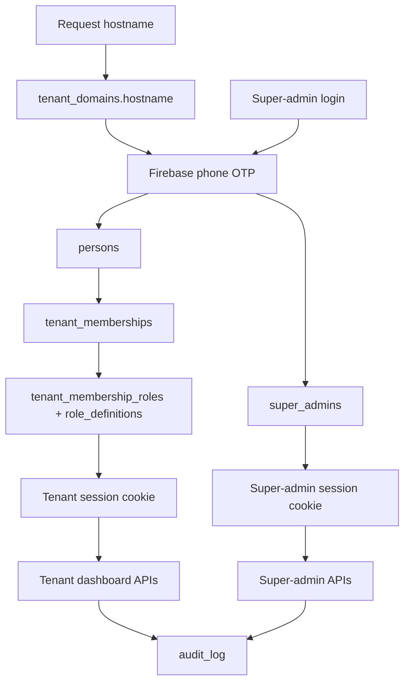
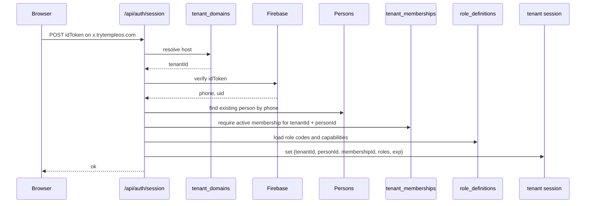

# Architecture Spine - TempleOS Logic Update

## Inherited Invariants

This spine inherits the super-admin panel spine as read-only context. The binding parent decisions are:

| Parent AD | Inherited rule |
| --- | --- |
| AD-1 | Super-admins are separate from tenant members. |
| AD-2 | Provisioning has one canonical mutation path. |
| AD-3 | Tenant identity is server-derived except in super-admin routes. |
| AD-6 | Privileged writes must use one shared `audit_log`. |
| AD-8 | Super-admin identity is phone OTP with no V0 super-admin role hierarchy. |
| AD-12 | Person identity is global; membership and roles are tenant-scoped. |
| AD-13 | Role definitions are platform-governed; assignments are tenant-governed. |
| AD-14 | Temple-owned login resolves tenant by subdomain. |
| AD-15 | Devotee profile is tenant-specific and may attach to a global person. |
| AD-16 | Clean DB reset starts from the forward schema; `admin_users` is not an auth source. |
| AD-17 | `persons` are created through provisioning, login, and explicit member management. |
| AD-18 | V0 role seeds and capabilities are fixed. |
| AD-19 | `tenant_domains.hostname` stores full normalized hosts like `x.trytempleos.com`. |

## Current Checkout Breakpoints

The code currently works around a pilot model:

- `app/api/auth/session/route.ts` verifies Firebase phone and looks up `admin_users`.
- `lib/auth/session.ts` creates one `templeos_session` containing `{ adminId, tenantId, phoneNumber, displayName, exp }`.
- `requireSuperAdmin()` checks `admin_users.role = 'super_admin'`, but that is still tenant-local data.
- Dashboard and API routes call `getSessionAdmin()` and trust `session.tenantId`.
- `app/api/events/route.ts` writes `createdBy: session.adminId`.
- `app/api/donations/route.ts` writes `recordedBy: session.adminId`.
- `scripts/seed*.mts` use `getPilotTenant()` and attach users/WhatsApp to the first seeded tenant.
- `scripts/migrate.mts` is append-only against `schema_migrations`; a clean reset requires replacing the migration set or dropping/recreating the database before applying the forward schema.
- `package.json` does not currently pin a Node runtime, while current dependencies require a modern Node runtime.

## Design Paradigm

Host-resolved tenant application with separate platform control plane. Tenant-facing routes first resolve the request host to a tenant domain, then authenticate a person and membership inside that tenant. Super-admin routes do not run through tenant host resolution; they authenticate against the platform `super_admins` table and may operate across tenants through explicit super-admin APIs.



## Invariants & Rules

### AD-1 - Session surfaces are split by product surface [ADOPTED]

- **Binds:** login routes, cookie names, auth helpers, layouts, API guards
- **Prevents:** a tenant member session being accepted as platform access, or a super-admin session being treated as tenant context.
- **Rule:** Replace the single `lib/auth/session.ts` model with separate tenant and super-admin session modules. Tenant sessions use a cookie such as `templeos_tenant_session` and carry `{ tenantId, personId, membershipId, roles, exp }`. Super-admin sessions use a cookie such as `templeos_super_admin_session` and carry `{ superAdminId, phoneNumber, displayName, exp }`. No route guard may accept both payload types implicitly.

### AD-2 - Tenant login and tenant guards are host-resolved [ADOPTED]

- **Binds:** `app/api/auth/session/route.ts`, middleware/hostname helpers, tenant login page, local development overrides
- **Prevents:** a phone number login creating a session without knowing which temple the user is entering, or a Tenant A cookie being used on Tenant B's host.
- **Rule:** One trusted-host helper owns host extraction, port stripping, lowercase normalization, reserved apex rejection, preview/local override handling, and production override blocking. Tenant session creation resolves the trusted request host through `tenant_domains.hostname` before reading membership roles. Every protected tenant route re-resolves the current request host and requires `resolvedTenantId === session.tenantId`. Apex hosts such as `trytempleos.com` and `www.trytempleos.com` do not create or accept tenant sessions.

### AD-3 - Tenant auth exchange uses person plus active membership

- **Binds:** Firebase verification, person repository, membership repository, role repository, session payload
- **Prevents:** global identity or devotee identity being mistaken for dashboard authorization.
- **Rule:** Tenant login flow is Firebase ID token -> normalized phone -> find existing `persons` row -> require active `tenant_memberships` row for resolved `tenant_id` -> load active role codes -> require at least one role with dashboard access -> set tenant session. Tenant login must not create unaffiliated `persons` rows for failed membership checks. Person creation happens through provisioning, tenant member management, or super-admin bootstrap. `devotees.person_id` is never sufficient for dashboard access.

### AD-4 - Super-admin auth exchange is separate

- **Binds:** super-admin login route, super-admin session helper, super-admin API wrapper
- **Prevents:** tenant-admin role assignments escalating to platform-wide control.
- **Rule:** Super-admin login flow is Firebase ID token -> normalized phone -> active `super_admins` row -> set super-admin session. Super-admin APIs must call `requireSuperAdminSession()` and re-read active super-admin state before privileged writes.

### AD-5 - Authorization checks use capabilities, not scattered role strings

- **Binds:** tenant API guards, member management, route layouts, future role mapping
- **Prevents:** different routes assigning their own meaning to `admin`, `priest`, or `committee_member`.
- **Rule:** Route code checks capabilities through helpers such as `requireTenantCapability("dashboard.access")` and `requireTenantCapability("members.manage")`. `role_definitions.capability_set` is a JSON text array of capability codes. V0 seeds `admin = ["dashboard.access", "members.manage"]`; `priest`, `committee_member`, `volunteer`, and `devotee` seed with no dashboard capability unless a later story adds a specific workflow capability. Tenant-admins with `members.manage` may assign any active V0 tenant role, including `admin`, inside their tenant. Raw role-code checks are limited to role management UI display and tests of the capability resolver.

### AD-6 - Tenant APIs derive tenant identity only from tenant session

- **Binds:** existing dashboard APIs, tenant-scoped repositories, server components
- **Prevents:** client-supplied tenant IDs leaking data across temples.
- **Rule:** Existing tenant routes keep their tenant-safety pattern: no client `tenantId` is accepted. The implementation changes `getSessionAdmin()` call sites to tenant-session helpers, then passes `session.tenantId` to repositories. Only super-admin routes may accept explicit tenant IDs.

### AD-7 - Admin management becomes tenant member management

- **Binds:** `app/api/admins`, `app/(dashboard)/dashboard/admins`, tenant-admin UI, super-admin tenant member UI, membership repositories
- **Prevents:** continuing to model temple admins as a special `admin_users` table after the reset.
- **Rule:** Replace admin CRUD routes with member and role routes. Tenant-admins with `members.manage` may create/reuse a person by phone, create or reactivate the tenant membership, and assign allowed tenant roles inside `session.tenantId`. Super-admins may manage any tenant's members and roles only through super-admin routes that require explicit `tenant_id` and audit logging. These routes call the shared membership mutation service; route handlers do not orchestrate person, membership, role, and audit writes directly. Tenant-admins cannot create tenants, manage super-admins, assign platform-only capabilities, or mutate another tenant.

### AD-8 - Authored tenant records use membership context

- **Binds:** events, donations, content changes, future audit displays
- **Prevents:** losing which temple context a multi-temple person used when they performed an action.
- **Rule:** The forward schema physically uses nullable FKs to `tenant_memberships(id)` for authored tenant records: `events.created_by_membership_id` and `donations.recorded_by_membership_id`, with matching TypeScript names `createdByMembershipId` and `recordedByMembershipId`. Repositories that accept actor membership IDs must assert the actor membership belongs to the same `tenant_id` as the record. Use nullable actor fields for system/provider writes such as WhatsApp webhook actions.

### AD-9 - Devotees remain tenant profiles, not authorization principals

- **Binds:** devotee repository, WhatsApp webhook, website login, member linking
- **Prevents:** a devotee relationship in one temple being treated as a role or dashboard permission in another temple.
- **Rule:** Devotee rows stay keyed by `tenant_id` and phone. When a matching person exists, `devotees.person_id` may be linked, but role checks must still go through tenant membership plus assigned role definitions.

### AD-10 - Provisioning scripts become explicit control-plane wrappers

- **Binds:** `scripts/seed*.mts`, `lib/db/tenants.ts`, reset seed flow, local demo setup
- **Prevents:** multiple temples attaching to the oldest tenant through `getPilotTenant()`.
- **Rule:** Remove production use of `getPilotTenant()` from provisioning. Add explicit scripts such as `seed-super-admin.mts`, `provision-temple.mts`, and optionally `seed-demo.mts` that call the canonical provisioning service. The only permitted pilot/default tenant helper is a local demo-only command clearly named as such.

### AD-11 - Audit writes are transactional for privileged mutations

- **Binds:** super-admin provisioning, tenant member role changes, WhatsApp linkage, role catalog changes
- **Prevents:** role/provisioning state changing without a durable privileged-action trail.
- **Rule:** Privileged mutations write to `audit_log` in the same transaction as the state change. If the audit insert fails, the privileged mutation fails. `actor_type` values are `super_admin`, `tenant_membership`, `system`, and `provider`; `actor_id` is nullable only for `system` or `provider`; `tenant_id` is nullable only for global platform actions such as role catalog changes. Ordinary tenant content changes may add audit later, but member/role/provisioning changes are fail-closed from V0.

### AD-12 - Repository names reveal scope

- **Binds:** new `lib/db` modules and refactored existing repositories
- **Prevents:** global lookup helpers being accidentally reused in tenant-local paths.
- **Rule:** Tenant-owned repository functions take `tenantId` and use names like `listTenantMembers`, `getTenantMembershipByPerson`, and `assignTenantMembershipRoles`. Global lookup names must say what makes them global, such as `findPersonByPhone`, `getTenantByHostname`, and `findSuperAdminByPhone`.

### AD-13 - Tenant authorization is live-checked from membership state

- **Binds:** tenant session helper, capability guard, role assignment changes, membership deactivation
- **Prevents:** removed roles or deactivated memberships retaining access until a long-lived cookie expires.
- **Rule:** Tenant session cookies may carry role codes as display/cache hints, but authorization guards must re-read active `tenant_memberships`, active `tenant_membership_roles`, and active `role_definitions.capability_set` before granting protected tenant access. Role removal, role-definition deactivation, or membership deactivation takes effect on the next guarded request.

### AD-14 - Membership and role table contracts are canonical

- **Binds:** reset schema, `types/db.ts`, membership repository, auth exchange, member management UI
- **Prevents:** schema, auth, and route code disagreeing on uniqueness, active state, role keys, or phone identity.
- **Rule:** `persons.phone_number` is globally unique and normalized to E.164. `tenant_memberships` is unique on `(tenant_id, person_id)` and uses `status IN ('active', 'inactive')` for membership access state. Tenant display name lives on `tenant_memberships.display_name`; global display name lives on `persons.display_name`. `tenant_membership_roles` references `role_definitions(id)` through `role_definition_id`; role codes are loaded by joining to `role_definitions.code`. Deactivation does not create a second membership row for the same person and tenant.

### AD-15 - Shared member mutation service owns person, membership, role, and audit writes

- **Binds:** provisioning service, tenant member routes, super-admin tenant member routes, scripts
- **Prevents:** first-admin provisioning and tenant-local member management implementing different duplicate, reactivation, phone normalization, role assignment, or audit semantics.
- **Rule:** A shared service such as `lib/memberships/service.ts` owns `ensureTenantMember`, `reactivateTenantMember`, and `setTenantMemberRoles`. `lib/provisioning/temples.ts`, super-admin member APIs, tenant member APIs, and CLI scripts call that service for person reuse, membership creation/reactivation, role assignment, and audit writes.

### AD-16 - Clean reset is an explicit migration-runner cutover

- **Binds:** migrations, reset commands, implementation order, local and production database setup
- **Prevents:** `npm run migrate` applying legacy migrations and producing a schema that cannot run the new logic.
- **Rule:** Because the project accepts a DB reset, implementation replaces the legacy migration set with forward-schema migrations or adds an explicit reset command that drops/recreates the database before applying the forward schema. The migration runner must not leave a path where ordinary setup creates `admin_users` as an auth source.

### AD-17 - Runtime floor is pinned for deployment

- **Binds:** Railway deploy, Firebase Admin verification, Next.js runtime, package metadata
- **Prevents:** a correct implementation failing in deployment on an unsupported Node version.
- **Rule:** The implementation pins Node `>=22` in repo configuration, such as `package.json engines.node`, because current Firebase Admin requires Node 22 or newer and Next.js 16 supports the modern runtime.

## Structural Seed

The following is planned target structure, not current checkout structure.

```text
lib/
  auth/
    tenant-session.ts          # tenant cookie, token, requireTenantSession
    super-admin-session.ts     # super-admin cookie, token, requireSuperAdminSession
    tenant-resolution.ts       # request host -> tenant_domains lookup
    capabilities.ts            # role codes -> capability checks
  db/
    persons.ts
    super-admins.ts
    tenant-domains.ts
    role-definitions.ts
    tenant-memberships.ts
    audit-log.ts
    tenants.ts                 # remove production getPilotTenant usage
  provisioning/
    temples.ts                 # canonical tenant + domain + first member + WhatsApp transaction
app/
  api/
    auth/session/route.ts      # tenant session exchange, host-resolved
    super-admin/auth/session/route.ts
    members/route.ts
    members/[membershipId]/roles/route.ts
    super-admin/temples/route.ts
scripts/
  seed-super-admin.mts
  provision-temple.mts
  seed-demo.mts                # optional, explicit local demo path only
```

Minimum planned identity/auth table contract:

```sql
persons(
  id,
  phone_number UNIQUE NOT NULL,
  display_name,
  firebase_uid,
  created_at,
  updated_at
)

tenant_memberships(
  id,
  tenant_id NOT NULL,
  person_id NOT NULL,
  display_name NOT NULL,
  status CHECK (status IN ('active', 'inactive')),
  created_at,
  updated_at,
  UNIQUE(tenant_id, person_id)
)

role_definitions(
  id,
  code UNIQUE NOT NULL,
  display_name NOT NULL,
  capability_set JSONB NOT NULL, -- array of capability strings
  active BOOLEAN NOT NULL
)

tenant_membership_roles(
  membership_id REFERENCES tenant_memberships(id),
  role_definition_id REFERENCES role_definitions(id),
  assigned_by_membership_id NULL REFERENCES tenant_memberships(id),
  assigned_by_super_admin_id NULL REFERENCES super_admins(id),
  assigned_at,
  PRIMARY KEY (membership_id, role_definition_id)
)
```



## Refactor Map

| Current code | Target logic |
| --- | --- |
| `lib/auth/session.ts` | Split into `tenant-session.ts`, `super-admin-session.ts`, and shared signing utility if needed. |
| `app/api/auth/session/route.ts` | Tenant host-resolved login: Firebase phone -> person -> active membership -> tenant session. |
| `requireSuperAdmin()` | Move to `super-admin-session.ts` and back it with `super_admins`, not `admin_users`. |
| `lib/db/admin-users.ts` | Retire after reset; replace with persons, memberships, roles, and super-admin repos. |
| `app/api/admins/*` | Replace with `app/api/members/*` tenant-local member and role assignment routes. |
| `session.adminId` | Replace with `session.membershipId` in tenant-authored paths. |
| `events.created_by` | Forward schema uses `events.created_by_membership_id`. |
| `donations.recorded_by` | Forward schema uses `donations.recorded_by_membership_id`. |
| `scripts/seed-admin.mts` | Replace with `seed-super-admin.mts` and `provision-temple.mts`. |
| `getPilotTenant()` | Remove from production provisioning paths; keep only explicit demo seed if needed. |

## Legacy Reset Mapping

The accepted path is clean reset, so no data migration is required. If local pilot data is preserved manually before reset, use this mapping:

| Legacy row | Forward target |
| --- | --- |
| `admin_users.role = 'super_admin'` | Create `super_admins` row for platform access and, if the person should also manage a temple, create a tenant membership with `admin`. |
| `admin_users.role = 'admin'` | Create `persons` row, `tenant_memberships` row for that tenant, and assign role `admin`. |
| `admin_users.tenant_id` | Becomes membership tenant context, not platform-admin scope. |
| `admin_users.firebase_uid` | Copy to `super_admins.firebase_uid` or `persons.firebase_uid` according to the target identity. |

## Deferred

| Deferred decision | Why it can wait |
| --- | --- |
| Generic tenant picker on `trytempleos.com` | V0 uses subdomains to know temple context. |
| Custom domains | V0 stores `x.trytempleos.com`; custom-domain verification can be added later. |
| Tenant-local custom role definitions | V0 uses platform-governed role definitions and tenant-local assignments. |
| Super-admin role hierarchy | V0 super-admins are all equal. |
| Impersonation | High-risk support feature requiring separate visible UI and audit rules. |
| Full audit for every content update | V0 fail-closes only privileged provisioning/member/role mutations. |
