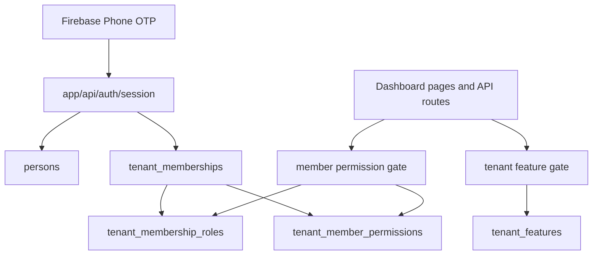
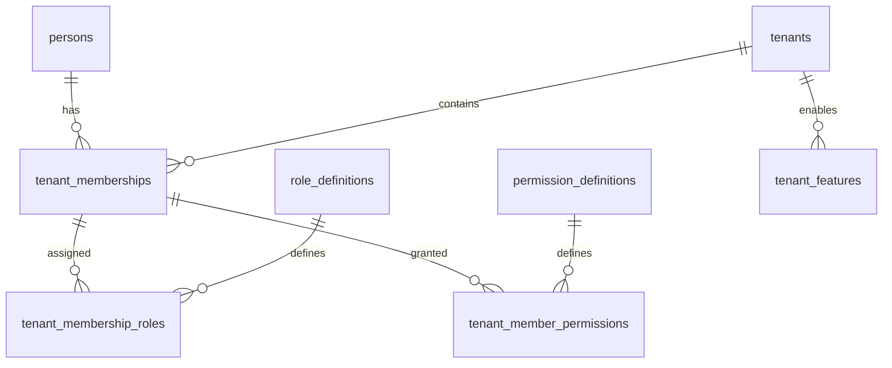

# Architecture Spine - TempleOS Staff Access Control

## Design Paradigm

Use policy-based authorization layered over the existing tenant membership model.



## Invariants & Rules

### AD-1 - Staff Accounts Stay Tenant Memberships [ADOPTED]

- **Binds:** tenant login, users, role assignment
- **Prevents:** rebuilding parallel account tables for priests or committee members.
- **Rule:** Priests, committee members, volunteers, and admins are all `persons` with active `tenant_memberships`; login continues through Firebase phone identity, tenant host resolution, and active membership lookup.

### AD-2 - Roles Describe Responsibility, Permissions Grant Access

- **Binds:** users, role assignment, permissions, dashboard gating
- **Prevents:** encoding every custom access combination as a new role.
- **Rule:** `role_definitions` and `tenant_membership_roles` remain coarse responsibility labels. Fine-grained dashboard access is stored separately as per-membership permission assignments.

### AD-2a - Permission Assignments Are Tenant-Scoped

- **Binds:** permission storage, permission mutation, permission reads
- **Prevents:** granting a permission to a membership without a database-enforced tenant boundary.
- **Rule:** Permission assignment rows carry both `tenant_id` and `membership_id`, and reference `tenant_memberships(id, tenant_id)` so cross-tenant permission grants are structurally impossible.

### AD-3 - Tenant Admin Owns Access Control

- **Binds:** user management pages, user management APIs, permission mutation
- **Prevents:** priests or committee members escalating their own access or granting peers access.
- **Rule:** Only an active tenant member with the `admin` role may invite members, change roles, assign permissions, disable/reactivate members, import users, export users, or view audit activity for users.

### AD-4 - Admin Has Implicit Full Tenant Authority

- **Binds:** permission checks, last-admin guard, migration strategy
- **Prevents:** accidentally locking every existing admin out until explicit permission rows are backfilled.
- **Rule:** For V1, `admin` implies all tenant permissions. Non-admin roles require explicit permissions.

### AD-5 - Feature Flags and Permissions Are Separate Gates

- **Binds:** dashboard modules, API routes
- **Prevents:** a member using a disabled tenant module or a feature-enabled tenant exposing a module to every member.
- **Rule:** `tenant_features` decides whether a module exists for the temple; member permissions decide whether the logged-in member may view or mutate that module.

### AD-6 - Effective Permissions Are Read Server-Side

- **Binds:** session payload, auth helpers, permission changes
- **Prevents:** stale cookies continuing to authorize a member after an admin revokes access.
- **Rule:** Keep the session token to identity, membership, and role codes. Load effective permissions from Postgres in server guards instead of embedding them in the signed cookie.

### AD-7 - Every Protected Surface Uses a Named Permission

- **Binds:** pages, route handlers, nav rendering, tests
- **Prevents:** ad hoc `roles.includes(...)` checks spreading across the app.
- **Rule:** Replace direct admin-only checks on feature surfaces with helpers such as `requireTenantPermission(session, "donations.view")` and `requireTenantPermissionApi(session, "donations.manage")`.

### AD-8 - Role Defaults Preselect Common Permissions

- **Binds:** user invite UI, user edit UI, permission assignment
- **Prevents:** temple admins having to build every priest or committee account from a blank permission slate.
- **Rule:** Selecting a role in user management auto-checks the common default permissions for that role; the temple admin can add or remove permissions before saving.

## Consistency Conventions

| Concern | Convention |
| --- | --- |
| Permission names | Lowercase dot keys: `<module>.<action>`, for example `donations.view` and `devotees.manage`. |
| Role names | Keep current role codes: `admin`, `priest`, `committee_member`, `volunteer`, `devotee`; do not create role variants like `donations_committee_member`. |
| Data ownership | `tenant_memberships` owns staff membership; `tenant_member_permissions` owns explicit staff access; `tenant_features` owns module availability. |
| Guards | Page guards redirect unauthenticated users to `/login`; forbidden permissions render `forbidden()` or `notFound()` according to current route pattern; API guards return stable JSON codes. |
| Mutations | Permission and role mutations go through `lib/provisioning/tenant-members.ts` and write `audit_log` entries. |
| Audit actions | Use explicit action names: `tenant_member.permissions_changed`, `tenant_member.invited`, `tenant_member.roles_changed`, `tenant_member.disabled`. |

## Stack

| Name | Version |
| --- | --- |
| Node.js | 24.x |
| Next.js | 16.2.10 |
| React | 19.2.4 |
| TypeScript | 5.x |
| PostgreSQL client | pg 8.22.0 |
| Firebase Admin | 14.2.0 |
| Firebase Web SDK | 12.16.0 |
| Zod | 4.4.3 |
| Vitest | 4.1.10 |

## Structural Seed

```text
lib/auth/
  session.ts              # identity/session validation; keep cookie payload lean
  tenant-member.ts        # new general tenant member auth result, no admin requirement
  permissions.ts          # new permission catalog and page/API guard helpers
  tenant-admin.ts         # admin-only management guard remains for access-control mutation

lib/db/
  tenant-memberships.ts   # extend membership reads with permission loading helpers
  tenant-permissions.ts   # new explicit permission query and replacement helpers

lib/provisioning/
  tenant-members.ts       # invite/change role/change permission transactions and audit logging

app/(dashboard)/dashboard/
  require-dashboard-member.ts  # new login-only dashboard guard
  require-dashboard-admin.ts   # keep for admin-only user-management surfaces

app/api/users/
  route.ts
  [membershipId]/roles/route.ts
  [membershipId]/permissions/route.ts
```



### Database Seed

Add:

```sql
CREATE TABLE permission_definitions (
  key TEXT PRIMARY KEY,
  display_name TEXT NOT NULL,
  description TEXT,
  feature_key TEXT REFERENCES features(key) ON DELETE SET NULL,
  sort_order INT NOT NULL DEFAULT 0,
  active BOOLEAN NOT NULL DEFAULT true,
  created_at TIMESTAMPTZ NOT NULL DEFAULT now(),
  updated_at TIMESTAMPTZ NOT NULL DEFAULT now()
);

CREATE TABLE tenant_member_permissions (
  tenant_id UUID NOT NULL REFERENCES tenants(id) ON DELETE CASCADE,
  membership_id UUID NOT NULL REFERENCES tenant_memberships(id) ON DELETE CASCADE,
  permission_key TEXT NOT NULL REFERENCES permission_definitions(key) ON DELETE CASCADE,
  granted_by_membership_id UUID REFERENCES tenant_memberships(id) ON DELETE SET NULL,
  granted_at TIMESTAMPTZ NOT NULL DEFAULT now(),
  PRIMARY KEY (tenant_id, membership_id, permission_key),
  FOREIGN KEY (membership_id, tenant_id) REFERENCES tenant_memberships(id, tenant_id) ON DELETE CASCADE
);
CREATE INDEX idx_tenant_member_permissions_tenant ON tenant_member_permissions(tenant_id);
```

Seed permission keys:

| Permission | Meaning | Feature gate |
| --- | --- | --- |
| `dashboard.view` | Enter dashboard shell/home. | `dashboard` |
| `events.view` | View events. | `events` |
| `events.manage` | Create, update, announce, cancel, export events. | `events` |
| `devotees.view` | View devotee/family records. | `devotees` |
| `devotees.manage` | Create, edit, import, deactivate, export devotees/families. | `devotees` |
| `donations.view` | View donations and summaries. | `donations` |
| `donations.manage` | Create, update, delete, export donations; manage payment account. | `donations` |
| `campaigns.view` | View campaigns and analytics. | `campaigns` |
| `campaigns.manage` | Create, edit, duplicate, schedule, send campaigns. | `campaigns` |
| `whatsapp.manage` | Connect/disconnect WhatsApp and manage message templates/chatbot settings. | `whatsapp_chatbot` |
| `notifications.manage` | Manage notification preferences and media sends. | `notifications` |
| `settings.manage` | Edit temple profile, sevas, social links, special days. | `dashboard` |
| `users.manage` | Invite, import/export, edit, role-change, permission-change, status-change users. | `user_management` |
| `audit.view` | View audit/activity logs. | `user_management` |

## Capability To Architecture Map

| Capability / Area | Lives in | Governed by |
| --- | --- | --- |
| Priest login | `app/api/auth/session/route.ts`, `lib/auth/session.ts` | AD-1, AD-6 |
| Committee member login | `app/api/auth/session/route.ts`, `lib/auth/session.ts` | AD-1, AD-6 |
| Create many staff accounts | `app/api/users/route.ts`, `lib/provisioning/tenant-members.ts` | AD-1, AD-3 |
| Define role/responsibility | `role_definitions`, `tenant_membership_roles`, users UI | AD-2 |
| Assign per-member access | `tenant_member_permissions`, `app/api/users/[membershipId]/permissions/route.ts` | AD-2, AD-3 |
| Gate donations | donations pages and APIs | AD-5, AD-7 |
| Gate devotees | devotees pages and APIs | AD-5, AD-7 |
| Gate user management | users pages and APIs | AD-3, AD-7 |
| Hide inaccessible nav | dashboard shell/nav component | AD-5, AD-7 |

## Implementation Plan

1. **Auth foundation:** add `requireTenantMemberSession()` for logged-in active tenant members without requiring `admin`; keep `requireTenantAdminSession()` for access-control mutation.
2. **Permission catalog:** add `permission_definitions` and `tenant_member_permissions` migration, TypeScript permission-key union, seed data, and DB read/replace helpers.
3. **Effective permission helper:** add `getEffectiveTenantPermissions(session)` with admin implicit full access and explicit permissions for non-admins.
4. **Guard helpers:** add page/API helpers for required permissions and module feature gates; preserve current response style.
5. **Dashboard shell:** change the dashboard layout from admin-only to member login plus `dashboard.view`/admin; render navigation from effective permissions.
6. **Users UI:** extend invite/edit member flows to show role labels and permission checkboxes; restrict this screen to `admin` only.
7. **Route migration:** replace coarse `requireTenantAdminSession()` on module routes with member-session plus specific permission checks, leaving user-management/admin settings admin-only where appropriate.
8. **Audit and tests:** audit-log permission changes; add tests for priest-only access, committee donations-only access, admin full access, revoked access, disabled feature plus granted permission, and last-admin protection.

## Suggested V1 Permission Defaults

| Role selected during invite | Default permissions |
| --- | --- |
| `admin` | Full tenant authority, implicit. |
| `committee_member` | `dashboard.view`, `donations.view`, `devotees.view`, `events.view`; temple admin adjusts as needed. |
| `priest` | `dashboard.view`, `events.view`; add future priest schedule/seva permissions once those modules exist. |
| `volunteer` | None by default. |

## Deferred

- Whether `view` permission implies export. V1 should treat export as `manage` unless the product wants separate data-export controls.
- Whether priests need a separate first-class priest operations module. Current repo only has coming-soon `priests`; this spine only unlocks login and gated dashboard access.
- Whether permission assignments should support deny overrides. V1 should avoid deny rules; absence of a grant means no access.
