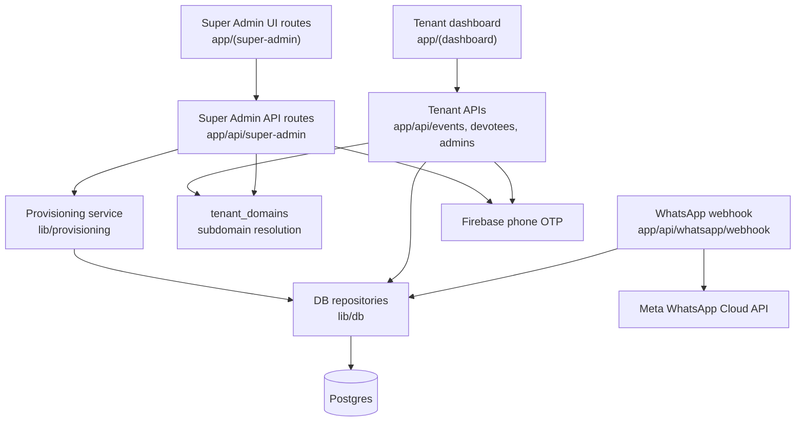
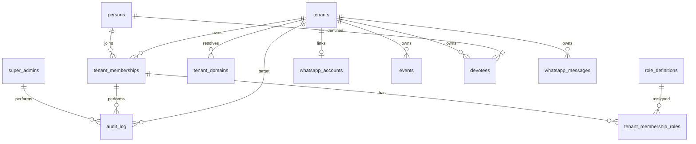
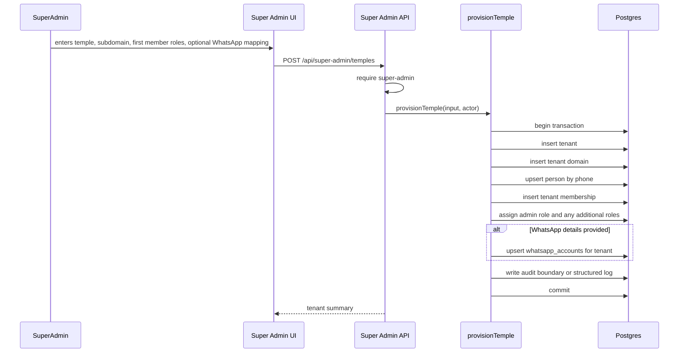

# Architecture Spine - TempleOS Super Admin Panel

## Clean-Start Baseline

The database will be reset for this slice. The target schema starts directly with `super_admins`, `persons`, `tenant_memberships`, `tenant_membership_roles`, `role_definitions`, and `tenant_domains`. The old pilot `admin_users` and `getPilotTenant()` paths are historical checkout context only, not migration constraints.

## Design Paradigm

Layered super-admin-control-plane extension to the existing Next.js app. The diagram below is target architecture for this slice, not current implemented structure.



Super-admin routes may create and configure tenants, role definitions, and tenant memberships. Temple-owned login resolves the tenant from the request subdomain before membership authorization. Tenant dashboard routes remain scoped to the tenant in the signed session. WhatsApp webhooks remain scoped by Meta `phone_number_id`.

## Invariants & Rules

### AD-1 - Super-admins are separate from tenant members [ADOPTED]

- **Binds:** super-admin auth, tenant member auth, role management, member management, provisioning
- **Prevents:** a tenant-local admin role becoming accidental cross-tenant root access.
- **Rule:** Cross-tenant actions require super-admin authorization from `super_admins`, outside tenant membership tables, using super-admin session helpers and cookie names distinct from tenant dashboard sessions. Tenant-admin capabilities may manage members and roles only inside `session.tenantId`.

### AD-2 - Provisioning has one canonical mutation path

- **Binds:** tenant creation, first tenant admin membership creation, role assignment, WhatsApp account linking, CLI provisioning, super-admin UI provisioning
- **Prevents:** CLI and UI flows creating different tenant shapes or leaving partial tenant setup.
- **Rule:** `lib/provisioning/temples.ts` owns every super-admin mutation that crosses tenant/person/membership/role/WhatsApp boundaries. It exposes `provisionTemple`, `updateProvisionedTemple`, `assignTenantMemberRoles`, and `linkTempleWhatsAppAccount`. Super Admin UI routes and CLI commands must call those service functions, not multi-table repository sequences.

### AD-3 - Tenant identity is server-derived except in super-admin routes [ADOPTED]

- **Binds:** tenant dashboard APIs, super-admin APIs, WhatsApp webhook, session handling
- **Prevents:** client-supplied tenant selectors leaking or mutating another tenant's data.
- **Rule:** Tenant dashboard APIs derive `tenant_id` only from the resolved tenant session. WhatsApp webhooks derive `tenant_id` only from `whatsapp_accounts.meta_phone_number_id`. Only super-admin-authorized APIs may accept an explicit tenant ID, and those routes must call a super-admin authorization wrapper before reading or mutating tenant detail.

### AD-4 - Pilot-only lookup must not provision production tenants

- **Binds:** `getPilotTenant`, `seed`, `seed:admin`, `seed:whatsapp`, new provision commands
- **Prevents:** new temples silently attaching admins or WhatsApp numbers to the oldest tenant.
- **Rule:** New production provisioning commands must require an explicit tenant target or create a tenant in the canonical provisioning service. `getPilotTenant()` may remain only for local demo bootstrap until retired.

### AD-5 - Super Admin panel is not self-serve onboarding

- **Binds:** super-admin UI scope, WhatsApp setup, tenant lifecycle
- **Prevents:** the provisioning panel turning into public signup, billing, tenant approval, or WhatsApp embedded onboarding.
- **Rule:** This slice supports super-admin create/list/view/update and manual WhatsApp account linkage only. Public signup, billing, approval queues, tenant switching, Meta embedded signup, webhook auto-registration, and template approval workflows are deferred.

### AD-6 - Privileged writes must use one audit log

- **Binds:** super-admin APIs, provisioning service, future audit tables, logs
- **Prevents:** untraceable creation or modification of temple tenants, privileged users, and tenant member roles.
- **Rule:** Use one durable `audit_log` table for privileged actions. Each entry records `actor_type`, `actor_id`, `tenant_id`, `action`, `target_type`, `target_id`, timestamp, and metadata. Super-admin writes and tenant-admin member/role writes both use this table.

### AD-7 - Destructive tenant lifecycle actions are out of scope

- **Binds:** super-admin UI, super-admin APIs, tenant data lifecycle
- **Prevents:** accidental production data loss or ambiguous temple ownership transfer.
- **Rule:** Super Admin UI starts without tenant deletion, tenant transfer, impersonation, or data export. Those actions require a later architecture decision with explicit safety rules.

### AD-8 - Super-admin identity is phone-OTP with no V0 super-admin role hierarchy

- **Binds:** super-admin login, first super-admin bootstrap, super-admin sessions, super-admin audit
- **Prevents:** incompatible super-admin auth implementations such as env-only actors, tenant-admin reuse, or premature super-admin role trees.
- **Rule:** Super-admins authenticate with Firebase phone OTP against `super_admins.phone_number`. V0 super-admins are all equal. The first super-admin is bootstrapped by an explicit CLI command or reset-time seed. Super-admin session payload is `{ superAdminId, phoneNumber, displayName, exp }` and uses a cookie name distinct from tenant sessions.

### AD-9 - Provisioning DTOs are canonical service contracts

- **Binds:** super-admin UI forms, super-admin APIs, CLI, provisioning service, tests
- **Prevents:** UI-shaped `temple` payloads and domain-shaped `tenant` payloads drifting apart.
- **Rule:** API and CLI inputs map into canonical TypeScript service DTOs before mutation. Service DTOs use domain names: `tenant`, `domain`, `firstMember`, `roles`, `whatsappAccount`. `firstMember.roles` must include `admin` during provisioning.

```ts
interface ProvisionTempleInput {
  tenant: {
    name: string;
    slug: string;
    defaultContactPhone?: string | null;
    address?: string | null;
    timezone: string;
  };
  domain: {
    subdomain: string;
  };
  firstMember: {
    phoneNumber: string;
    displayName: string;
    roles: Array<RoleCode>;
  };
  whatsappAccount?: LinkWhatsAppAccountInput;
}

type RoleCode = "admin" | "priest" | "committee_member" | "volunteer" | "devotee";

interface LinkWhatsAppAccountInput {
  phoneNumber: string;
  metaPhoneNumberId: string;
  metaBusinessAccountId: string;
}

interface UpdateProvisionedTempleInput {
  tenantId: string;
  tenant: Partial<{
    name: string;
    defaultContactPhone: string | null;
    address: string | null;
    timezone: string;
  }>;
}

interface ProvisionTempleResult {
  tenant: Tenant;
  domain: TenantDomain;
  firstMember: TenantMembership;
  roles: Array<RoleCode>;
  whatsappAccount: WhatsAppAccount | null;
}

interface SuperAdminTenantSummary {
  tenant: Tenant;
  domain: TenantDomain | null;
  admins: Array<TenantMembership>;
  whatsappAccount: WhatsAppAccount | null;
}
```

### AD-10 - Repository scopes must be visible in function names and signatures

- **Binds:** `lib/db` repositories, tenant APIs, super-admin APIs, provisioning service
- **Prevents:** globally keyed repository helpers being reused in tenant-local paths without tenant authorization.
- **Rule:** Tenant-owned reads and writes include `tenantId` in the repository signature unless they are explicitly global lookup functions needed for login, subdomain resolution, or provider routing, such as `findPersonByPhone`, `getTenantByHostname`, and `getWhatsAppAccountByPhoneNumberId`. Super-admin-only cross-tenant reads use `listTenantsForSuperAdmin` / `getTenantDetailForSuperAdmin` style names and are not called from tenant dashboard APIs.

### AD-11 - WhatsApp account ownership is single-tenant and non-transferable in V0

- **Binds:** WhatsApp account repository, super-admin linkage, webhook tenant resolution, message history integrity
- **Prevents:** a Meta phone number being silently reassigned to another tenant while old message history still points at the former tenant.
- **Rule:** V0 enforces at most one WhatsApp account per tenant and one tenant per `meta_phone_number_id`. Manual linkage rejects reassignment of an existing `meta_phone_number_id` to a different tenant. Transfer/disconnect semantics are deferred and require explicit audit and message-history rules.

### AD-12 - Person identity is global; membership and roles are tenant-scoped

- **Binds:** login, role checks, member management, devotee identity, future multi-temple users
- **Prevents:** one human's role in Temple A leaking into Temple B, or duplicate people being created only because they belong to multiple temples.
- **Rule:** Phone/Firebase identity resolves to one global `person`. Temple-specific identity lives in `tenant_memberships`, and authorization is always evaluated as `person_id + tenant_id + role_code`. The same person may hold multiple roles in one tenant and different roles in different tenants.

### AD-13 - Role definitions are platform-governed; assignments are tenant-governed

- **Binds:** super-admin role provisioning, tenant-admin role provisioning, member management UI
- **Prevents:** each temple inventing incompatible meanings for core roles like `admin`, `priest`, `committee_member`, and `devotee`.
- **Rule:** Super-admins define and maintain global role definitions and capability mappings. Tenant admins with member-management capability may assign or remove allowed roles for members inside their own tenant only. Tenant-local custom roles are deferred until the core role model is proven.

### AD-14 - Temple-owned login resolves tenant by subdomain

- **Binds:** login, session creation, tenant domains, website-hosted auth, membership authorization
- **Prevents:** a phone login succeeding without knowing which temple context the user intended to enter.
- **Rule:** Temple-owned login starts by resolving request hostname through `tenant_domains`. Firebase phone OTP proves the person; the resolved subdomain proves the tenant context; `tenant_memberships` and `tenant_membership_roles` determine access. Generic `trytempleos.com` login with tenant picker is deferred.

### AD-15 - Devotee profile is tenant-specific and may attach to a global person

- **Binds:** devotees, WhatsApp auto-create, member management, future website login
- **Prevents:** a person's devotee data from one temple being treated as their role/profile in another temple.
- **Rule:** `devotees` remains a tenant-owned profile. When a phone number maps to a `person`, the tenant devotee profile may reference that `person_id`, but devotee fields such as opt-in status, last interaction, birth star, lineage, and temple-specific display name remain scoped to `tenant_id`.

### AD-16 - Clean DB reset starts from the forward schema

- **Binds:** schema reset, tenant login, session payload, authorship columns, repositories
- **Prevents:** old pilot tables and compatibility paths becoming accidental sources of truth after reset.
- **Rule:** The reset schema does not include `admin_users` as an auth source. Tenant login is membership-only from day one. Tenant sessions carry `{ tenantId, personId, membershipId, roles, exp }`. Author/user references in new tenant-owned tables point to `tenant_memberships` or `persons`, not legacy admin IDs.

### AD-17 - `persons` are created through provisioning, login, and explicit member management

- **Binds:** person creation, devotee linking, phone collisions, future login
- **Prevents:** builders creating different global person populations from WhatsApp-only devotees.
- **Rule:** Super-admin provisioning, tenant member management, and authenticated login create or reuse `persons` by normalized phone number. WhatsApp-only devotees do not require `persons` rows in V0. `devotees.person_id` is linked opportunistically when a matching normalized phone already has a person or when that devotee later logs in or is added as a member. A person may exist without a tenant membership only if they are a super-admin or have been explicitly provisioned for future membership.

### AD-18 - V0 role seeds and capabilities are fixed

- **Binds:** role seeds, role checks, member-management UI, tenant sessions
- **Prevents:** incompatible meanings for `devotee` or inconsistent admin capabilities.
- **Rule:** V0 seeds exactly these active role definitions: `admin` with dashboard access and member/role management inside the tenant; `priest` with priest identity and future priest workflow capability but no extra V0 dashboard permission by itself; `committee_member` with committee identity and future workflow capability but no extra V0 dashboard permission by itself; `volunteer` with volunteer identity and no V0 dashboard permission by itself; `devotee` as a tenant relationship marker, not automatically dashboard login permission. WhatsApp-only devotees do not automatically receive a `devotee` membership role in V0.

### AD-19 - Tenant domain stores full normalized hostnames

- **Binds:** subdomain provisioning, middleware/login resolution, local development, preview deploys
- **Prevents:** one builder storing slugs and another storing full hosts, causing login mismatches.
- **Rule:** `tenant_domains.hostname` stores the full normalized hostname, for example `svtemple.trytempleos.com`, lowercase with no scheme, path, query, or port. Slugs are validated separately for allowed characters and reserved names, then composed with `trytempleos.com` during provisioning. V0 tenant login accepts only active tenant subdomain hosts. Apex/generic hosts such as `trytempleos.com` and `www.trytempleos.com` do not create tenant sessions; super-admin login uses a separate super-admin route. Local development may use an environment-selected tenant host override, but that override must not run in production.

## Consistency Conventions

| Concern | Convention |
| --- | --- |
| Admin naming | Use `super-admin` for platform-wide administrators and `tenant-admin` for temple-scoped administrators. Do not use `operator` for product roles. |
| Tenant naming | Use `tenant` in code and database identifiers; user-facing copy may say `temple`. |
| Role naming | Use stable role codes: `admin`, `priest`, `committee_member`, `volunteer`, `devotee`. Display labels can vary by UI, but permission checks use codes. |
| Provisioning names | Use `provisionTemple` / `provision:temple` for the full tenant + subdomain + first member roles + optional WhatsApp setup. Use `createTenant` only for the lower-level tenant repository function. |
| Identity | Phone numbers are normalized before writes. `persons.phone_number` is globally unique; memberships and roles are tenant-scoped. |
| Sessions | Super-admin sessions and tenant sessions use separate helper modules, cookie names, and payload types. |
| Errors | Missing/invalid session returns `401`; authenticated but insufficient privilege returns `403`; validation errors return `400`; duplicate unique keys return `409`. |
| Transactions | Provisioning service owns transaction boundaries for multi-table setup. Individual repositories expose small data operations. |
| Logging | Super-admin mutation logs include `superAdminId`, `tenantId`, `action`, and stable target IDs where available. |
| Subdomains | Use normalized, unique tenant slugs for `*.trytempleos.com`; custom domains are deferred. |

## Stack

| Name | Version |
| --- | --- |
| Next.js | 16.2.10 |
| React | 19.2.4 |
| TypeScript | 5.9.3 lockfile-resolved |
| PostgreSQL driver `pg` | 8.22.0 |
| Firebase JS SDK | 12.16.0 |
| Firebase Admin SDK | 14.2.0 |
| Zod | 4.4.3 |
| Vitest | 4.1.10 |
| Railway app hosting | MVP target |
| Railway Postgres | MVP target |
| Meta WhatsApp Cloud API | manually configured provider |

## Structural Seed

The following files and tables are planned structure for this feature; they are not present in the current checkout yet.

```text
app/
  (super-admin)/
    super-admin/
      page.tsx                 # super-admin tenant list
      temples/
        new/page.tsx           # provision temple form
        [tenantId]/page.tsx    # super-admin view of one temple
  api/
    super-admin/
      temples/route.ts         # list/provision temples
      temples/[tenantId]/route.ts
      temples/[tenantId]/whatsapp/route.ts
lib/
  auth/
    super-admin-session.ts        # super-admin session verification
  db/
    super-admins.ts             # super-admin identity store
    persons.ts                 # global human identity
    tenant-domains.ts          # subdomain to tenant mapping
    role-definitions.ts        # platform-governed role catalog
    tenant-memberships.ts      # person-to-tenant membership and role assignment
    tenants.ts                 # create/list/get/update tenant repository
    whatsapp-accounts.ts       # tenant WhatsApp mapping repository
    audit-log.ts               # durable audit log for privileged actions
  provisioning/
    temples.ts                 # canonical provisionTemple transaction
scripts/
  provision-temple.mts         # CLI wrapper over provisionTemple
  seed-super-admin.mts         # first super-admin bootstrap
```



Minimum planned super-admin and identity tables:

```sql
super_admins(
  id,
  phone_number UNIQUE,
  display_name,
  firebase_uid,
  active,
  created_at,
  updated_at
)

persons(
  id,
  phone_number UNIQUE,
  display_name,
  firebase_uid,
  created_at,
  updated_at
)

tenant_domains(
  id,
  tenant_id,
  hostname UNIQUE,
  kind,
  status,
  created_at,
  updated_at
)

role_definitions(
  id,
  code UNIQUE,
  display_name,
  description,
  capability_set,
  active,
  created_at,
  updated_at
)

tenant_memberships(
  id,
  tenant_id,
  person_id,
  display_name,
  status,
  created_at,
  updated_at,
  UNIQUE(tenant_id, person_id)
)

tenant_membership_roles(
  membership_id,
  role_definition_id,
  assigned_by_membership_id,
  assigned_at,
  PRIMARY KEY(membership_id, role_definition_id)
)

devotees(
  id,
  tenant_id,
  person_id NULL,
  whatsapp_phone,
  display_name,
  temple_specific_profile_fields,
  whatsapp_opt_in_status,
  created_at,
  updated_at,
  UNIQUE(tenant_id, whatsapp_phone)
)

audit_log(
  id,
  actor_type,
  actor_id,
  tenant_id,
  action,
  target_type,
  target_id,
  metadata,
  created_at
)
```



## Capability -> Architecture Map

| Capability / Area | Lives in | Governed by |
| --- | --- | --- |
| List temples | `app/(super-admin)/super-admin`, `app/api/super-admin/temples`, `lib/db/tenants.ts` | AD-1, AD-3 |
| Provision temple | `app/api/super-admin/temples`, `lib/provisioning/temples.ts`, `scripts/provision-temple.mts` | AD-2, AD-4, AD-6, AD-9 |
| Create first tenant admin/member | `lib/provisioning/temples.ts`, `lib/db/persons.ts`, `lib/db/tenant-memberships.ts` | AD-1, AD-2, AD-12 |
| Define role catalog | `app/api/super-admin/roles`, `lib/db/role-definitions.ts` | AD-13 |
| Assign tenant member roles | `app/api/super-admin/temples/*`, tenant member APIs, `lib/db/tenant-memberships.ts` | AD-12, AD-13 |
| Resolve temple website login | middleware/auth route, `lib/db/tenant-domains.ts`, tenant session helpers | AD-3, AD-14 |
| Preserve devotee distinction across temples | `lib/db/devotees.ts`, `lib/db/persons.ts`, WhatsApp webhook | AD-12, AD-15 |
| Link WhatsApp account | `lib/provisioning/temples.ts`, `lib/db/whatsapp-accounts.ts` | AD-2, AD-3, AD-5 |
| Tenant-local member management | tenant member APIs, `lib/db/tenant-memberships.ts` | AD-1, AD-3, AD-12, AD-13 |
| WhatsApp tenant resolution | existing `app/api/whatsapp/webhook/route.ts`, `lib/db/whatsapp-accounts.ts` | AD-3, AD-5 |
| Privileged action auditability | `lib/db/audit-log.ts` | AD-6 |

## Deferred

| Deferred decision | Why it can wait |
| --- | --- |
| Tenant deletion and restore | Needs production data retention and human approval policy. |
| Tenant impersonation | High-risk support feature; requires audit, visible banners, and tenant consent rules. |
| Billing/subscriptions | Original MVP excluded it; provisioning can validate multi-temple setup without payment rails. |
| Self-serve temple signup and approval | Current need is super-admin provisioning, not public onboarding. |
| Meta embedded signup / WhatsApp connection wizard | Manual WhatsApp setup is already the accepted MVP path. |
| Tenant-local custom role definitions | Core platform-governed roles need to prove out first. |
| Custom domains | Subdomain login is the accepted V0 tenant resolution path. |
| Generic `trytempleos.com` tenant picker | Temple-owned subdomain login resolves tenant context without asking the user. |
