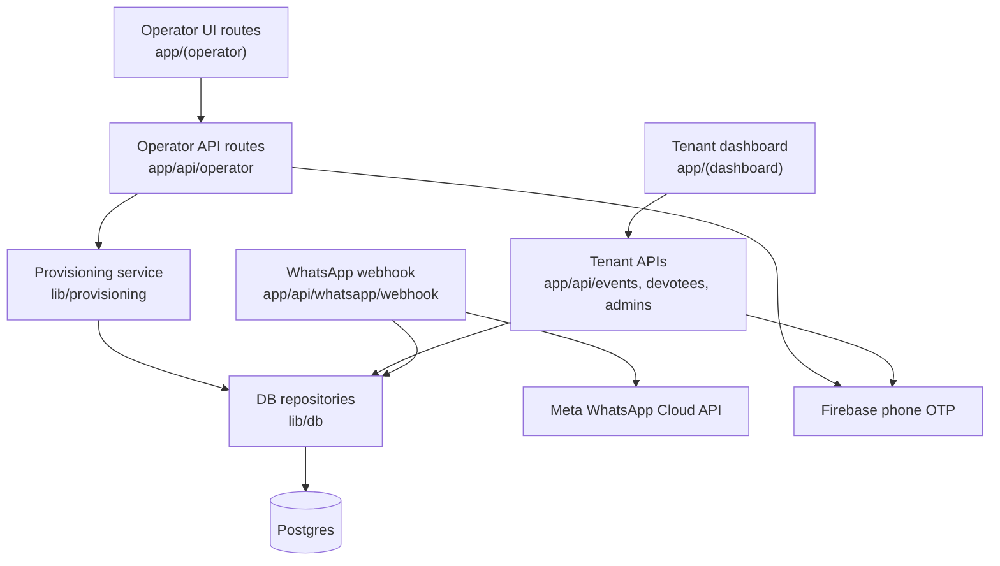
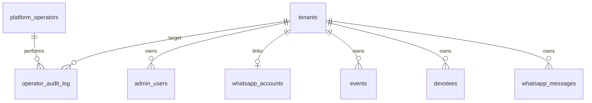
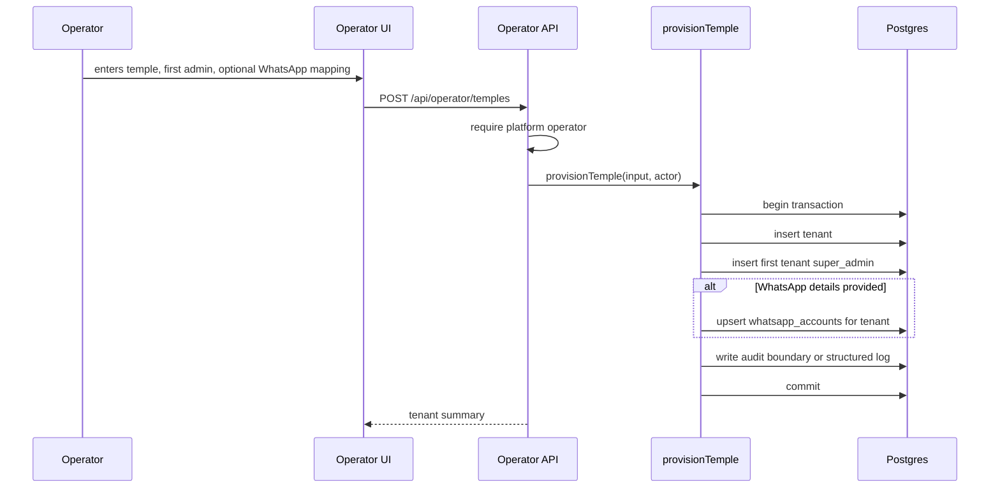

# Architecture Spine - TempleOS Super Admin Panel

## Design Paradigm

Layered operator-control-plane extension to the existing Next.js app.



Operator routes may create and configure tenants. Tenant dashboard routes remain scoped to the tenant in the signed session. WhatsApp webhooks remain scoped by Meta `phone_number_id`.

## Invariants & Rules

### AD-1 - Platform operators are separate from tenant admins [ADOPTED]

- **Binds:** operator auth, tenant admin auth, admin management, provisioning
- **Prevents:** a tenant-local `super_admin` becoming accidental cross-tenant root access.
- **Rule:** Cross-tenant actions require platform operator authorization from an operator identity store outside `admin_users`, using operator session helpers and cookie names distinct from tenant dashboard sessions. Tenant-local `super_admin` may manage admins only inside `session.tenantId`.

### AD-2 - Provisioning has one canonical mutation path

- **Binds:** tenant creation, first tenant admin creation, WhatsApp account linking, CLI provisioning, operator UI provisioning
- **Prevents:** CLI and UI flows creating different tenant shapes or leaving partial tenant setup.
- **Rule:** `lib/provisioning/temples.ts` owns every operator mutation that crosses tenant/admin/WhatsApp boundaries. It exposes `provisionTemple`, `updateProvisionedTemple`, and `linkTempleWhatsAppAccount`. Operator UI routes and CLI commands must call those service functions, not multi-table repository sequences.

### AD-3 - Tenant identity is server-derived except in operator routes [ADOPTED]

- **Binds:** tenant dashboard APIs, operator APIs, WhatsApp webhook, session handling
- **Prevents:** client-supplied tenant selectors leaking or mutating another tenant's data.
- **Rule:** Tenant dashboard APIs derive `tenant_id` only from the signed session. WhatsApp webhooks derive `tenant_id` only from `whatsapp_accounts.meta_phone_number_id`. Only operator-authorized APIs may accept an explicit tenant ID, and those routes must call an operator authorization wrapper before reading or mutating tenant detail.

### AD-4 - Pilot-only lookup must not provision production tenants

- **Binds:** `getPilotTenant`, `seed`, `seed:admin`, `seed:whatsapp`, new provision commands
- **Prevents:** new temples silently attaching admins or WhatsApp numbers to the oldest tenant.
- **Rule:** New production provisioning commands must require an explicit tenant target or create a tenant in the canonical provisioning service. `getPilotTenant()` may remain only for local demo bootstrap until retired.

### AD-5 - Operator panel is not self-serve onboarding

- **Binds:** operator UI scope, WhatsApp setup, tenant lifecycle
- **Prevents:** the provisioning panel turning into public signup, billing, tenant approval, or WhatsApp embedded onboarding.
- **Rule:** This slice supports operator create/list/view/update and manual WhatsApp account linkage only. Public signup, billing, approval queues, tenant switching, Meta embedded signup, webhook auto-registration, and template approval workflows are deferred.

### AD-6 - Cross-tenant writes must be auditable

- **Binds:** operator APIs, provisioning service, future audit tables, logs
- **Prevents:** untraceable creation or modification of temple tenants and privileged users.
- **Rule:** Every operator-created or operator-updated tenant, admin, or WhatsApp account action must have an action boundary that records actor, target tenant, action, timestamp, and metadata. Until a durable audit table exists, server logs must carry those fields.

### AD-7 - Destructive tenant lifecycle actions are out of scope

- **Binds:** operator UI, operator APIs, tenant data lifecycle
- **Prevents:** accidental production data loss or ambiguous temple ownership transfer.
- **Rule:** Operator UI starts without tenant deletion, tenant transfer, impersonation, or data export. Those actions require a later architecture decision with explicit safety rules.

### AD-8 - Operator identity is phone-OTP with no V0 role hierarchy

- **Binds:** platform operator login, first operator bootstrap, operator sessions, operator audit
- **Prevents:** incompatible operator auth implementations such as env-only actors, tenant-admin reuse, or premature operator role trees.
- **Rule:** Platform operators authenticate with Firebase phone OTP against `platform_operators.phone_number`. V0 operators are all equal. The first operator is bootstrapped by an explicit CLI command or migration-controlled seed outside `admin_users`. Operator session payload is `{ operatorId, phoneNumber, displayName, exp }` and uses a cookie name distinct from `templeos_session`.

### AD-9 - Provisioning DTOs are canonical service contracts

- **Binds:** operator UI forms, operator APIs, CLI, provisioning service, tests
- **Prevents:** UI-shaped `temple` payloads and domain-shaped `tenant` payloads drifting apart.
- **Rule:** API and CLI inputs map into canonical TypeScript service DTOs before mutation. Service DTOs use domain names: `tenant`, `firstAdmin`, `whatsappAccount`. `firstAdmin.role` is not caller-supplied during provisioning; it is always `super_admin`.

```ts
interface ProvisionTempleInput {
  tenant: {
    name: string;
    defaultContactPhone?: string | null;
    address?: string | null;
    timezone: string;
  };
  firstAdmin: {
    phoneNumber: string;
    displayName: string;
  };
  whatsappAccount?: LinkWhatsAppAccountInput;
}

interface LinkWhatsAppAccountInput {
  phoneNumber: string;
  metaPhoneNumberId: string;
  metaBusinessAccountId: string;
}

interface UpdateProvisionedTempleInput {
  tenantId: string;
  tenant: Partial<{
    name: string;
    defaultContactPhone: string | null;
    address: string | null;
    timezone: string;
  }>;
}

interface ProvisionTempleResult {
  tenant: Tenant;
  firstAdmin: AdminUser;
  whatsappAccount: WhatsAppAccount | null;
}

interface OperatorTenantSummary {
  tenant: Tenant;
  firstAdmin: AdminUser | null;
  whatsappAccount: WhatsAppAccount | null;
}
```

### AD-10 - Repository scopes must be visible in function names and signatures

- **Binds:** `lib/db` repositories, tenant APIs, operator APIs, provisioning service
- **Prevents:** globally keyed repository helpers being reused in tenant-local paths without tenant authorization.
- **Rule:** Tenant-owned reads and writes include `tenantId` in the repository signature unless they are explicitly global lookup functions needed for login or provider routing, such as `findActiveAdminByPhone` and `getWhatsAppAccountByPhoneNumberId`. Operator-only cross-tenant reads use `listTenantsForOperator` / `getTenantDetailForOperator` style names and are not called from tenant dashboard APIs.

### AD-11 - WhatsApp account ownership is single-tenant and non-transferable in V0

- **Binds:** WhatsApp account repository, operator linkage, webhook tenant resolution, message history integrity
- **Prevents:** a Meta phone number being silently reassigned to another tenant while old message history still points at the former tenant.
- **Rule:** V0 enforces at most one WhatsApp account per tenant and one tenant per `meta_phone_number_id`. Manual linkage rejects reassignment of an existing `meta_phone_number_id` to a different tenant. Transfer/disconnect semantics are deferred and require explicit audit and message-history rules.

## Consistency Conventions

| Concern | Convention |
| --- | --- |
| Operator naming | Use `operator` for platform-level users and routes. Do not call platform operators `super_admin`; `super_admin` remains a tenant-local role. |
| Tenant naming | Use `tenant` in code and database identifiers; user-facing copy may say `temple`. |
| Provisioning names | Use `provisionTemple` / `provision:temple` for the full tenant + first admin + optional WhatsApp setup. Use `createTenant` only for the lower-level tenant repository function. |
| Identity | Phone numbers are normalized before writes. Admin phone numbers remain globally unique unless a later decision changes the login model. |
| Sessions | Operator sessions and tenant sessions use separate helper modules, cookie names, and payload types. |
| Errors | Missing/invalid session returns `401`; authenticated but insufficient privilege returns `403`; validation errors return `400`; duplicate unique keys return `409`. |
| Transactions | Provisioning service owns transaction boundaries for multi-table setup. Individual repositories expose small data operations. |
| Logging | Operator mutation logs include `actorOperatorId`, `tenantId`, `action`, and stable target IDs where available. |

## Stack

| Name | Version |
| --- | --- |
| Next.js | 16.2.10 |
| React | 19.2.4 |
| TypeScript | 5.9.3 lockfile-resolved |
| PostgreSQL driver `pg` | 8.22.0 |
| Firebase JS SDK | 12.16.0 |
| Firebase Admin SDK | 14.2.0 |
| Zod | 4.4.3 |
| Vitest | 4.1.10 |
| Railway app hosting | MVP target |
| Railway Postgres | MVP target |
| Meta WhatsApp Cloud API | manually configured provider |

## Structural Seed

The following files and tables are planned structure for this feature; they are not present in the current checkout yet.

```text
app/
  (operator)/
    operator/
      page.tsx                 # operator tenant list
      temples/
        new/page.tsx           # provision temple form
        [tenantId]/page.tsx    # operator view of one temple
  api/
    operator/
      temples/route.ts         # list/provision temples
      temples/[tenantId]/route.ts
      temples/[tenantId]/whatsapp/route.ts
lib/
  auth/
    operator-session.ts        # platform operator session verification
  db/
    platform-operators.ts      # operator identity store
    tenants.ts                 # create/list/get/update tenant repository
    admin-users.ts             # tenant-local admin repository
    whatsapp-accounts.ts       # tenant WhatsApp mapping repository
    operator-audit-log.ts      # durable audit when introduced
  provisioning/
    temples.ts                 # canonical provisionTemple transaction
scripts/
  provision-temple.mts         # CLI wrapper over provisionTemple
  seed-operator.mts            # first platform operator bootstrap
```



Minimum planned operator tables:

```sql
platform_operators(
  id,
  phone_number UNIQUE,
  display_name,
  firebase_uid,
  active,
  created_at,
  updated_at
)

operator_audit_log(
  id,
  operator_id,
  tenant_id,
  action,
  target_type,
  target_id,
  metadata,
  created_at
)
```



## Capability -> Architecture Map

| Capability / Area | Lives in | Governed by |
| --- | --- | --- |
| List temples | `app/(operator)/operator`, `app/api/operator/temples`, `lib/db/tenants.ts` | AD-1, AD-3 |
| Provision temple | `app/api/operator/temples`, `lib/provisioning/temples.ts`, `scripts/provision-temple.mts` | AD-2, AD-4, AD-6 |
| Create first tenant admin | `lib/provisioning/temples.ts`, `lib/db/admin-users.ts` | AD-1, AD-2 |
| Link WhatsApp account | `lib/provisioning/temples.ts`, `lib/db/whatsapp-accounts.ts` | AD-2, AD-3, AD-5 |
| Tenant-local admin management | existing `app/api/admins/*`, `lib/db/admin-users.ts` | AD-1, AD-3 |
| WhatsApp tenant resolution | existing `app/api/whatsapp/webhook/route.ts`, `lib/db/whatsapp-accounts.ts` | AD-3, AD-5 |
| Operator auditability | `lib/db/operator-audit-log.ts`, server logs | AD-6 |

## Deferred

| Deferred decision | Why it can wait |
| --- | --- |
| Tenant deletion and restore | Needs production data retention and human approval policy. |
| Tenant impersonation | High-risk support feature; requires audit, visible banners, and tenant consent rules. |
| Billing/subscriptions | Original MVP excluded it; provisioning can validate multi-temple setup without payment rails. |
| Self-serve temple signup and approval | Current need is operator provisioning, not public onboarding. |
| Meta embedded signup / WhatsApp connection wizard | Manual WhatsApp setup is already the accepted MVP path. |
| Tenant-local role expansion beyond `super_admin` and `admin` | Existing tenant admin management already covers current dashboard access. |
| Per-tenant custom domains or public temple sites | Separate product surface from operator provisioning. |
