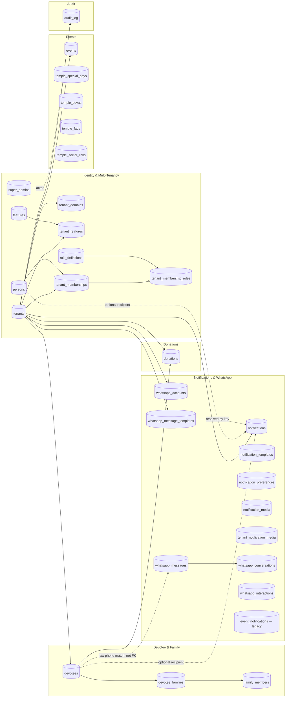

# Database Architecture

> Source: [`ARCHITECTURE_HANDBOOK.md`](../../ARCHITECTURE_HANDBOOK.md) §8-9, reorganized. No ORM — hand-written parameterized SQL via a shared `pg.Pool` (`lib/db/pool.ts`), one repository file per table/domain (35 files in `lib/db/*.ts`, excluding tests).

## Entity relationship diagram

## Current schema — 30 tables after 23 migrations

- **Identity & Auth**: `persons` (global identity), `super_admins` (`person_id` FK, `active` = platform allowlist), `role_definitions` (5-role catalog), `tenant_memberships` (`UNIQUE(tenant_id, person_id)`), `tenant_membership_roles`.
- **Multi-Tenancy & Platform Admin**: `tenants`, `tenant_domains` (hostname routing), `features` (~26-entry platform catalog), `tenant_features` (per-tenant overrides), `audit_log` (also records every cron run as `actor_type='system'`).
- **Devotee & Family**: `devotees` (`UNIQUE(tenant_id, whatsapp_phone)`), `devotee_families`, `family_members`.
- **Donations**: `donations` (`devotee_id` NOT NULL).
- **Events**: `events` (`banner_media_id` → `notification_media`).
- **Notifications & WhatsApp**: `notification_templates`, `notifications` (unified queue, CHECK exactly one of `recipient_person_id`/`recipient_devotee_id`), `notification_preferences`, `notification_media`, `tenant_notification_media`, `event_notifications` (legacy, no new writes), `whatsapp_accounts` (partial unique indexes `WHERE status='connected'`), `whatsapp_messages`, `whatsapp_interactions`, `whatsapp_conversations`, `whatsapp_message_templates` (`UNIQUE(tenant_id, template_key, language)`, now includes `submission_guide` from migration 020).
- **Temple Content/CMS**: `temple_special_days`, `temple_sevas`, `temple_faqs`, `temple_social_links`.

## Migration history highlights (23 files — full table in the handbook §9)

- No migration contains a `DROP TABLE` — all tables created across the 23 files persist in the final schema.
- **Fixes/reverts of earlier migrations**: `002`/`003` retroactively neutered into no-ops; `011` drops a column `001` created (moves Firebase UID binding off `super_admins` onto `persons`); `014_whatsapp_account_uniqueness.sql` drops and replaces a `001` constraint (a plain UNIQUE that blocked reassigning a disconnected phone number); `018` replaces an implicit hard-delete devotee flow with soft-delete (`is_active`).
- **Migration 020** (added this session): `submission_guide TEXT` column on `whatsapp_message_templates` — nullable, additive, zero backfill, supports the new template-bootstrap guided-setup flow. See [WhatsApp-Architecture.md](./WhatsApp-Architecture.md).
- Migrations run manually via `npm run migrate` (`scripts/migrate.mts`) against `DATABASE_URL`, tracked in a `schema_migrations` table — **not automatic on deploy**. See [Deployment-Architecture.md](./Deployment-Architecture.md).

## Repository layer conventions

- One file per table/domain in `lib/db/*.ts`, no ORM, parameterized `$n` placeholders throughout.
- `lib/db/query-client.ts` defines a `QueryClient` interface implemented by both `Pool` and `PoolClient`, letting a function run standalone or inside a caller's transaction.
- Explicit `BEGIN`/`COMMIT`/`ROLLBACK` transactions exist in: `devotee-families.ts` (create/update/add-members), `donations.ts` (create/update/delete, recomputes devotee donor-cache columns), `features.ts`/`role-definitions.ts`/`super-admins.ts` (seed upserts), `whatsapp-messages.ts` (log + conversation upsert).
- `tenant-memberships.ts` uses `FOR UPDATE` row locks instead of explicit transactions for role/status changes.
- **9 files locally reimplement `isUniqueViolation`** instead of importing the shared `lib/db/unique-violation.ts` helper — see [Refactoring-Opportunities.md](./Refactoring-Opportunities.md).

## Cross-references

[Route-Inventory.md](./Route-Inventory.md) for which routes touch which tables · [Security-Architecture.md](./Security-Architecture.md) for the SQL-injection check (none found) · [Testing-Architecture.md](./Testing-Architecture.md) for which `lib/db/*.ts` files lack tests · [Audit/lib/db/](./Audit/) for per-file audits (Phase 2, Batch 4).
