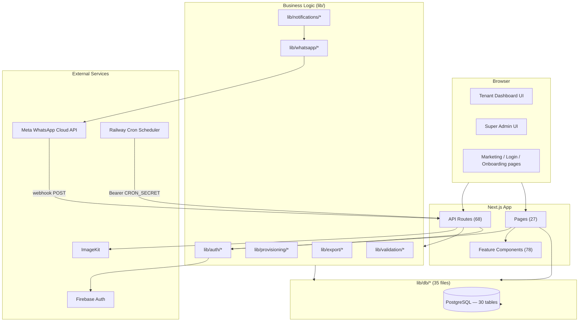

# Dependency Graph

## System-level dependency diagram

See [Layer-Architecture.md](./Layer-Architecture.md) for the strict `app → features → lib/components` layering rule and the one latent (not active) circular-dependency risk around `lib/db/audit-log.ts`.

## Most-depended-on files (by import count — inferred from the layering above and the handbook's per-domain breakdowns)

| File | Why it's a hot dependency |
|---|---|
| `lib/db/pool.ts` | Every one of the 35 `lib/db/*.ts` files imports the shared `pg.Pool` singleton from here |
| `lib/auth/session.ts` (`getSessionAdmin`/`requireDashboardAdmin`) | Called by all 16 tenant-scoped dashboard pages and indirectly by every `requireTenantAdminSession`-guarded API route |
| `lib/db/audit-log.ts` (`createAuditLogEntry`) | Written to by provisioning, WhatsApp connect/disconnect, super-admin mutations, users, tenant-features — the dependency sink flagged in [Layer-Architecture.md](./Layer-Architecture.md) |
| `lib/whatsapp/client.ts` | The raw Graph API primitive layer underneath both free-form sends and template sends |
| `lib/db/notifications.ts` | Read/written by the Notification Engine, every domain's "enqueue on mutation" call sites, and the delivery-status webhook handler |
| `components/ui/*` (button, dialog, table, sheet, etc.) | Imported across effectively all 78 `features/**` files |
| `lib/pagination.ts` | Centralized `computeOffset`/`DEFAULT_PAGE_SIZE`/`parsePageParam` — reused by every paginated list (devotees, donations, events, users) |

## Cross-reference

Every individual file's own inbound/outbound dependency list lives in its [per-file audit](./Audit/README.md) once that batch has been produced — this document only covers the system-level shape, not a literal 390-node graph (impractical to render usefully as one diagram; the per-file audits are the queryable source of truth for "what imports X").
