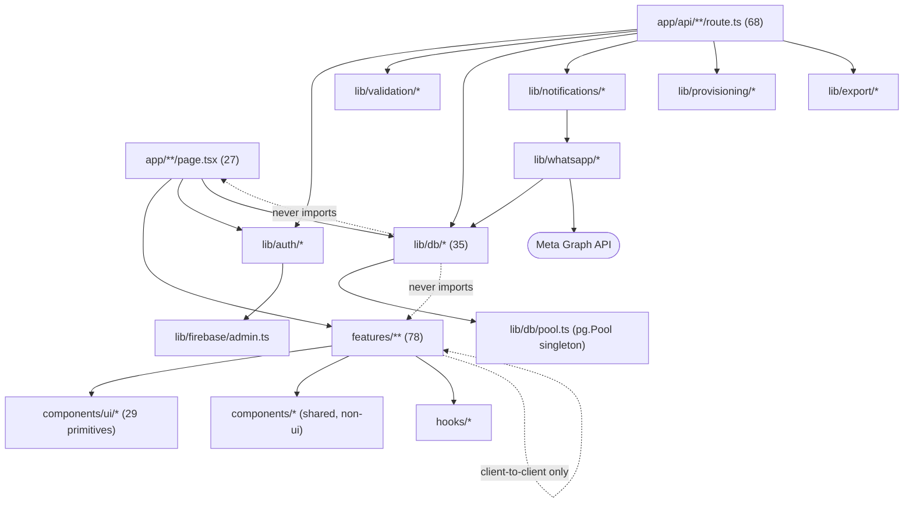

# Layer Architecture

## Layering diagram

## The rule

Strict one-directional layering: `app` → `features` → `lib`/`components`. Repo-wide checks in both directions found **zero backwards imports** — nothing in `lib/` or `components/` imports from `features/`, and nothing in `features/` imports from `app/`.

## Circular dependency risk

**`lib/db/*.ts` internal graph** — every intra-`lib/db` import points toward a true leaf module (`pool.ts`, `query-client.ts`, `audit-log.ts`, `devotees.ts`, `notification-templates.ts`, `whatsapp-conversations.ts`). **No cycles exist today.** The risk is latent, not active: `audit-log.ts` is a dependency sink for 4+ other modules (every domain writes audit entries), so a future edit adding an import *from* `audit-log.ts` back to one of its callers would immediately create a cycle. Worth a lint rule (`import/no-cycle`) if the `lib/db` surface keeps growing.

## Why no `middleware.ts`

There is deliberately no Next.js Edge Middleware in this repo. Every authorization decision is made inline per-request by one of three guard functions (`requireDashboardAdmin`, `requireSuperAdminPage`/`requireSuperAdmin`, `isAuthorizedCronRequest`) rather than a central gate. See [Authentication-Architecture.md](./Authentication-Architecture.md) for the full reasoning and the trade-off this implies (a new route that forgets to call its guard is invisible to any central enforcement layer — verified today that no route has this gap, see [Security-Architecture.md](./Security-Architecture.md)).
