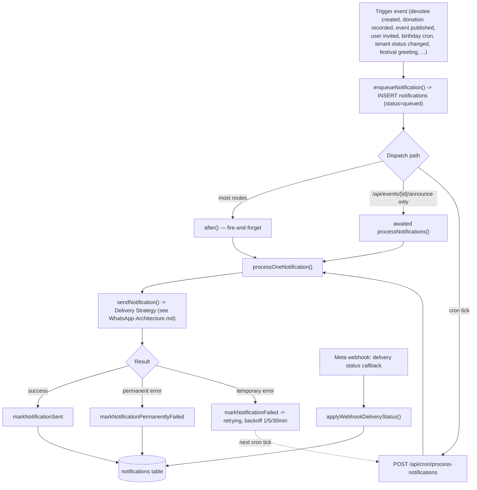

# Notification Architecture

> Source: [`ARCHITECTURE_HANDBOOK.md`](../../ARCHITECTURE_HANDBOOK.md) §5 (generic half) + §6, reorganized. See [WhatsApp-Architecture.md](./WhatsApp-Architecture.md) for the WhatsApp-specific delivery mechanics this engine hands off to.

## Two distinct "template" concepts — do not confuse

1. **`notification_templates`** (`lib/db/notification-templates.ts`) — TempleOS's own free-form message-body copy, `{{variable}}` placeholders rendered by `renderTemplate()`. Generates the *text* of a free-form WhatsApp message or in-app notification. Tenant-agnostic seed data, no Meta involvement.
2. **`whatsapp_message_templates`** — Meta-approved HSM templates required to message outside the 24h window. See [WhatsApp-Architecture.md](./WhatsApp-Architecture.md).

## Notification flow

## Background processes

See [Cron-Architecture.md](./Cron-Architecture.md) for the full 4-route table. In short: no queue/worker library exists — all "background" work is cron-polling HTTP endpoints plus `after()`-dispatched fire-and-forget sends within a request.

## Legacy pipeline still present

`lib/whatsapp/event-notifications.ts` + `lib/db/event-notifications.ts` (own `event_notifications` table, own cron route) predate the generic engine. Explicitly superseded, not deleted — drains historical rows only, no new writes. Its own code comments reference a "Resend failed" route (`app/api/events/[id]/notifications/resend/route.ts`) that **does not exist anywhere in the codebase** — a dangling reference. See [Dead-Code-Audit.md](./Dead-Code-Audit.md) and [Refactoring-Opportunities.md](./Refactoring-Opportunities.md) for the consolidation recommendation.

## Error classification (`lib/whatsapp/errors.ts`)

| Category | Meta codes | Retried? |
|---|---|---|
| Re-engagement (window closed) | 131047 | No |
| Recipient unreachable/invalid | 131026 | No |
| Template param/format mismatch, not approved/found | 132000, 132001, 132005, 132012 | No |
| Everything else (rate limits, 5xx, network) | — | Yes, 1/5/30-min backoff |
| Local validation failures | resolved pre-Meta-call | No — never attempted |

## Cross-references

[WhatsApp-Architecture.md](./WhatsApp-Architecture.md) · [Cron-Architecture.md](./Cron-Architecture.md) · [Database-Architecture.md](./Database-Architecture.md) for the `notifications` table shape · [Audit/lib/notifications/](./Audit/) (Phase 2, Batch 5).
