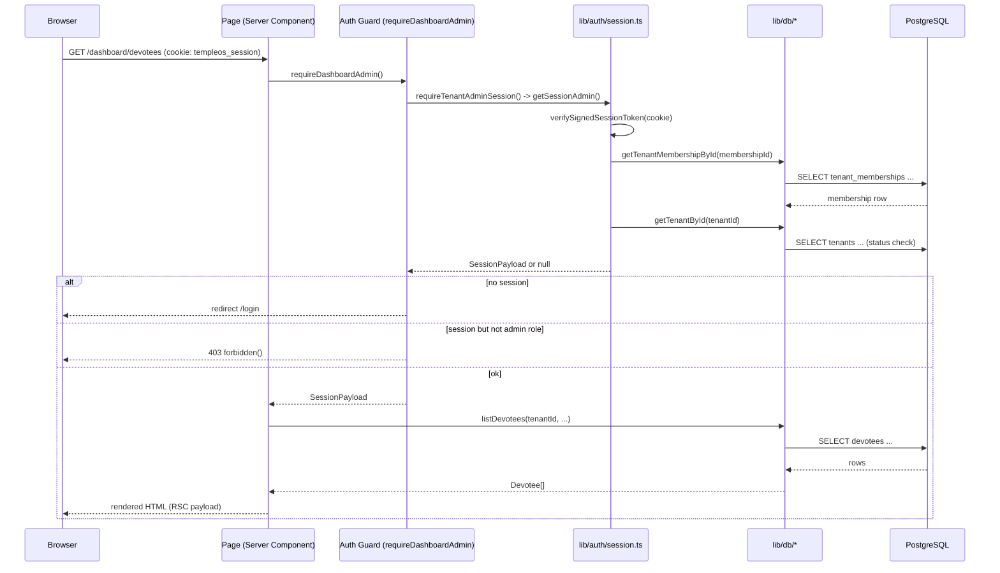
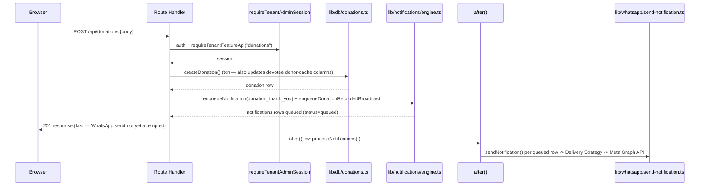
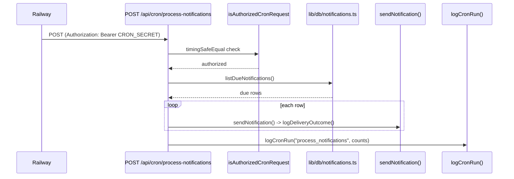
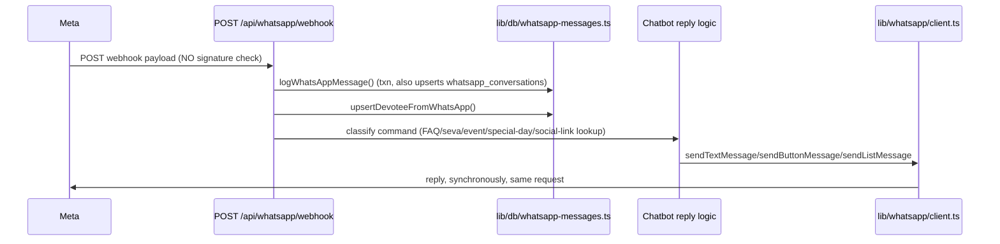

# Request Lifecycle

> Source: [`ARCHITECTURE_HANDBOOK.md`](../../ARCHITECTURE_HANDBOOK.md) §3.2-3.3, expanded with additional traced flows.

## Flow 1 — Typical tenant admin page load

## Flow 2 — Mutating POST with a WhatsApp side effect (e.g. `POST /api/donations`)

The response returns to the browser *before* the Graph API round-trip — the one deliberate exception is `POST /api/events/[id]/announce`, which awaits delivery synchronously so the UI can show a real sent/failed count.

## Flow 3 — Cron tick

## Flow 4 — Inbound WhatsApp webhook (synchronous, not cron)

See [Security-Architecture.md](./Security-Architecture.md) for why Flow 4's missing signature check is the single highest-priority finding in this audit.

## Cross-references

[Authentication-Architecture.md](./Authentication-Architecture.md) · [Notification-Architecture.md](./Notification-Architecture.md) · [Cron-Architecture.md](./Cron-Architecture.md) · [WhatsApp-Architecture.md](./WhatsApp-Architecture.md)
