# WhatsApp Architecture

> Source: [`ARCHITECTURE_HANDBOOK.md`](../../ARCHITECTURE_HANDBOOK.md) §5 (WhatsApp half) + §3.5, **updated** with the Phase-2 template-bootstrap/guided-setup/continuous-sync work shipped this session (not present in the root handbook).

## The 24-hour conversation window

Meta only allows arbitrary free-form outbound messages within 24 hours of the recipient's last **inbound** message. Outside that window, free-form sends are rejected (error 131047) and only an approved template can reach that recipient. `lib/whatsapp/conversation-resolver.ts`'s `resolveConversationStatus(tenantId, phone)` answers this by querying `whatsapp_messages` for the most recent inbound message from that phone (raw string match, not an FK — works identically for devotees and staff).

## Delivery Strategy — the single decision point

`lib/whatsapp/delivery-strategy.ts`'s `resolveDeliveryStrategy({tenantId, phone, templateKey, language})`:

- **`FREE_FORM`** — window open, send plain text/image/button/list exactly as before.
- **`TEMPLATE`** — window closed, approved+enabled template exists — send that.
- **`UNDELIVERABLE`** — window closed, no usable template — permanent failure, no Meta call, no retry.

`lib/whatsapp/send-notification.ts`'s `sendNotification()` wraps this: `TEMPLATE` goes `template-client.ts` → `template-registry.ts` → `template-validator.ts` → `template-variable-resolver.ts` → `client.ts`'s `sendTemplateMessage`. `lib/whatsapp/delivery-logger.ts` persists the outcome.

## Per-tenant WABA, shared platform token

Each temple has its own Meta WhatsApp Business Account (`whatsapp_accounts`, 1:1 per tenant). TempleOS is a Meta **Tech Provider** — one shared platform-level `WHATSAPP_ACCESS_TOKEN` System User token covers every connected WABA; no per-tenant OAuth token is stored. Template approval is inherently per-WABA (`UNIQUE(tenant_id, template_key, language)`).

## Template system — now with bootstrap, guided setup, and continuous sync (this session)

Prior to this session, `whatsapp_message_templates` rows were only ever created manually via the "Add Template" dialog, and approval status was only checked one row at a time via a manual "Sync status" button that never auto-enabled a newly-approved template. Three gaps closed:

1. **Automatic bootstrap on connect** — `lib/whatsapp/standard-template-catalog.ts` (26 entries: 13 `NotificationType` keys × {en, te}) + `lib/whatsapp/template-bootstrap.ts::bootstrapStandardTemplates(tenantId)`, called from `app/api/whatsapp/connect/callback/route.ts` right after `completeEmbeddedSignup` succeeds (wrapped in try/catch — a bootstrap failure never blocks the connection response). Rows insert `ON CONFLICT DO NOTHING`, start `enabled=false`, never clobber admin edits on reconnect.
2. **Transition-guarded auto-enable** — `lib/db/whatsapp-message-templates.ts::setApprovalStatus` now flips `enabled` to `true` only on the exact `pending → approved` transition, never re-enabling a row an admin later disabled, never touching rows already `approved`. Shared by both the existing single-row sync button and the new bulk/cron paths.
3. **Bulk "Setup" orchestration** — `POST /api/whatsapp/templates/setup`: preflight `validatePlatformAccessToken()`, `bootstrapStandardTemplates()`, then loops every pending template through `syncTemplateApprovalStatus` + `setApprovalStatus`, catching per-item errors so one template's failure doesn't abort the batch. Surfaced via `features/chatbot-settings/whatsapp-template-setup-wizard.tsx` (a Dialog narrating one API call as bootstrap→sync→ready steps — there's no real multi-request infrastructure to narrate genuinely).
4. **Continuous sync cron** — `POST /api/cron/sync-whatsapp-templates`, same shape as the other 3 cron routes, loops every connected tenant's pending templates through the same read-only sync. Code-complete; **scheduling it in Railway's dashboard is a manual follow-up**, not something this codebase can do itself.
5. **Guide-only submission surface** — no Meta template submission via API anywhere (deliberate — `syncTemplateApprovalStatus` stays read-only). `submissionGuide` (migration 020's new column) gives the admin a copy-paste-ready name/category/language/body/variable-legend for missing templates, surfaced via a read-only dialog in `whatsapp-templates-tab.tsx`'s per-row overflow menu.

**Known risk designed around**: `event-announcements.ts` builds `eventLocationLine` as `event.location ? "\n📍 ${event.location}" : ""` — an empty string when absent. `template-variable-resolver.ts` treats `""` as missing, and missing-variable failures are permanent (no retry). The bootstrap catalog and submission guide for `new_event`/`event_updated`/`event_cancelled` **omit the location line entirely** to avoid every location-less event's template send failing permanently forever.

## WhatsApp flow diagram

```mermaid
flowchart TB
    subgraph Inbound["Inbound (Meta -> TempleOS)"]
        MetaMsg["Devotee/staff sends WhatsApp message"] --> Webhook["POST /api/whatsapp/webhook (no signature verification)"]
        Webhook --> LogMsg["logWhatsAppMessage() -> whatsapp_messages"]
        Webhook --> UpsertDevotee["upsertDevoteeFromWhatsApp()"]
        Webhook --> BotLogic["Chatbot reply logic (FAQs, sevas, events, special days, social links)"]
        BotLogic --> BotSend["sendTextMessage/sendButtonMessage/sendListMessage (bypasses Delivery Strategy)"]
        Webhook --> DeliveryStatus["Delivery status callback"] --> ApplyWebhook["applyWebhookDeliveryStatus() -> notifications"]
    end
    subgraph Outbound["Outbound, business-triggered"]
        NotifEngine["Notification Engine"] --> Strategy["Delivery Strategy Layer"]
        Strategy --> TemplateSys["Template System"]
        Strategy --> FreeFormSend["Free-form send"]
        TemplateSys --> ClientPrimitives["lib/whatsapp/client.ts"]
        FreeFormSend --> ClientPrimitives
        ClientPrimitives --> MetaAPI["Meta Graph API (shared WHATSAPP_ACCESS_TOKEN)"]
    end
    subgraph NewThisSession["New — template lifecycle automation"]
        Connect["Embedded Signup connect/reconnect"] --> Bootstrap["bootstrapStandardTemplates()"]
        Bootstrap --> Templates[("whatsapp_message_templates")]
        SetupBtn["Setup wizard button"] --> SetupRoute["POST /api/whatsapp/templates/setup"]
        SetupRoute --> Bootstrap
        SetupRoute --> SyncLoop["syncTemplateApprovalStatus + auto-enable"]
        SyncCron["POST /api/cron/sync-whatsapp-templates"] --> SyncLoop
        SyncLoop --> Templates
    end
    Templates -.reads.-> TemplateSys
    BotSend --> MetaAPI
```

## Cross-references

[Notification-Architecture.md](./Notification-Architecture.md) · [Security-Architecture.md](./Security-Architecture.md) for the webhook signature gap · [Database-Architecture.md](./Database-Architecture.md) for `whatsapp_message_templates`'s schema · [Audit/lib/whatsapp/](./Audit/) (Phase 2, Batch 2 — highest priority).
